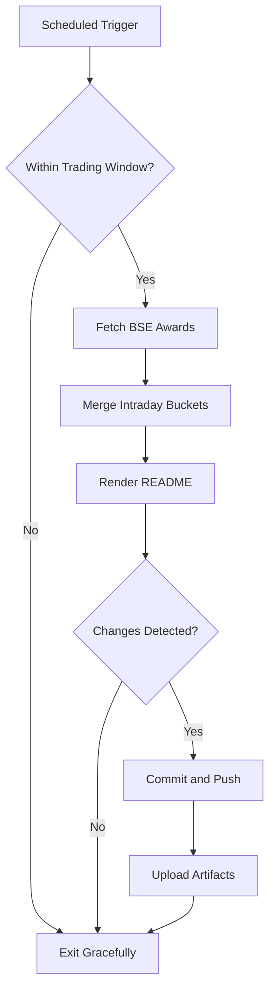

# Bombay Duck 🦆

     

<!-- aim:start -->

## Aim 🎯

⚠️ **Caution:\*\*** This project does not recommend buying or selling any security; it simply tracks BSE "Award of Order / Receipt of Order" announcements for informational purposes.

Bombay Duck keeps a pulse on BSE's "Award of Order / Receipt of Order" announcements so traders can spot fresh bullish catalysts without refreshing the exchange site. The goal is a hands-free tracker that respects BSE rate limits, stores every intraday fetch in git, and keeps the repository's front page as a living dashboard.

<!-- aim:end -->

## Intraday Snapshot 📊

ℹ️ **Important:\*\*** The README snapshot is updated automatically by the scheduled GitHub Action. Always pull the latest changes (or rebase) before editing README content locally to avoid merge conflicts.

<!-- snapshot:start -->

### Today's Awarded Orders (2025-11-28 IST)

| Hour (IST) | Company | Code | Headline | Profit Outlook | Announced At |
| --- | --- | --- | --- | --- | --- |
| 2025-11-28 15:00 | Prince Pipes and Fittings Ltd | 542907 | The Company has received Demand Order from the Superintendent Central Tax & Central Excise, Palakkad North Range State/UT Kerala ([Link](https://www.bseindia.com/stock-share-price/prince-pipes-and-fittings-ltd/princepipe/542907/)) | Likely Positive | 28 Nov 2025 - 15:11 |
| 2025-11-28 13:00 | Ceigall India Ltd | 544223 | In accordance with the provisions of the SEBI (Listing Obligations and Disclosure Requirements) Regulation, 2015, we wish to inform you that Ceigall Infra Projects Private Limited, a wholly .... ([Link](https://www.bseindia.com/stock-share-price/ceigall-india-ltd/ceigall/544223/)) | Neutral | 28 Nov 2025 - 13:59 |
| 2025-11-28 13:00 | Kranti Industries Ltd | 542459 | Pursuant to Reg 30 of SEBI(Listing obligations and Disclosure Requirements) Regulations, 2015, we wish to inform you that the Company has received 12 Purchase Orders from a New Customer .... ([Link](https://www.bseindia.com/stock-share-price/kranti-industries-ltd/kranti/542459/)) | Likely Positive | 28 Nov 2025 - 13:20 |
| 2025-11-28 12:00 | Dilip Buildcon Ltd | 540047 | In continuation to our disclosure dated October 27, 2025 and accordance with the provisions of the Securities and Exchange Board of India (Listing Obligations and Disclosure Requirements) .... ([Link](https://www.bseindia.com/stock-share-price/dilip-buildcon-ltd/dbl/540047/)) | Neutral | 28 Nov 2025 - 12:32 |
| 2025-11-28 09:00 | TANFAC Industries Ltd-$ | 506854 | Disclosure under Regulation 30 of SEBI LODR - Signing of Contract ([Link](https://www.bseindia.com/stock-share-price/tanfac-industries-ltd/tanfacind/506854/)) | Likely Positive | 28 Nov 2025 - 09:40 |

_Last updated: 28 Nov 2025 - 15:33 | Entries: 5 | Requests: 8 | Retries: 0 | [Raw JSON](data/2025-11-28.json)_

<!-- snapshot:end -->

<!-- how-it-works:start -->

## How It Works ⚙️

1. Scheduled GitHub Action runs at the top of each hour from 09:00 to 16:00 IST, Monday through Friday.
2. Trading-window guard aborts early outside market hours or on weekends/holidays.
3. Node.js fetcher (with throttling and retries) polls the BSE API and archives the raw JSON response.
4. Intraday state manager deduplicates announcements per hour and rolls over automatically at the next market open.
5. Mustache-based renderer injects a fresh table into the README so the latest data is always visible.
6. If anything changed, the workflow commits the README and JSON state back to `main` using a bot token and uploads artifacts for auditing.

<!-- how-it-works:end -->

## Automation Timeline 🕒

- **09:00 IST**: First eligible run clears out yesterday's state, fetches fresh announcements, and resets the README snapshot.
- **09:15-15:00 IST**: At the top of each hour the workflow repeats the fetch->merge->render pipeline, committing only when new data appears.
- **After 15:00 IST**: Guard step exits successfully; the last intraday snapshot remains until markets reopen.

## Project Resources 📚

- 📘 [Contributing Guidelines](CONTRIBUTING.md)
- 🧾 [Pull Request Guide](PR_GUIDE.md)
- 🐞 [Known Issues](KNOWN_ISSUES.md)
- 👥 [Authors](AUTHORS.md)

## Appendix 📎

- **API Endpoint:** `https://api.bseindia.com/BseIndiaAPI/api/AnnSubCategoryGetData/w`
- **Query Parameters:** `strCat=Company Update`, `subcategory=Award of Order / Receipt of Order`; date fields align with the active IST trading day.
- **Outputs:** Exposes `trading_date`, `announcement_count`, and the JSON-encoded announcements via `GITHUB_OUTPUT` for downstream jobs.
- **Logs & Summaries:** Fetch step writes a Markdown table to the GitHub Step Summary for quick triage.
