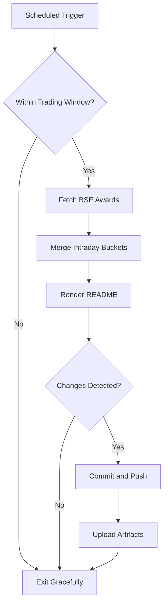

# Bombay Duck 🦆

     

<!-- aim:start -->

## Aim 🎯

⚠️ **Caution:\*\*** This project does not recommend buying or selling any security; it simply tracks BSE "Award of Order / Receipt of Order" announcements for informational purposes.

Bombay Duck keeps a pulse on BSE's "Award of Order / Receipt of Order" announcements so traders can spot fresh bullish catalysts without refreshing the exchange site. The goal is a hands-free tracker that respects BSE rate limits, stores every intraday fetch in git, and keeps the repository's front page as a living dashboard.

<!-- aim:end -->

## Intraday Snapshot 📊

ℹ️ **Important:\*\*** The README snapshot is updated automatically by the scheduled GitHub Action. Always pull the latest changes (or rebase) before editing README content locally to avoid merge conflicts.

<!-- snapshot:start -->

### Today's Awarded Orders (2025-12-12 IST)

| Hour (IST) | Company | Code | Headline | Profit Outlook | Announced At |
| --- | --- | --- | --- | --- | --- |
| 2025-12-12 15:00 | GPT Infraprojects Ltd | 533761 | Please find press release for order bagged by the Company woth Rs. 53.6 Crore ([Link](https://www.bseindia.com/stock-share-price/gpt-infraprojects-ltd/gptinfra/533761/)) | Likely Positive | 12 Dec 2025 - 15:23 |
| 2025-12-12 14:00 | SBC Exports Ltd | 542725 | Work Order awarded by Management Development Insititute (MDI Gurgaon) ([Link](https://www.bseindia.com/stock-share-price/sbc-exports-ltd/sbc/542725/)) | Likely Positive | 12 Dec 2025 - 14:24 |
| 2025-12-12 14:00 | Marsons Ltd | 517467 | We are pleased to inform that our company has received a LOA/Purchase order worth Rs. 25,02,78,000.00 (incl GST) from Galaxy Solar Energy Pvt. Ltd. for supply of 72 nos of various ratings .... ([Link](https://www.bseindia.com/stock-share-price/marsons-ltd/marsons/517467/)) | Likely Positive | 12 Dec 2025 - 14:22 |
| 2025-12-12 14:00 | Texmaco Rail & Engineering Ltd | 533326 | Receipt of Order ([Link](https://www.bseindia.com/stock-share-price/texmaco-rail--engineering-ltd/texrail/533326/)) | Likely Positive | 12 Dec 2025 - 14:21 |
| 2025-12-12 12:00 | Kranti Industries Ltd | 542459 | Pursuant to Regulation 30 and other applicable provisions of SEBI (Listing Obligations and Disclosure Requirements) Regulations, 2015, we hereby inform you that the Company has received .... ([Link](https://www.bseindia.com/stock-share-price/kranti-industries-ltd/kranti/542459/)) | Neutral | 12 Dec 2025 - 12:57 |
| 2025-12-12 12:00 | Shakti Pumps India Ltd-$ | 531431 | We would like to inform you that Company has received a Work Order from Madhya Pradesh Urja Vikas Nigam Limited for 2,033 Stand-alone Off-Grid DC Solar Photovoltaic Water Pumping System .... ([Link](https://www.bseindia.com/stock-share-price/shakti-pumps-india-ltd/shaktipump/531431/)) | Likely Positive | 12 Dec 2025 - 12:55 |
| 2025-12-12 12:00 | Marsons Ltd | 517467 | We are pleased to inform that our company has received a LOA worth Rs. 9,91,20,000.00 (incl GST) from LC Infra Projects Private Limited for supply of 1 nos. 70 MVA & 1 nos. 80 MVA Power .... ([Link](https://www.bseindia.com/stock-share-price/marsons-ltd/marsons/517467/)) | Neutral | 12 Dec 2025 - 12:54 |
| 2025-12-12 12:00 | DMR Engineering Ltd | 543410 | Intimation of receipt of work order ([Link](https://www.bseindia.com/stock-share-price/dmr-engineering-ltd/dmr/543410/)) | Likely Positive | 12 Dec 2025 - 12:14 |
| 2025-12-12 11:00 | Shelter Pharma Ltd | 543963 | Intimation with Regards to Shelter Pharma Secured Order from Taha Drugs & Chemicals Co. Ltd Pursuant to Regulation 30 of SEBI ( Listing Obligation and Disclousure Requirements) Regulation 2015 ([Link](https://www.bseindia.com/stock-share-price/shelter-pharma-ltd/shelter/543963/)) | Likely Positive | 12 Dec 2025 - 11:44 |
| 2025-12-12 11:00 | Shakti Pumps India Ltd-$ | 531431 | We would like to inform you that Company has received second order from State of Jharkhand. Jharkhand Renewable Energy Development Agency has given Letter of Award for 1,200 Nos. of Solar .... ([Link](https://www.bseindia.com/stock-share-price/shakti-pumps-india-ltd/shaktipump/531431/)) | Likely Positive | 12 Dec 2025 - 11:36 |
| 2025-12-12 11:00 | Interarch Building Solutions Ltd | 544232 | Intimation under Regulation 30 of the SEBI (LODR) Regulations,2015 regarding receipt of an order. ([Link](https://www.bseindia.com/stock-share-price/interarch-building-solutions-ltd/interarch/544232/)) | Likely Positive | 12 Dec 2025 - 11:33 |
| 2025-12-12 10:00 | RailTel Corporation of India Ltd | 543265 | New Order Received ([Link](https://www.bseindia.com/stock-share-price/railtel-corporation-of-india-ltd/railtel/543265/)) | Likely Positive | 12 Dec 2025 - 10:55 |
| 2025-12-12 10:00 | Steel Strips Wheels Ltd-$ | 513262 | As per attachment enclosed. ([Link](https://www.bseindia.com/stock-share-price/steel-strips-wheels-ltd/sswl/513262/)) | Neutral | 12 Dec 2025 - 10:09 |

_Last updated: 12 Dec 2025 - 15:33 | Entries: 13 | Requests: 8 | Retries: 0 | [Raw JSON](data/2025-12-12.json)_

<!-- snapshot:end -->

<!-- how-it-works:start -->

## How It Works ⚙️

1. Scheduled GitHub Action runs at the top of each hour from 09:00 to 16:00 IST, Monday through Friday.
2. Trading-window guard aborts early outside market hours or on weekends/holidays.
3. Node.js fetcher (with throttling and retries) polls the BSE API and archives the raw JSON response.
4. Intraday state manager deduplicates announcements per hour and rolls over automatically at the next market open.
5. Mustache-based renderer injects a fresh table into the README so the latest data is always visible.
6. If anything changed, the workflow commits the README and JSON state back to `main` using a bot token and uploads artifacts for auditing.

<!-- how-it-works:end -->

## Automation Timeline 🕒

- **09:00 IST**: First eligible run clears out yesterday's state, fetches fresh announcements, and resets the README snapshot.
- **09:15-15:00 IST**: At the top of each hour the workflow repeats the fetch->merge->render pipeline, committing only when new data appears.
- **After 15:00 IST**: Guard step exits successfully; the last intraday snapshot remains until markets reopen.

## Project Resources 📚

- 📘 [Contributing Guidelines](CONTRIBUTING.md)
- 🧾 [Pull Request Guide](PR_GUIDE.md)
- 🐞 [Known Issues](KNOWN_ISSUES.md)
- 👥 [Authors](AUTHORS.md)

## Appendix 📎

- **API Endpoint:** `https://api.bseindia.com/BseIndiaAPI/api/AnnSubCategoryGetData/w`
- **Query Parameters:** `strCat=Company Update`, `subcategory=Award of Order / Receipt of Order`; date fields align with the active IST trading day.
- **Outputs:** Exposes `trading_date`, `announcement_count`, and the JSON-encoded announcements via `GITHUB_OUTPUT` for downstream jobs.
- **Logs & Summaries:** Fetch step writes a Markdown table to the GitHub Step Summary for quick triage.
