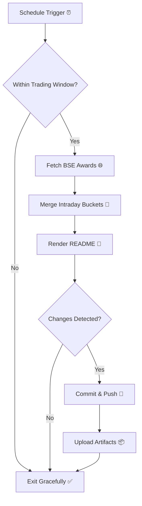

# Bombay Duck Automation 🦆

<!-- aim:start -->
## Aim 🎯
Bombay Duck keeps a pulse on BSE’s “Award of Order / Receipt of Order” announcements so traders can spot fresh bullish catalysts without refreshing the exchange site. The goal is a hands-free tracker that respects BSE rate limits, stores every intraday fetch in git, and keeps the repository’s front page as a living dashboard.
<!-- aim:end -->

<!-- how-it-works:start -->
## How It Works ⚙️
1. ⏰ A scheduled GitHub Action runs every 15 minutes from 09:00 to 15:00 IST, Monday through Friday.
2. 🚦 A trading-window guard aborts early outside market hours or on weekends/holidays.
3. 🌐 A Node.js fetcher (with throttling and retries) polls the BSE API and archives the raw JSON response.
4. 🧮 The intraday state manager deduplicates announcements per hour and rolls over automatically at the next market open.
5. 📝 A Mustache-based renderer injects a fresh table into the README so the latest data is always visible.
6. 🤖 If anything changed, the workflow commits the README and JSON state back to `main` using a bot token and uploads artifacts for auditing.


<!-- how-it-works:end -->

## Components 🧩
- **GitHub Action**: `.github/workflows/bse-award-watch.yml` orchestrates checkout, install, build, guard, fetch, merge, render, commit, and artifact upload steps.
- **Fetch Service** (`src/fetch-bse-awards.ts`): Axios-based client with exponential retry, rate limiting, and GitHub output/summary integration.
- **State Manager** (`src/merge-awards.ts`): Maintains `data/YYYY-MM-DD.json`, groups announcements by hour, and wipes older trading-day files.
- **Renderer** (`src/render-readme.ts`): Uses `templates/awards.md.mustache` to rebuild the README block between snapshot markers.
- **Guard** (`src/guards/ensure-trading-window.ts`): Emits a `should_run` output after verifying market hours in IST.
- **Utilities**: Shared helpers for time zones, checksum, rate limiting, and filesystem operations live in `src/lib/`.

## Automation Timeline 🕒
- **09:00 IST**: First eligible run clears out yesterday’s state, fetches fresh announcements, and resets the README snapshot.
- **09:15–15:00 IST**: Every 15 minutes the workflow repeats the fetch→merge→render pipeline, committing only when new data appears.
- **After 15:00 IST**: Guard step exits successfully; the last intraday snapshot remains until markets reopen.

## Intraday Snapshot
<!-- snapshot:start -->

### Today's Awarded Orders (2025-09-27 IST)

_No award announcements have been captured yet today._

_Last updated: 27 Sep 2025 - 12:08 | Entries: 0 | Requests: 3 | Retries: 0 | [Raw JSON](data/2025-09-27.json)_

<!-- snapshot:end -->

## Data Lifecycle 📂
- Raw API responses are saved under `data/raw/<trading-date>/awards-HHmmss.json` for auditing.
- `data/latest-fetch.json` stores metadata about the most recent poll.
- `data/<trading-date>.json` is the canonical intraday state consumed by the renderer.
- Generated artifacts (`data/raw`, `data/latest-fetch.json`, `.rate-limit.json`) are ignored by git; only the per-day JSON and README land in commits.

## Safety & Reliability 🔒
- **Rate Limiting**: `src/lib/rate-limit.ts` enforces a minimum 60-second gap between API calls, even if jobs retry.
- **Retries**: Fetcher performs up to four attempts with exponential backoff (2s base delay, factor 2).
- **Concurrency Control**: Workflow-level concurrency (`group: bse-award-watch`) cancels overlapping runs.
- **Manual Override**: `workflow_dispatch` allows ad-hoc runs; the guard still protects against out-of-hours execution.

## Local Development 🛠️
```bash
npm install           # install dependencies & build once (prepare hook)
npm run build         # manual TypeScript build
npm run fetch         # call BSE API (uses live endpoint)
npm run merge         # merge latest snapshot into intraday state
npm run render        # rebuild README snapshot section
npm run guard         # simulate trading-window check
npm run clean         # wipe dist/
```
- Use `npm run dev:*` commands for ts-node execution without compiling.
- Set `TZ=Asia/Kolkata` when testing on non-Windows environments to mirror production behaviour.
- Provide a GitHub personal access token with repo scope as `BOT_PAT` secret before enabling the workflow.

## Deployment Notes 🚀
1. Push the repository to GitHub with the workflow enabled.
2. Add `BOT_PAT` secret (repo scope, least privilege) so the action can commit.
3. Monitor the first scheduled cycle via Actions UI; review the run summary table and downloaded artifacts.
4. Investigate any multi-run gaps by checking `data/raw/` payloads and job logs stored in the run summary.

\n## Project Resources 📚\n- [Contributing Guidelines](CONTRIBUTING.md)\n- [Pull Request Guide](PR_GUIDE.md)\n- [Known Issues](KNOWN_ISSUES.md)\n- [Authors](AUTHORS.md)\n\n## Appendix 📎
- **API Endpoint**: `https://api.bseindia.com/BseIndiaAPI/api/AnnSubCategoryGetData/w`
- **Query Parameters**: `strCat=Company Update`, `subcategory=Award of Order / Receipt of Order`, date fields are generated per IST trading day.
- **Outputs**: `trading_date`, `announcement_count`, and JSON-encoded announcement list are exposed via `GITHUB_OUTPUT` for downstream jobs if needed.
- **Logs & Summaries**: Fetch step writes a Markdown table to the GitHub Step Summary to aid triage.

