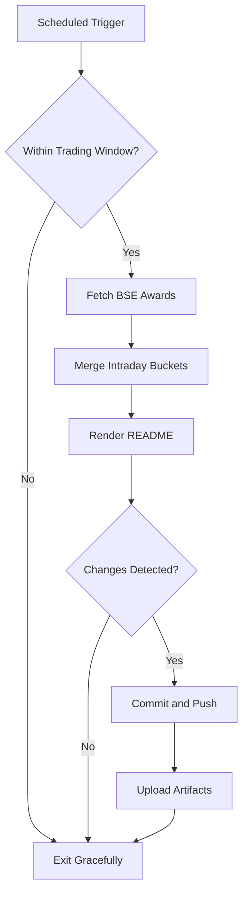

# Bombay Duck 🦆

     

<!-- aim:start -->

## Aim 🎯

⚠️ **Caution:\*\*** This project does not recommend buying or selling any security; it simply tracks BSE "Award of Order / Receipt of Order" announcements for informational purposes.

Bombay Duck keeps a pulse on BSE's "Award of Order / Receipt of Order" announcements so traders can spot fresh bullish catalysts without refreshing the exchange site. The goal is a hands-free tracker that respects BSE rate limits, stores every intraday fetch in git, and keeps the repository's front page as a living dashboard.

<!-- aim:end -->

## Intraday Snapshot 📊

ℹ️ **Important:\*\*** The README snapshot is updated automatically by the scheduled GitHub Action. Always pull the latest changes (or rebase) before editing README content locally to avoid merge conflicts.

<!-- snapshot:start -->

### Today's Awarded Orders (2025-12-23 IST)

| Hour (IST) | Company | Code | Headline | Profit Outlook | Announced At |
| --- | --- | --- | --- | --- | --- |
| 2025-12-23 13:00 | Soma Papers & Industries Ltd | 516038 | Intimation towards receipt of order from School Education Department, Government of Punjab to the Company''s wholly owned subsidiary. ([Link](https://www.bseindia.com/stock-share-price/soma-papers--industries-ltd/somappr/516038/)) | Likely Positive | 23 Dec 2025 - 13:10 |
| 2025-12-23 13:00 | Oriental Rail Infrastructure Ltd | 531859 | Oriental Foundry Private Limited, a Wholly-Owned Subsidiary Company secures order ([Link](https://www.bseindia.com/stock-share-price/oriental-rail-infrastructure-ltd/orirail/531859/)) | Likely Positive | 23 Dec 2025 - 13:04 |
| 2025-12-23 13:00 | Oriental Rail Infrastructure Ltd | 531859 | Oriental Foundry Private Limited, a Wholly-Owned Subsidiary of the Company secures order ([Link](https://www.bseindia.com/stock-share-price/oriental-rail-infrastructure-ltd/orirail/531859/)) | Likely Positive | 23 Dec 2025 - 13:01 |
| 2025-12-23 12:00 | Ceigall India Ltd | 544223 | In continuation to our earlier letter dated 22nd December 2025, we are pleased to inform you that Company has received Multiple Letter of Award (LOA) from Madhya Pradesh Urja Vikas Nigam .... ([Link](https://www.bseindia.com/stock-share-price/ceigall-india-ltd/ceigall/544223/)) | Neutral | 23 Dec 2025 - 12:47 |
| 2025-12-23 12:00 | Dev Information Technology Ltd | 543462 | DEVIT secures order from "Knowledge Consortium of Gujarat" (KCG) ([Link](https://www.bseindia.com/stock-share-price/dev-information-technology-ltd/devit/543462/)) | Likely Positive | 23 Dec 2025 - 12:39 |
| 2025-12-23 11:00 | Shakti Pumps India Ltd-$ | 531431 | We are glad to inform you that Company has received Letter of Empanelment/Award from Maharashtra State Electricity Distribution Company Limited for 12,883 Off-Grid DC Solar Photovaltaic .... ([Link](https://www.bseindia.com/stock-share-price/shakti-pumps-india-ltd/shaktipump/531431/)) | Neutral | 23 Dec 2025 - 11:17 |
| 2025-12-23 11:00 | Dilip Buildcon Ltd | 540047 | Dilip Buildcon Limited has received letter of award (LOA) from Madhya Pradesh Urja Vikas Nigam Limited (MPUVNL) for a total capacity of 1363.55 MW AC under the Non-DCR category for establishment .... ([Link](https://www.bseindia.com/stock-share-price/dilip-buildcon-ltd/dbl/540047/)) | Neutral | 23 Dec 2025 - 11:08 |
| 2025-12-23 09:00 | Larsen & Toubro Ltd | 500510 | L&T Wins (Major*) Order for Hydrocarbon Onshore Business ([Link](https://www.bseindia.com/stock-share-price/larsen--toubro-ltd/lt/500510/)) | Likely Positive | 23 Dec 2025 - 09:48 |
| 2025-12-23 08:00 | RITES Ltd | 541556 | Intimation regarding major order secured from Ndalama Capital (Pty) Ltd., South Africa ([Link](https://www.bseindia.com/stock-share-price/rites-ltd/rites/541556/)) | Likely Positive | 23 Dec 2025 - 08:28 |

_Last updated: 23 Dec 2025 - 13:34 | Entries: 9 | Requests: 6 | Retries: 0 | [Raw JSON](data/2025-12-23.json)_

<!-- snapshot:end -->

<!-- how-it-works:start -->

## How It Works ⚙️

1. Scheduled GitHub Action runs at the top of each hour from 09:00 to 16:00 IST, Monday through Friday.
2. Trading-window guard aborts early outside market hours or on weekends/holidays.
3. Node.js fetcher (with throttling and retries) polls the BSE API and archives the raw JSON response.
4. Intraday state manager deduplicates announcements per hour and rolls over automatically at the next market open.
5. Mustache-based renderer injects a fresh table into the README so the latest data is always visible.
6. If anything changed, the workflow commits the README and JSON state back to `main` using a bot token and uploads artifacts for auditing.

<!-- how-it-works:end -->

## Automation Timeline 🕒

- **09:00 IST**: First eligible run clears out yesterday's state, fetches fresh announcements, and resets the README snapshot.
- **09:15-15:00 IST**: At the top of each hour the workflow repeats the fetch->merge->render pipeline, committing only when new data appears.
- **After 15:00 IST**: Guard step exits successfully; the last intraday snapshot remains until markets reopen.

## Project Resources 📚

- 📘 [Contributing Guidelines](CONTRIBUTING.md)
- 🧾 [Pull Request Guide](PR_GUIDE.md)
- 🐞 [Known Issues](KNOWN_ISSUES.md)
- 👥 [Authors](AUTHORS.md)

## Appendix 📎

- **API Endpoint:** `https://api.bseindia.com/BseIndiaAPI/api/AnnSubCategoryGetData/w`
- **Query Parameters:** `strCat=Company Update`, `subcategory=Award of Order / Receipt of Order`; date fields align with the active IST trading day.
- **Outputs:** Exposes `trading_date`, `announcement_count`, and the JSON-encoded announcements via `GITHUB_OUTPUT` for downstream jobs.
- **Logs & Summaries:** Fetch step writes a Markdown table to the GitHub Step Summary for quick triage.
