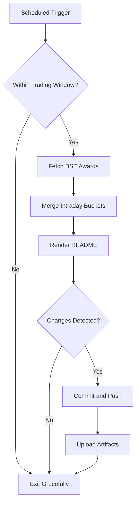

# Bombay Duck 🦆

     

<!-- aim:start -->

## Aim 🎯

⚠️ **Caution:\*\*** This project does not recommend buying or selling any security; it simply tracks BSE "Award of Order / Receipt of Order" announcements for informational purposes.

Bombay Duck keeps a pulse on BSE's "Award of Order / Receipt of Order" announcements so traders can spot fresh bullish catalysts without refreshing the exchange site. The goal is a hands-free tracker that respects BSE rate limits, stores every intraday fetch in git, and keeps the repository's front page as a living dashboard.

<!-- aim:end -->

## Intraday Snapshot 📊

ℹ️ **Important:\*\*** The README snapshot is updated automatically by the scheduled GitHub Action. Always pull the latest changes (or rebase) before editing README content locally to avoid merge conflicts.

<!-- snapshot:start -->

### Today's Awarded Orders (2026-01-12 IST)

| Hour (IST) | Company | Code | Headline | Profit Outlook | Announced At |
| --- | --- | --- | --- | --- | --- |
| 2026-01-12 15:00 | JTL Industries Ltd | 534600 | Receipt of Landmark Order from Punjab State Transmission Corporation Limited ([Link](https://www.bseindia.com/stock-share-price/jtl-industries-ltd/jtlind/534600/)) | Likely Positive | 12 Jan 2026 - 15:01 |
| 2026-01-12 12:00 | JD Cables Ltd | 544524 | Pursuant to Regulation 30 of SEBI (LODR) Regulations 2015, the intimation is given by the company regarding the bagging of the work order from a reputed EPC Contractor for Rs. 19.55 crores .... ([Link](https://www.bseindia.com/stock-share-price/jd-cables-ltd/jdcables/544524/)) | Likely Positive | 12 Jan 2026 - 12:32 |
| 2026-01-12 12:00 | Krystal Integrated Services Ltd | 544149 | Intimation under Regulation 30 of SEBI (Listing Obligations and Disclosure Requirements), Regulations 2015 ([Link](https://www.bseindia.com/stock-share-price/krystal-integrated-services-ltd/krystal/544149/)) | Neutral | 12 Jan 2026 - 12:21 |
| 2026-01-12 12:00 | Krystal Integrated Services Ltd | 544149 | Intimation under Regulation 30 of SEBI (Listing Obligations and Disclosure Requirements) Regulations, 2015 ([Link](https://www.bseindia.com/stock-share-price/krystal-integrated-services-ltd/krystal/544149/)) | Neutral | 12 Jan 2026 - 12:18 |
| 2026-01-12 12:00 | Krystal Integrated Services Ltd | 544149 | Intimation under Regulation 30 of SEBI (Listing Obligations and Disclosure Requirements), Regulations 2015 ([Link](https://www.bseindia.com/stock-share-price/krystal-integrated-services-ltd/krystal/544149/)) | Neutral | 12 Jan 2026 - 12:14 |
| 2026-01-12 11:00 | Siyaram Recycling Industries Ltd | 544047 | Intimation with Regards to Siyaram Recycling Secured Order amounting to Rs 40466844 Pursuant to Regulation 30 of SEBI ( Listing Obligation and Disclosure Requirements) Regulation 2015 ([Link](https://www.bseindia.com/stock-share-price/siyaram-recycling-industries-ltd/siyaram/544047/)) | Likely Positive | 12 Jan 2026 - 11:39 |
| 2026-01-12 10:00 | Quest Flow Controls Ltd | 543982 | Pursuant to Regulation 30 of the SEBI (Listing Obligations and Disclosure Requirements) Regulations, 2015 ('Listing Regulations'), we hereby inform you that purchase order received from .... ([Link](https://www.bseindia.com/stock-share-price/quest-flow-controls-ltd/questflow/543982/)) | Likely Positive | 12 Jan 2026 - 10:43 |
| 2026-01-12 08:00 | Man Industries (India) Ltd-$ | 513269 | This is to inform that the Company has received new orders for approx. Rs. 550 crores. ([Link](https://www.bseindia.com/stock-share-price/man-industries-(india)-ltd/maninds/513269/)) | Likely Positive | 12 Jan 2026 - 08:52 |
| 2026-01-12 08:00 | TANFAC Industries Ltd-$ | 506854 | Disclosure under regulation 30 of SEBI LODR - Signing of Contract ([Link](https://www.bseindia.com/stock-share-price/tanfac-industries-ltd/tanfacind/506854/)) | Likely Positive | 12 Jan 2026 - 08:52 |
| 2026-01-12 08:00 | Shakti Pumps India Ltd-$ | 531431 | We glad to inform that Company has received 1st Letter of Award from Karnataka Renewable Energy Development Limited for 16,780 Standalone Off-Grid DC Solar Photovoltaic Water Pumping Systems .... ([Link](https://www.bseindia.com/stock-share-price/shakti-pumps-india-ltd/shaktipump/531431/)) | Neutral | 12 Jan 2026 - 08:39 |

_Last updated: 12 Jan 2026 - 15:34 | Entries: 10 | Requests: 8 | Retries: 0 | [Raw JSON](data/2026-01-12.json)_

<!-- snapshot:end -->

<!-- how-it-works:start -->

## How It Works ⚙️

1. Scheduled GitHub Action runs at the top of each hour from 09:00 to 16:00 IST, Monday through Friday.
2. Trading-window guard aborts early outside market hours or on weekends/holidays.
3. Node.js fetcher (with throttling and retries) polls the BSE API and archives the raw JSON response.
4. Intraday state manager deduplicates announcements per hour and rolls over automatically at the next market open.
5. Mustache-based renderer injects a fresh table into the README so the latest data is always visible.
6. If anything changed, the workflow commits the README and JSON state back to `main` using a bot token and uploads artifacts for auditing.

<!-- how-it-works:end -->

## Automation Timeline 🕒

- **09:00 IST**: First eligible run clears out yesterday's state, fetches fresh announcements, and resets the README snapshot.
- **09:15-15:00 IST**: At the top of each hour the workflow repeats the fetch->merge->render pipeline, committing only when new data appears.
- **After 15:00 IST**: Guard step exits successfully; the last intraday snapshot remains until markets reopen.

## Project Resources 📚

- 📘 [Contributing Guidelines](CONTRIBUTING.md)
- 🧾 [Pull Request Guide](PR_GUIDE.md)
- 🐞 [Known Issues](KNOWN_ISSUES.md)
- 👥 [Authors](AUTHORS.md)

## Appendix 📎

- **API Endpoint:** `https://api.bseindia.com/BseIndiaAPI/api/AnnSubCategoryGetData/w`
- **Query Parameters:** `strCat=Company Update`, `subcategory=Award of Order / Receipt of Order`; date fields align with the active IST trading day.
- **Outputs:** Exposes `trading_date`, `announcement_count`, and the JSON-encoded announcements via `GITHUB_OUTPUT` for downstream jobs.
- **Logs & Summaries:** Fetch step writes a Markdown table to the GitHub Step Summary for quick triage.
