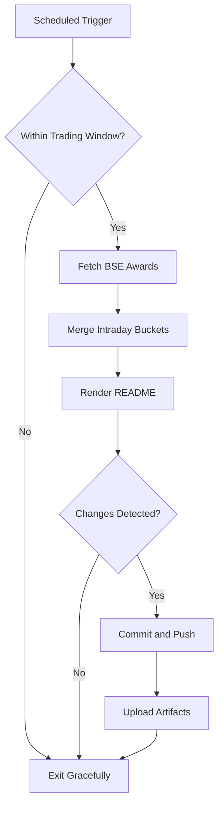

# Bombay Duck 🦆

     

<!-- aim:start -->

## Aim 🎯

⚠️ **Caution:\*\*** This project does not recommend buying or selling any security; it simply tracks BSE "Award of Order / Receipt of Order" announcements for informational purposes.

Bombay Duck keeps a pulse on BSE's "Award of Order / Receipt of Order" announcements so traders can spot fresh bullish catalysts without refreshing the exchange site. The goal is a hands-free tracker that respects BSE rate limits, stores every intraday fetch in git, and keeps the repository's front page as a living dashboard.

<!-- aim:end -->

## Intraday Snapshot 📊

ℹ️ **Important:\*\*** The README snapshot is updated automatically by the scheduled GitHub Action. Always pull the latest changes (or rebase) before editing README content locally to avoid merge conflicts.

<!-- snapshot:start -->

### Today's Awarded Orders (2026-02-18 IST)

| Hour (IST) | Company | Code | Headline | Profit Outlook | Announced At |
| --- | --- | --- | --- | --- | --- |
| 2026-02-18 15:00 | B. L. Kashyap and Sons Ltd | 532719 | The Company has secured a new work order of Rs. 300 Crores ([Link](https://www.bseindia.com/stock-share-price/b-l-kashyap-and-sons-ltd/blkashyap/532719/)) | Likely Positive | 18 Feb 2026 - 15:33 |
| 2026-02-18 15:00 | Airfloa Rail Technology Ltd | 544516 | Airfloa Rail Technology Ltd in receipt of new Order value of Rs.11.78 Crores ([Link](https://www.bseindia.com/stock-share-price/airfloa-rail-technology-ltd/airfloa/544516/)) | Likely Positive | 18 Feb 2026 - 15:08 |
| 2026-02-18 15:00 | Dhabriya Polywood Ltd | 538715 | Intimation of Receipt of Work orders by Dhabriya Polywood Limited and it''s wholly owned subsidiary company i.e. Dynasty Modular Furnitures Private Limited. ([Link](https://www.bseindia.com/stock-share-price/dhabriya-polywood-ltd/dhabriya/538715/)) | Likely Positive | 18 Feb 2026 - 15:04 |
| 2026-02-18 15:00 | Aptech Ltd | 532475 | Disclosure under Regulation 30 of SEBI (Listing Obligations and Disclosure Requirements) Regulations, 2015 ([Link](https://www.bseindia.com/stock-share-price/aptech-ltd/aptecht/532475/)) | Neutral | 18 Feb 2026 - 15:01 |
| 2026-02-18 15:00 | Rail Vikas Nigam Ltd | 542649 | Disclosure under Regulation 30 of SEBI (LODR) Regulations, 2015- Receipt of Letter of Acceptance (LOA) from Northern Railway ([Link](https://www.bseindia.com/stock-share-price/rail-vikas-nigam-ltd/rvnl/542649/)) | Likely Positive | 18 Feb 2026 - 15:01 |
| 2026-02-18 12:00 | Power Mech Projects Ltd | 539302 | Please find the enclosed ([Link](https://www.bseindia.com/stock-share-price/power-mech-projects-ltd/powermech/539302/)) | Neutral | 18 Feb 2026 - 12:18 |
| 2026-02-18 11:00 | ITCONS E-Solutions Ltd | 543806 | We are pleased to inform that the comapny ahs received a new contract of Rs. 1943307.67 from Indian Railways, Sourthern Railways, Ministry of Railways. For more details kindly refer attached file. ([Link](https://www.bseindia.com/stock-share-price/itcons-e-solutions-ltd/itcons/543806/)) | Likely Positive | 18 Feb 2026 - 11:29 |

_Last updated: 18 Feb 2026 - 15:45 | Entries: 7 | Requests: 8 | Retries: 0 | [Raw JSON](data/2026-02-18.json)_

<!-- snapshot:end -->

<!-- how-it-works:start -->

## How It Works ⚙️

1. Scheduled GitHub Action runs at the top of each hour from 09:00 to 16:00 IST, Monday through Friday.
2. Trading-window guard aborts early outside market hours or on weekends/holidays.
3. Node.js fetcher (with throttling and retries) polls the BSE API and archives the raw JSON response.
4. Intraday state manager deduplicates announcements per hour and rolls over automatically at the next market open.
5. Mustache-based renderer injects a fresh table into the README so the latest data is always visible.
6. If anything changed, the workflow commits the README and JSON state back to `main` using a bot token and uploads artifacts for auditing.

<!-- how-it-works:end -->

## Automation Timeline 🕒

- **09:00 IST**: First eligible run clears out yesterday's state, fetches fresh announcements, and resets the README snapshot.
- **09:15-15:00 IST**: At the top of each hour the workflow repeats the fetch->merge->render pipeline, committing only when new data appears.
- **After 15:00 IST**: Guard step exits successfully; the last intraday snapshot remains until markets reopen.

## Project Resources 📚

- 📘 [Contributing Guidelines](CONTRIBUTING.md)
- 🧾 [Pull Request Guide](PR_GUIDE.md)
- 🐞 [Known Issues](KNOWN_ISSUES.md)
- 👥 [Authors](AUTHORS.md)

## Appendix 📎

- **API Endpoint:** `https://api.bseindia.com/BseIndiaAPI/api/AnnSubCategoryGetData/w`
- **Query Parameters:** `strCat=Company Update`, `subcategory=Award of Order / Receipt of Order`; date fields align with the active IST trading day.
- **Outputs:** Exposes `trading_date`, `announcement_count`, and the JSON-encoded announcements via `GITHUB_OUTPUT` for downstream jobs.
- **Logs & Summaries:** Fetch step writes a Markdown table to the GitHub Step Summary for quick triage.
