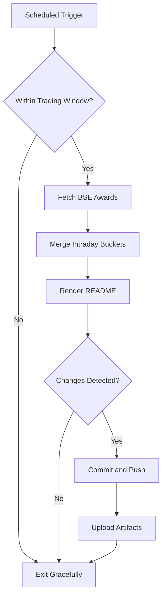

# Bombay Duck 🦆

     

<!-- aim:start -->

## Aim 🎯

⚠️ **Caution:\*\*** This project does not recommend buying or selling any security; it simply tracks BSE "Award of Order / Receipt of Order" announcements for informational purposes.

Bombay Duck keeps a pulse on BSE's "Award of Order / Receipt of Order" announcements so traders can spot fresh bullish catalysts without refreshing the exchange site. The goal is a hands-free tracker that respects BSE rate limits, stores every intraday fetch in git, and keeps the repository's front page as a living dashboard.

<!-- aim:end -->

## Intraday Snapshot 📊

ℹ️ **Important:\*\*** The README snapshot is updated automatically by the scheduled GitHub Action. Always pull the latest changes (or rebase) before editing README content locally to avoid merge conflicts.

<!-- snapshot:start -->

### Today's Awarded Orders (2026-01-20 IST)

| Hour (IST) | Company | Code | Headline | Profit Outlook | Announced At |
| --- | --- | --- | --- | --- | --- |
| 2026-01-20 15:00 | Tinna Rubber and Infrastructure Ltd | 530475 | Tinna Rubber And Infrastructure Limited has informed the Stock Exchange about Bagging/Receiving of orders/Contracts from Indian Oil Corporation Limited for providing Crumb Rubber Modifier .... ([Link](https://www.bseindia.com/stock-share-price/tinna-rubber-and-infrastructure-ltd/tinnarubr/530475/)) | Likely Positive | 20 Jan 2026 - 15:13 |
| 2026-01-20 14:00 | Patel Retail Ltd | 544487 | Patel Retail Limited has informed the Exchange about Bagging/ Receiving of Orders/ Contracts. ([Link](https://www.bseindia.com/stock-share-price/patel-retail-ltd/patelrmart/544487/)) | Likely Positive | 20 Jan 2026 - 14:50 |
| 2026-01-20 14:00 | Gabion Technologies India Ltd | 544675 | Disclosure under Regulation-30, Press Release with regards to Bagging of orders in last week ([Link](https://www.bseindia.com/stock-share-price/gabion-technologies-india-ltd/gtil/544675/)) | Likely Positive | 20 Jan 2026 - 14:43 |
| 2026-01-20 12:00 | Medico Remedies Ltd | 540937 | Please find attached Intimation under Regulation 30 of SEBI LODR Regulations 2025 ([Link](https://www.bseindia.com/stock-share-price/medico-remedies-ltd/medico/540937/)) | Neutral | 20 Jan 2026 - 12:35 |
| 2026-01-20 11:00 | Prostarm Info Systems Ltd | 544410 | Prostarm Info Systems Limited has been declared as L-1 bidder by SAIL for 2MW Roof Top Solar Project ([Link](https://www.bseindia.com/stock-share-price/prostarm-info-systems-ltd/prostarm/544410/)) | Neutral | 20 Jan 2026 - 11:38 |
| 2026-01-20 10:00 | Cranex Ltd | 522001 | Pursuant to Regulation 30 of SEBI (Listing Obligations and Disclosure Requirements) Regulations, 2015 and the relevant amendment thereto from time to time, we would like to inform you that .... ([Link](https://www.bseindia.com/stock-share-price/cranex-ltd/cranex/522001/)) | Neutral | 20 Jan 2026 - 10:36 |
| 2026-01-20 07:00 | Atishay Ltd | 538713 | The Company has received a work order for Digitisation of Registration Records from the Department of Prohibition, Excise and Registration, Government of Bihar- Order Value Rs. 3.77 Crores. .... ([Link](https://www.bseindia.com/stock-share-price/atishay-ltd/atishay/538713/)) | Likely Positive | 20 Jan 2026 - 07:59 |

_Last updated: 20 Jan 2026 - 15:35 | Entries: 7 | Requests: 8 | Retries: 0 | [Raw JSON](data/2026-01-20.json)_

<!-- snapshot:end -->

<!-- how-it-works:start -->

## How It Works ⚙️

1. Scheduled GitHub Action runs at the top of each hour from 09:00 to 16:00 IST, Monday through Friday.
2. Trading-window guard aborts early outside market hours or on weekends/holidays.
3. Node.js fetcher (with throttling and retries) polls the BSE API and archives the raw JSON response.
4. Intraday state manager deduplicates announcements per hour and rolls over automatically at the next market open.
5. Mustache-based renderer injects a fresh table into the README so the latest data is always visible.
6. If anything changed, the workflow commits the README and JSON state back to `main` using a bot token and uploads artifacts for auditing.

<!-- how-it-works:end -->

## Automation Timeline 🕒

- **09:00 IST**: First eligible run clears out yesterday's state, fetches fresh announcements, and resets the README snapshot.
- **09:15-15:00 IST**: At the top of each hour the workflow repeats the fetch->merge->render pipeline, committing only when new data appears.
- **After 15:00 IST**: Guard step exits successfully; the last intraday snapshot remains until markets reopen.

## Project Resources 📚

- 📘 [Contributing Guidelines](CONTRIBUTING.md)
- 🧾 [Pull Request Guide](PR_GUIDE.md)
- 🐞 [Known Issues](KNOWN_ISSUES.md)
- 👥 [Authors](AUTHORS.md)

## Appendix 📎

- **API Endpoint:** `https://api.bseindia.com/BseIndiaAPI/api/AnnSubCategoryGetData/w`
- **Query Parameters:** `strCat=Company Update`, `subcategory=Award of Order / Receipt of Order`; date fields align with the active IST trading day.
- **Outputs:** Exposes `trading_date`, `announcement_count`, and the JSON-encoded announcements via `GITHUB_OUTPUT` for downstream jobs.
- **Logs & Summaries:** Fetch step writes a Markdown table to the GitHub Step Summary for quick triage.
