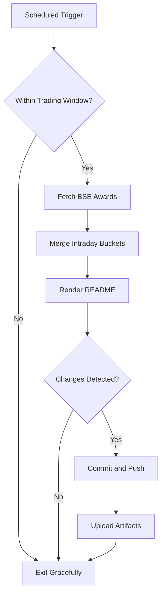

# Bombay Duck 🦆

     

<!-- aim:start -->

## Aim 🎯

⚠️ **Caution:\*\*** This project does not recommend buying or selling any security; it simply tracks BSE "Award of Order / Receipt of Order" announcements for informational purposes.

Bombay Duck keeps a pulse on BSE's "Award of Order / Receipt of Order" announcements so traders can spot fresh bullish catalysts without refreshing the exchange site. The goal is a hands-free tracker that respects BSE rate limits, stores every intraday fetch in git, and keeps the repository's front page as a living dashboard.

<!-- aim:end -->

## Intraday Snapshot 📊

ℹ️ **Important:\*\*** The README snapshot is updated automatically by the scheduled GitHub Action. Always pull the latest changes (or rebase) before editing README content locally to avoid merge conflicts.

<!-- snapshot:start -->

### Today's Awarded Orders (2025-10-15 IST)

| Hour (IST) | Company | Code | Headline | Profit Outlook | Announced At |
| --- | --- | --- | --- | --- | --- |
| 2025-10-15 15:00 | Meta Infotech Ltd | 544441 | We wish to inform that company has received renewal of purchase orders amounting to Rs. 28.77/- lakhs bagged by the Company in the ordinary course of business, since previous intimation .... ([Link](https://www.bseindia.com/stock-share-price/meta-infotech-ltd/metainfo/544441/)) | Likely Positive | 15 Oct 2025 - 15:31 |
| 2025-10-15 14:00 | Indobell Insulations Ltd | 544334 | New Order Awarded to the Company ([Link](https://www.bseindia.com/stock-share-price/indobell-insulations-ltd/indobell/544334/)) | Likely Positive | 15 Oct 2025 - 14:58 |
| 2025-10-15 14:00 | Marsons Ltd | 517467 | We are pleased to announce that our Company has received a Purchase order worth Rs. 25,84,96,779.00 (incl GST ) from West Bengal State Electricity Distribution Company Limited for manufacturing, .... ([Link](https://www.bseindia.com/stock-share-price/marsons-ltd/marsons/517467/)) | Likely Positive | 15 Oct 2025 - 14:24 |
| 2025-10-15 14:00 | Seamec Ltd | 526807 | Please find as attached. ([Link](https://www.bseindia.com/stock-share-price/seamec-ltd/seamecltd/526807/)) | Neutral | 15 Oct 2025 - 14:21 |
| 2025-10-15 13:00 | Ultracab (India) Ltd | 538706 | Enclosed herewith Intimation on Awarded 50 Crores Purchase Order from Larsen & Toubro (L&T Construction), EPC Divisions. ([Link](https://www.bseindia.com/stock-share-price/ultracab-(india)-ltd/ultracab/538706/)) | Likely Positive | 15 Oct 2025 - 13:59 |
| 2025-10-15 13:00 | Toss The Coin Ltd | 544303 | Announcement under Regulation 30 (LODR)-Master Retainer Service Agreement ([Link](https://www.bseindia.com/stock-share-price/toss-the-coin-ltd/ttc/544303/)) | Neutral | 15 Oct 2025 - 13:57 |
| 2025-10-15 13:00 | Ultracab (India) Ltd | 538706 | Enclosed herewith intimation for Award of Annual Rate Contract (ARC) from Larsen & Toubro Limited (L&T Construction) for Supply of 63 LT Cable Items Across 600+ PAN India Sites Covering .... ([Link](https://www.bseindia.com/stock-share-price/ultracab-(india)-ltd/ultracab/538706/)) | Likely Positive | 15 Oct 2025 - 13:53 |
| 2025-10-15 13:00 | Waaree Renewable Technologies Ltd | 534618 | Received order of EPC work for 150 MWac/ 217.5 MWp. ([Link](https://www.bseindia.com/stock-share-price/waaree-renewable-technologies-ltd/waareertl/534618/)) | Likely Positive | 15 Oct 2025 - 13:42 |
| 2025-10-15 11:00 | Butterfly Gandhimathi Appliances Ltd | 517421 | Receipt of Order ([Link](https://www.bseindia.com/stock-share-price/butterfly-gandhimathi-appliances-ltd/butterfly/517421/)) | Likely Positive | 15 Oct 2025 - 11:32 |
| 2025-10-15 10:00 | Power Mech Projects Ltd | 539302 | Please find the attched order intimation ([Link](https://www.bseindia.com/stock-share-price/power-mech-projects-ltd/powermech/539302/)) | Likely Positive | 15 Oct 2025 - 10:50 |
| 2025-10-15 08:00 | Mini Diamonds India Ltd | 523373 | Receipt of export order for lab-grown cut and polished diamonds amounting to USD 1.50 millions (approximately INR 13,35,00,000) ([Link](https://www.bseindia.com/stock-share-price/mini-diamonds-india-ltd/minid/523373/)) | Likely Positive | 15 Oct 2025 - 08:26 |

_Last updated: 15 Oct 2025 - 15:34 | Entries: 11 | Requests: 8 | Retries: 0 | [Raw JSON](data/2025-10-15.json)_

<!-- snapshot:end -->

<!-- how-it-works:start -->

## How It Works ⚙️

1. Scheduled GitHub Action runs at the top of each hour from 09:00 to 16:00 IST, Monday through Friday.
2. Trading-window guard aborts early outside market hours or on weekends/holidays.
3. Node.js fetcher (with throttling and retries) polls the BSE API and archives the raw JSON response.
4. Intraday state manager deduplicates announcements per hour and rolls over automatically at the next market open.
5. Mustache-based renderer injects a fresh table into the README so the latest data is always visible.
6. If anything changed, the workflow commits the README and JSON state back to `main` using a bot token and uploads artifacts for auditing.

<!-- how-it-works:end -->

## Automation Timeline 🕒

- **09:00 IST**: First eligible run clears out yesterday's state, fetches fresh announcements, and resets the README snapshot.
- **09:15-15:00 IST**: At the top of each hour the workflow repeats the fetch->merge->render pipeline, committing only when new data appears.
- **After 15:00 IST**: Guard step exits successfully; the last intraday snapshot remains until markets reopen.

## Project Resources 📚

- 📘 [Contributing Guidelines](CONTRIBUTING.md)
- 🧾 [Pull Request Guide](PR_GUIDE.md)
- 🐞 [Known Issues](KNOWN_ISSUES.md)
- 👥 [Authors](AUTHORS.md)

## Appendix 📎

- **API Endpoint:** `https://api.bseindia.com/BseIndiaAPI/api/AnnSubCategoryGetData/w`
- **Query Parameters:** `strCat=Company Update`, `subcategory=Award of Order / Receipt of Order`; date fields align with the active IST trading day.
- **Outputs:** Exposes `trading_date`, `announcement_count`, and the JSON-encoded announcements via `GITHUB_OUTPUT` for downstream jobs.
- **Logs & Summaries:** Fetch step writes a Markdown table to the GitHub Step Summary for quick triage.
