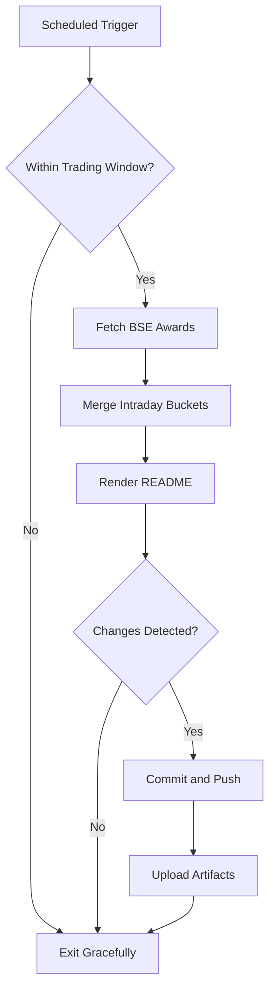

# Bombay Duck 🦆

     

<!-- aim:start -->

## Aim 🎯

⚠️ **Caution:\*\*** This project does not recommend buying or selling any security; it simply tracks BSE "Award of Order / Receipt of Order" announcements for informational purposes.

Bombay Duck keeps a pulse on BSE's "Award of Order / Receipt of Order" announcements so traders can spot fresh bullish catalysts without refreshing the exchange site. The goal is a hands-free tracker that respects BSE rate limits, stores every intraday fetch in git, and keeps the repository's front page as a living dashboard.

<!-- aim:end -->

## Intraday Snapshot 📊

ℹ️ **Important:\*\*** The README snapshot is updated automatically by the scheduled GitHub Action. Always pull the latest changes (or rebase) before editing README content locally to avoid merge conflicts.

<!-- snapshot:start -->

### Today's Awarded Orders (2026-01-01 IST)

| Hour (IST) | Company | Code | Headline | Profit Outlook | Announced At |
| --- | --- | --- | --- | --- | --- |
| 2026-01-01 12:00 | Marsons Ltd | 517467 | We are pleased to announce that our company has received a purchase order worth Rs. 22,39,05,000/- (incl GST)from Cabcon India Limited (Project) for supply of 10 MVA 33/11KV Power transformers. ([Link](https://www.bseindia.com/stock-share-price/marsons-ltd/marsons/517467/)) | Likely Positive | 01 Jan 2026 - 12:28 |
| 2026-01-01 12:00 | Shakti Pumps India Ltd-$ | 531431 | We glad to inform that Company has further received new work order from Madhya Pradesh Urja Vikas Nigam Limited for 1,952 stand-alone off grid DC Solar Photovoltaic Water Pumping Systems .... ([Link](https://www.bseindia.com/stock-share-price/shakti-pumps-india-ltd/shaktipump/531431/)) | Likely Positive | 01 Jan 2026 - 12:17 |
| 2026-01-01 11:00 | KEC International Ltd | 532714 | We are pleased to enclose a copy of the press release with respect to new orders of Rs. 1,050 crores secured by the Company. All the Orders mentioned in the enclosed press release have .... ([Link](https://www.bseindia.com/stock-share-price/kec-international-ltd/kec/532714/)) | Likely Positive | 01 Jan 2026 - 11:49 |
| 2026-01-01 08:00 | Kalpataru Projects International Ltd | 522287 | Press Release - KPIL AWARDED NEW ORDERS OF RS. 719 CRORES ([Link](https://www.bseindia.com/stock-share-price/kalpataru-projects-international-ltd/kpil/522287/)) | Likely Positive | 01 Jan 2026 - 08:42 |

_Last updated: 01 Jan 2026 - 12:35 | Entries: 4 | Requests: 5 | Retries: 0 | [Raw JSON](data/2026-01-01.json)_

<!-- snapshot:end -->

<!-- how-it-works:start -->

## How It Works ⚙️

1. Scheduled GitHub Action runs at the top of each hour from 09:00 to 16:00 IST, Monday through Friday.
2. Trading-window guard aborts early outside market hours or on weekends/holidays.
3. Node.js fetcher (with throttling and retries) polls the BSE API and archives the raw JSON response.
4. Intraday state manager deduplicates announcements per hour and rolls over automatically at the next market open.
5. Mustache-based renderer injects a fresh table into the README so the latest data is always visible.
6. If anything changed, the workflow commits the README and JSON state back to `main` using a bot token and uploads artifacts for auditing.

<!-- how-it-works:end -->

## Automation Timeline 🕒

- **09:00 IST**: First eligible run clears out yesterday's state, fetches fresh announcements, and resets the README snapshot.
- **09:15-15:00 IST**: At the top of each hour the workflow repeats the fetch->merge->render pipeline, committing only when new data appears.
- **After 15:00 IST**: Guard step exits successfully; the last intraday snapshot remains until markets reopen.

## Project Resources 📚

- 📘 [Contributing Guidelines](CONTRIBUTING.md)
- 🧾 [Pull Request Guide](PR_GUIDE.md)
- 🐞 [Known Issues](KNOWN_ISSUES.md)
- 👥 [Authors](AUTHORS.md)

## Appendix 📎

- **API Endpoint:** `https://api.bseindia.com/BseIndiaAPI/api/AnnSubCategoryGetData/w`
- **Query Parameters:** `strCat=Company Update`, `subcategory=Award of Order / Receipt of Order`; date fields align with the active IST trading day.
- **Outputs:** Exposes `trading_date`, `announcement_count`, and the JSON-encoded announcements via `GITHUB_OUTPUT` for downstream jobs.
- **Logs & Summaries:** Fetch step writes a Markdown table to the GitHub Step Summary for quick triage.
