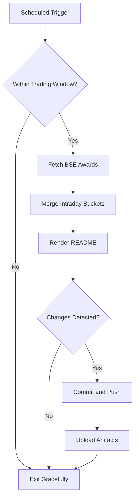

# Bombay Duck 🦆

     

<!-- aim:start -->

## Aim 🎯

⚠️ **Caution:\*\*** This project does not recommend buying or selling any security; it simply tracks BSE "Award of Order / Receipt of Order" announcements for informational purposes.

Bombay Duck keeps a pulse on BSE's "Award of Order / Receipt of Order" announcements so traders can spot fresh bullish catalysts without refreshing the exchange site. The goal is a hands-free tracker that respects BSE rate limits, stores every intraday fetch in git, and keeps the repository's front page as a living dashboard.

<!-- aim:end -->

## Intraday Snapshot 📊

ℹ️ **Important:\*\*** The README snapshot is updated automatically by the scheduled GitHub Action. Always pull the latest changes (or rebase) before editing README content locally to avoid merge conflicts.

<!-- snapshot:start -->

### Today's Awarded Orders (2025-10-09 IST)

| Hour (IST) | Company | Code | Headline | Profit Outlook | Announced At |
| --- | --- | --- | --- | --- | --- |
| 2025-10-09 14:00 | NIBE Ltd | 535136 | The Company has received Purchase Order of Rs. 29.07 Crore from one of the leading Infra and Defence Company ([Link](https://www.bseindia.com/stock-share-price/nibe-ltd/nibe/535136/)) | Likely Positive | 09 Oct 2025 - 14:55 |
| 2025-10-09 14:00 | HPL Electric & Power Ltd | 540136 | Amendment to the Notification of award dated September 24, 2025. ([Link](https://www.bseindia.com/stock-share-price/hpl-electric--power-ltd/hpl/540136/)) | Neutral | 09 Oct 2025 - 14:51 |
| 2025-10-09 13:00 | Power and Instrumentation (Gujarat) Ltd | 543912 | Intimation under Regulation 30 of SEBI (Listing obligations and Disclosure Requirements) Regulations 2015 ([Link](https://www.bseindia.com/stock-share-price/power-and-instrumentation-(gujarat)-ltd/pigl/543912/)) | Neutral | 09 Oct 2025 - 13:44 |
| 2025-10-09 13:00 | Crompton Greaves Consumer Electricals Ltd | 539876 | Intimation of Order passed ([Link](https://www.bseindia.com/stock-share-price/crompton-greaves-consumer-electricals-ltd/crompton/539876/)) | Likely Positive | 09 Oct 2025 - 13:13 |
| 2025-10-09 13:00 | Sungold Capital Ltd | 531433 | Receipt of Final Order from SEBI bearing reference no WTM/AN/IVD/AD5/31713/2025-26 dated 08.10.2025 ([Link](https://www.bseindia.com/stock-share-price/sungold-capital-ltd/sungold/531433/)) | Likely Positive | 09 Oct 2025 - 13:06 |
| 2025-10-09 12:00 | Vascon Engineers Ltd | 533156 | Letter of Intent for Redevelopment of "Saudamini" building for MSEB HCL Mahalaxmi, Mumbai amounting to Rs. 161.18 Crore ([Link](https://www.bseindia.com/stock-share-price/vascon-engineers-ltd/vasconeq/533156/)) | Neutral | 09 Oct 2025 - 12:53 |
| 2025-10-09 12:00 | Panacea Biotec Ltd | 531349 | We are delighted to inform you that the Central Medical Services Society, Ministry of Health and Family Welfare, Government of India (CMSS) has, vide its Letter of Acceptance (LOA) dated .... ([Link](https://www.bseindia.com/stock-share-price/panacea-biotec-ltd/panaceabio/531349/)) | Neutral | 09 Oct 2025 - 12:18 |
| 2025-10-09 11:00 | Marsons Ltd | 517467 | We are pleased to announce that our company has received a Purchase Order worth Rs. 17,48,76,000/- (incl GST)(Rupees Seventeen Crores Forty Eight lakh and Seventy Six Thousand only) from .... ([Link](https://www.bseindia.com/stock-share-price/marsons-ltd/marsons/517467/)) | Likely Positive | 09 Oct 2025 - 11:38 |
| 2025-10-09 10:00 | Larsen & Toubro Ltd | 500510 | L&T Wins (Ultra-Mega*) Order for Hydrocarbon Onshore Business ([Link](https://www.bseindia.com/stock-share-price/larsen--toubro-ltd/lt/500510/)) | Likely Positive | 09 Oct 2025 - 10:47 |

_Last updated: 09 Oct 2025 - 15:34 | Entries: 9 | Requests: 8 | Retries: 0 | [Raw JSON](data/2025-10-09.json)_

<!-- snapshot:end -->

<!-- how-it-works:start -->

## How It Works ⚙️

1. Scheduled GitHub Action runs at the top of each hour from 09:00 to 16:00 IST, Monday through Friday.
2. Trading-window guard aborts early outside market hours or on weekends/holidays.
3. Node.js fetcher (with throttling and retries) polls the BSE API and archives the raw JSON response.
4. Intraday state manager deduplicates announcements per hour and rolls over automatically at the next market open.
5. Mustache-based renderer injects a fresh table into the README so the latest data is always visible.
6. If anything changed, the workflow commits the README and JSON state back to `main` using a bot token and uploads artifacts for auditing.

<!-- how-it-works:end -->

## Automation Timeline 🕒

- **09:00 IST**: First eligible run clears out yesterday's state, fetches fresh announcements, and resets the README snapshot.
- **09:15-15:00 IST**: At the top of each hour the workflow repeats the fetch->merge->render pipeline, committing only when new data appears.
- **After 15:00 IST**: Guard step exits successfully; the last intraday snapshot remains until markets reopen.

## Project Resources 📚

- 📘 [Contributing Guidelines](CONTRIBUTING.md)
- 🧾 [Pull Request Guide](PR_GUIDE.md)
- 🐞 [Known Issues](KNOWN_ISSUES.md)
- 👥 [Authors](AUTHORS.md)

## Appendix 📎

- **API Endpoint:** `https://api.bseindia.com/BseIndiaAPI/api/AnnSubCategoryGetData/w`
- **Query Parameters:** `strCat=Company Update`, `subcategory=Award of Order / Receipt of Order`; date fields align with the active IST trading day.
- **Outputs:** Exposes `trading_date`, `announcement_count`, and the JSON-encoded announcements via `GITHUB_OUTPUT` for downstream jobs.
- **Logs & Summaries:** Fetch step writes a Markdown table to the GitHub Step Summary for quick triage.
