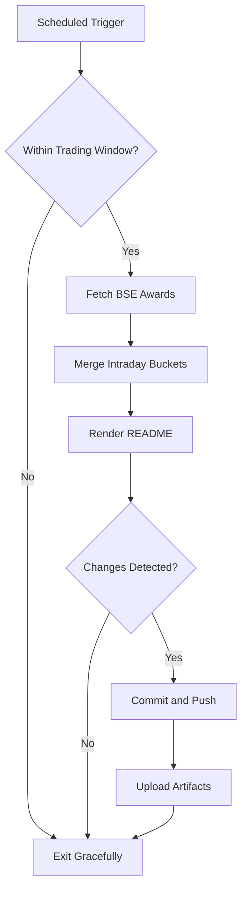

# Bombay Duck 🦆

     

<!-- aim:start -->

## Aim 🎯

⚠️ **Caution:\*\*** This project does not recommend buying or selling any security; it simply tracks BSE "Award of Order / Receipt of Order" announcements for informational purposes.

Bombay Duck keeps a pulse on BSE's "Award of Order / Receipt of Order" announcements so traders can spot fresh bullish catalysts without refreshing the exchange site. The goal is a hands-free tracker that respects BSE rate limits, stores every intraday fetch in git, and keeps the repository's front page as a living dashboard.

<!-- aim:end -->

## Intraday Snapshot 📊

ℹ️ **Important:\*\*** The README snapshot is updated automatically by the scheduled GitHub Action. Always pull the latest changes (or rebase) before editing README content locally to avoid merge conflicts.

<!-- snapshot:start -->

### Today's Awarded Orders (2025-10-03 IST)

| Hour (IST) | Company | Code | Headline | Profit Outlook | Announced At |
| --- | --- | --- | --- | --- | --- |
| 2025-10-03 14:00 | Panacea Biotec Ltd | 531349 | We are delighted to inform you that the Company has received a Letter of Award from Unicef for a Long-Term Agreement for supply of bivalent oral polio vaccine (bOPV) to Unicef worth ~US$ .... ([Link](https://www.bseindia.com/stock-share-price/panacea-biotec-ltd/panaceabio/531349/)) | Neutral | 03 Oct 2025 - 14:27 |
| 2025-10-03 13:00 | Hiliks Technologies Ltd | 539697 | The Company has received a sub-contract order from M/s. MSR-Medikonda JV towards Comprehensive Signalling and Telecommunication works in connection with doubling of track between Dornakal .... ([Link](https://www.bseindia.com/stock-share-price/hiliks-technologies-ltd/hiliks/539697/)) | Likely Positive | 03 Oct 2025 - 13:57 |
| 2025-10-03 13:00 | Desco Infratech Ltd | 544387 | Intimation Regarding receipt of order from Sabarmati Gas Limited against previous intimation of L1 Bid on 26.09.2025 and other orders worth totaling Rs. 3.09 Cr ([Link](https://www.bseindia.com/stock-share-price/desco-infratech-ltd/desco/544387/)) | Likely Positive | 03 Oct 2025 - 13:31 |
| 2025-10-03 12:00 | Mukka Proteins Ltd | 544135 | Revised Intimation - Update on litigation. ([Link](https://www.bseindia.com/stock-share-price/mukka-proteins-ltd/mukka/544135/)) | Neutral | 03 Oct 2025 - 12:31 |
| 2025-10-03 11:00 | Larsen & Toubro Ltd | 500510 | L&T wins (Major*) Orders for Building & Factories Business ([Link](https://www.bseindia.com/stock-share-price/larsen--toubro-ltd/lt/500510/)) | Likely Positive | 03 Oct 2025 - 11:24 |
| 2025-10-03 09:00 | Paras Defence and Space Technologies Ltd | 543367 | We are pleased to inform that Paras Anti-Drone Technologies Private Limited ("Paras Anti-Drone"), a subsidiary of Paras Defence and Space Technologies Limited ("PARAS"), has received an .... ([Link](https://www.bseindia.com/stock-share-price/paras-defence-and-space-technologies-ltd/paras/543367/)) | Neutral | 03 Oct 2025 - 09:05 |

_Last updated: 03 Oct 2025 - 14:33 | Entries: 6 | Requests: 7 | Retries: 0 | [Raw JSON](data/2025-10-03.json)_

<!-- snapshot:end -->

<!-- how-it-works:start -->

## How It Works ⚙️

1. Scheduled GitHub Action runs at the top of each hour from 09:00 to 16:00 IST, Monday through Friday.
2. Trading-window guard aborts early outside market hours or on weekends/holidays.
3. Node.js fetcher (with throttling and retries) polls the BSE API and archives the raw JSON response.
4. Intraday state manager deduplicates announcements per hour and rolls over automatically at the next market open.
5. Mustache-based renderer injects a fresh table into the README so the latest data is always visible.
6. If anything changed, the workflow commits the README and JSON state back to `main` using a bot token and uploads artifacts for auditing.

<!-- how-it-works:end -->

## Automation Timeline 🕒

- **09:00 IST**: First eligible run clears out yesterday's state, fetches fresh announcements, and resets the README snapshot.
- **09:15-15:00 IST**: At the top of each hour the workflow repeats the fetch->merge->render pipeline, committing only when new data appears.
- **After 15:00 IST**: Guard step exits successfully; the last intraday snapshot remains until markets reopen.

## Project Resources 📚

- 📘 [Contributing Guidelines](CONTRIBUTING.md)
- 🧾 [Pull Request Guide](PR_GUIDE.md)
- 🐞 [Known Issues](KNOWN_ISSUES.md)
- 👥 [Authors](AUTHORS.md)

## Appendix 📎

- **API Endpoint:** `https://api.bseindia.com/BseIndiaAPI/api/AnnSubCategoryGetData/w`
- **Query Parameters:** `strCat=Company Update`, `subcategory=Award of Order / Receipt of Order`; date fields align with the active IST trading day.
- **Outputs:** Exposes `trading_date`, `announcement_count`, and the JSON-encoded announcements via `GITHUB_OUTPUT` for downstream jobs.
- **Logs & Summaries:** Fetch step writes a Markdown table to the GitHub Step Summary for quick triage.
