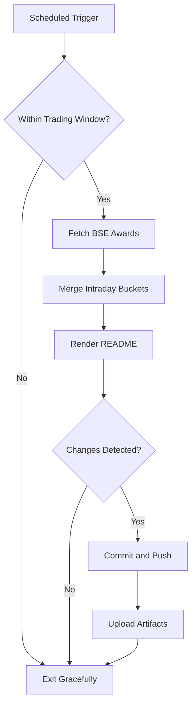

# Bombay Duck 🦆

     

<!-- aim:start -->

## Aim 🎯

⚠️ **Caution:\*\*** This project does not recommend buying or selling any security; it simply tracks BSE "Award of Order / Receipt of Order" announcements for informational purposes.

Bombay Duck keeps a pulse on BSE's "Award of Order / Receipt of Order" announcements so traders can spot fresh bullish catalysts without refreshing the exchange site. The goal is a hands-free tracker that respects BSE rate limits, stores every intraday fetch in git, and keeps the repository's front page as a living dashboard.

<!-- aim:end -->

## Intraday Snapshot 📊

ℹ️ **Important:\*\*** The README snapshot is updated automatically by the scheduled GitHub Action. Always pull the latest changes (or rebase) before editing README content locally to avoid merge conflicts.

<!-- snapshot:start -->

### Today's Awarded Orders (2025-11-25 IST)

| Hour (IST) | Company | Code | Headline | Profit Outlook | Announced At |
| --- | --- | --- | --- | --- | --- |
| 2025-11-25 14:00 | Cryogenic Ogs Ltd | 544440 | We are pleased to inform you that Cryogenic OGS Limited has received an LOI from Advanced Sys-Tek Limited amounting to Rs. 97,66,448/-. ([Link](https://www.bseindia.com/stock-share-price/cryogenic-ogs-ltd/cryogenic/544440/)) | Neutral | 25 Nov 2025 - 14:29 |
| 2025-11-25 14:00 | Oriental Rail Infrastructure Ltd | 531859 | Oriental Foundry Private Limited, a Wholly Owned Subsidiary has secured an order from Southern Railway. ([Link](https://www.bseindia.com/stock-share-price/oriental-rail-infrastructure-ltd/orirail/531859/)) | Likely Positive | 25 Nov 2025 - 14:10 |
| 2025-11-25 12:00 | Transformers and Rectifiers (India) Ltd | 532928 | We would like to inform you that TARIL has secured order of Rs. 389.97 Cr ([Link](https://www.bseindia.com/stock-share-price/transformers-and-rectifiers-(india)-ltd/taril/532928/)) | Likely Positive | 25 Nov 2025 - 12:53 |
| 2025-11-25 12:00 | Schneider Electric Infrastructure Ltd | 534139 | Pursuant to Regulation 30 of Listing Regulations, please be informed that the Company has received the Demand Order(s) from GST authority, as per the attached intimation. ([Link](https://www.bseindia.com/stock-share-price/schneider-electric-infrastructure-ltd/schneider/534139/)) | Likely Positive | 25 Nov 2025 - 12:36 |
| 2025-11-25 12:00 | B. L. Kashyap and Sons Ltd | 532719 | The Company has secured a new Order of Rs. 254.22 Crores (excluding GST) ([Link](https://www.bseindia.com/stock-share-price/b-l-kashyap-and-sons-ltd/blkashyap/532719/)) | Likely Positive | 25 Nov 2025 - 12:17 |
| 2025-11-25 11:00 | Avantel Ltd | 532406 | Receipt of Purchase Order from M/s. Bharat Electronics Limited worth of Rs.17.55 Cr ([Link](https://www.bseindia.com/stock-share-price/avantel-ltd/avantel/532406/)) | Likely Positive | 25 Nov 2025 - 11:04 |
| 2025-11-25 11:00 | ZEN Technologies Ltd | 533339 | Intimation of receipt of order from Ministry of Defence, Government of India ([Link](https://www.bseindia.com/stock-share-price/zen-technologies-ltd/zentec/533339/)) | Likely Positive | 25 Nov 2025 - 11:02 |
| 2025-11-25 09:00 | ACME Solar Holdings Ltd | 544283 | Execution of Power Purchase Agreement ([Link](https://www.bseindia.com/stock-share-price/acme-solar-holdings-ltd/acmesolar/544283/)) | Neutral | 25 Nov 2025 - 09:38 |
| 2025-11-25 09:00 | Desco Infratech Ltd | 544387 | Intimation regarding Receipt of Orders worth totaling Rs. 8.08 Cr ([Link](https://www.bseindia.com/stock-share-price/desco-infratech-ltd/desco/544387/)) | Likely Positive | 25 Nov 2025 - 09:36 |

_Last updated: 25 Nov 2025 - 14:34 | Entries: 9 | Requests: 7 | Retries: 0 | [Raw JSON](data/2025-11-25.json)_

<!-- snapshot:end -->

<!-- how-it-works:start -->

## How It Works ⚙️

1. Scheduled GitHub Action runs at the top of each hour from 09:00 to 16:00 IST, Monday through Friday.
2. Trading-window guard aborts early outside market hours or on weekends/holidays.
3. Node.js fetcher (with throttling and retries) polls the BSE API and archives the raw JSON response.
4. Intraday state manager deduplicates announcements per hour and rolls over automatically at the next market open.
5. Mustache-based renderer injects a fresh table into the README so the latest data is always visible.
6. If anything changed, the workflow commits the README and JSON state back to `main` using a bot token and uploads artifacts for auditing.

<!-- how-it-works:end -->

## Automation Timeline 🕒

- **09:00 IST**: First eligible run clears out yesterday's state, fetches fresh announcements, and resets the README snapshot.
- **09:15-15:00 IST**: At the top of each hour the workflow repeats the fetch->merge->render pipeline, committing only when new data appears.
- **After 15:00 IST**: Guard step exits successfully; the last intraday snapshot remains until markets reopen.

## Project Resources 📚

- 📘 [Contributing Guidelines](CONTRIBUTING.md)
- 🧾 [Pull Request Guide](PR_GUIDE.md)
- 🐞 [Known Issues](KNOWN_ISSUES.md)
- 👥 [Authors](AUTHORS.md)

## Appendix 📎

- **API Endpoint:** `https://api.bseindia.com/BseIndiaAPI/api/AnnSubCategoryGetData/w`
- **Query Parameters:** `strCat=Company Update`, `subcategory=Award of Order / Receipt of Order`; date fields align with the active IST trading day.
- **Outputs:** Exposes `trading_date`, `announcement_count`, and the JSON-encoded announcements via `GITHUB_OUTPUT` for downstream jobs.
- **Logs & Summaries:** Fetch step writes a Markdown table to the GitHub Step Summary for quick triage.
