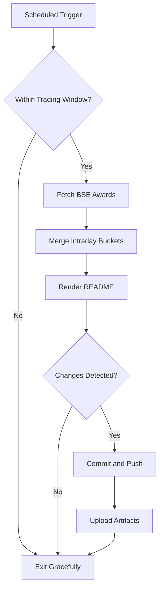

# Bombay Duck 🦆

     

<!-- aim:start -->

## Aim 🎯

⚠️ **Caution:\*\*** This project does not recommend buying or selling any security; it simply tracks BSE "Award of Order / Receipt of Order" announcements for informational purposes.

Bombay Duck keeps a pulse on BSE's "Award of Order / Receipt of Order" announcements so traders can spot fresh bullish catalysts without refreshing the exchange site. The goal is a hands-free tracker that respects BSE rate limits, stores every intraday fetch in git, and keeps the repository's front page as a living dashboard.

<!-- aim:end -->

## Intraday Snapshot 📊

ℹ️ **Important:\*\*** The README snapshot is updated automatically by the scheduled GitHub Action. Always pull the latest changes (or rebase) before editing README content locally to avoid merge conflicts.

<!-- snapshot:start -->

### Today's Awarded Orders (2025-12-31 IST)

| Hour (IST) | Company | Code | Headline | Profit Outlook | Announced At |
| --- | --- | --- | --- | --- | --- |
| 2025-12-31 13:00 | Waaree Renewable Technologies Ltd | 534618 | We are please to inform that WAAREERTL has been awarded Letter of Award (LOA) for the execution of Engineering, Procurement and Construction (EPC) works of Ground Mount Solar Power Project. ([Link](https://www.bseindia.com/stock-share-price/waaree-renewable-technologies-ltd/waareertl/534618/)) | Likely Positive | 31 Dec 2025 - 13:57 |
| 2025-12-31 12:00 | Mazda Ltd-$ | 523792 | Pursuant to Regulation 30 of SEBI Listing Regulations, we would like to inform that the company ('MAZDA LIMITED') has received an order of Rs. 28.75 Crore (excluding tax) for supply of .... ([Link](https://www.bseindia.com/stock-share-price/mazda-ltd/mazda/523792/)) | Likely Positive | 31 Dec 2025 - 12:45 |
| 2025-12-31 12:00 | Bharat Forge Ltd | 500493 | Intimation under Regulation 30 of SEBI Listing Regulations regarding award of order ([Link](https://www.bseindia.com/stock-share-price/bharat-forge-ltd/bharatforg/500493/)) | Likely Positive | 31 Dec 2025 - 12:31 |
| 2025-12-31 12:00 | Solar Industries India Ltd | 532725 | Intimation for receipt of an additional order amounting to INR 1,746 Crores from Coal India Limited ([Link](https://www.bseindia.com/stock-share-price/solar-industries-india-ltd/solarinds/532725/)) | Likely Positive | 31 Dec 2025 - 12:24 |
| 2025-12-31 12:00 | S Chand and Company Ltd | 540497 | Receipt of Income Tax Refund amounting to INR 15.67 crores ([Link](https://www.bseindia.com/stock-share-price/s-chand-and-company-ltd/schand/540497/)) | Likely Positive | 31 Dec 2025 - 12:05 |
| 2025-12-31 12:00 | Sudarshan Chemical Industries Ltd | 506655 | Announcement under Reg 30 - Intimation of receipt of GST order ([Link](https://www.bseindia.com/stock-share-price/sudarshan-chemical-industries-ltd/sudarschem/506655/)) | Likely Positive | 31 Dec 2025 - 12:02 |
| 2025-12-31 11:00 | Waaree Energies Ltd | 544277 | Receipt of Order on December 30, 2025. ([Link](https://www.bseindia.com/stock-share-price/waaree-energies-ltd/waareeener/544277/)) | Likely Positive | 31 Dec 2025 - 11:50 |
| 2025-12-31 11:00 | IL&FS Transportation Networks Ltd | 533177 | Receipt of Demand Notice ([Link](https://www.bseindia.com/stock-share-price/ilfs-transportation-networks-ltd/ilfstrans/533177/)) | Likely Positive | 31 Dec 2025 - 11:11 |
| 2025-12-31 11:00 | Moil Ltd | 533286 | Submission of receipt of Order from Joint Commisioner of State Tax, Madhya Pradesh. ([Link](https://www.bseindia.com/stock-share-price/moil-ltd/moil/533286/)) | Likely Positive | 31 Dec 2025 - 11:06 |
| 2025-12-31 10:00 | Shakti Pumps India Ltd-$ | 531431 | We glad to inform that Company has received New Work Order from Madhya Pradesh Urja Vikas Nigam for 4,840 Stand-alone Off-Grid DC Solar Photovoltaic Water Pumping Systems (SPWPS) pumps .... ([Link](https://www.bseindia.com/stock-share-price/shakti-pumps-india-ltd/shaktipump/531431/)) | Likely Positive | 31 Dec 2025 - 10:37 |
| 2025-12-31 10:00 | Mach Conferences And Events Ltd | 544248 | Enclosed. ([Link](https://www.bseindia.com/stock-share-price/mach-conferences-and-events-ltd/mcel/544248/)) | Neutral | 31 Dec 2025 - 10:00 |

_Last updated: 31 Dec 2025 - 14:35 | Entries: 11 | Requests: 7 | Retries: 0 | [Raw JSON](data/2025-12-31.json)_

<!-- snapshot:end -->

<!-- how-it-works:start -->

## How It Works ⚙️

1. Scheduled GitHub Action runs at the top of each hour from 09:00 to 16:00 IST, Monday through Friday.
2. Trading-window guard aborts early outside market hours or on weekends/holidays.
3. Node.js fetcher (with throttling and retries) polls the BSE API and archives the raw JSON response.
4. Intraday state manager deduplicates announcements per hour and rolls over automatically at the next market open.
5. Mustache-based renderer injects a fresh table into the README so the latest data is always visible.
6. If anything changed, the workflow commits the README and JSON state back to `main` using a bot token and uploads artifacts for auditing.

<!-- how-it-works:end -->

## Automation Timeline 🕒

- **09:00 IST**: First eligible run clears out yesterday's state, fetches fresh announcements, and resets the README snapshot.
- **09:15-15:00 IST**: At the top of each hour the workflow repeats the fetch->merge->render pipeline, committing only when new data appears.
- **After 15:00 IST**: Guard step exits successfully; the last intraday snapshot remains until markets reopen.

## Project Resources 📚

- 📘 [Contributing Guidelines](CONTRIBUTING.md)
- 🧾 [Pull Request Guide](PR_GUIDE.md)
- 🐞 [Known Issues](KNOWN_ISSUES.md)
- 👥 [Authors](AUTHORS.md)

## Appendix 📎

- **API Endpoint:** `https://api.bseindia.com/BseIndiaAPI/api/AnnSubCategoryGetData/w`
- **Query Parameters:** `strCat=Company Update`, `subcategory=Award of Order / Receipt of Order`; date fields align with the active IST trading day.
- **Outputs:** Exposes `trading_date`, `announcement_count`, and the JSON-encoded announcements via `GITHUB_OUTPUT` for downstream jobs.
- **Logs & Summaries:** Fetch step writes a Markdown table to the GitHub Step Summary for quick triage.
