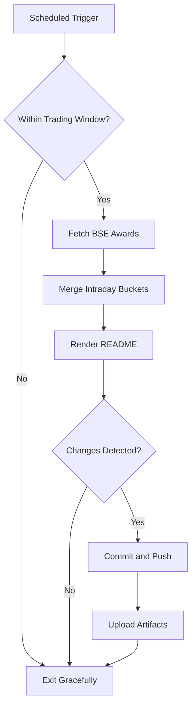

# Bombay Duck 🦆

     

<!-- aim:start -->

## Aim 🎯

⚠️ **Caution:\*\*** This project does not recommend buying or selling any security; it simply tracks BSE "Award of Order / Receipt of Order" announcements for informational purposes.

Bombay Duck keeps a pulse on BSE's "Award of Order / Receipt of Order" announcements so traders can spot fresh bullish catalysts without refreshing the exchange site. The goal is a hands-free tracker that respects BSE rate limits, stores every intraday fetch in git, and keeps the repository's front page as a living dashboard.

<!-- aim:end -->

## Intraday Snapshot 📊

ℹ️ **Important:\*\*** The README snapshot is updated automatically by the scheduled GitHub Action. Always pull the latest changes (or rebase) before editing README content locally to avoid merge conflicts.

<!-- snapshot:start -->

### Today's Awarded Orders (2025-10-14 IST)

| Hour (IST) | Company | Code | Headline | Profit Outlook | Announced At |
| --- | --- | --- | --- | --- | --- |
| 2025-10-14 14:00 | Subex Ltd | 532348 | The Company has entered into an upgarde engaement with a marquee communications service provider in the Middle East to enhance the operator''s Fraud Management (FM) capabilities ([Link](https://www.bseindia.com/stock-share-price/subex-ltd/subexltd/532348/)) | Neutral | 14 Oct 2025 - 14:33 |
| 2025-10-14 13:00 | Aptech Ltd | 532475 | Disclosure under Regulation 30 of SEBI (Listing Obligations and Disclosure Requirements) Regulations, 2015 ([Link](https://www.bseindia.com/stock-share-price/aptech-ltd/aptecht/532475/)) | Neutral | 14 Oct 2025 - 13:56 |
| 2025-10-14 13:00 | Kranti Industries Ltd | 542459 | Pursuant to Regulation 30 and other applicable regulations of SEBI (Listing Obligations and Disclosure Requirements) Regulations, 2015 and in continuation with the earlier intimation dated .... ([Link](https://www.bseindia.com/stock-share-price/kranti-industries-ltd/kranti/542459/)) | Neutral | 14 Oct 2025 - 13:22 |
| 2025-10-14 12:00 | B. L. Kashyap and Sons Ltd | 532719 | The Company has secured a new order of Rs. 295 Crores (excluding GST). ([Link](https://www.bseindia.com/stock-share-price/b-l-kashyap-and-sons-ltd/blkashyap/532719/)) | Likely Positive | 14 Oct 2025 - 12:34 |
| 2025-10-14 12:00 | Bharti Airtel Ltd | 532454 | Please find enclosed disclosure under Regulation 30 w.r.t. the Company entering into a strategic partnership with Google to set up India''s first Artificial Intelligence (AI hub) in Visakhapatnam. ([Link](https://www.bseindia.com/stock-share-price/bharti-airtel-ltd/bhartiartl/532454/)) | Neutral | 14 Oct 2025 - 12:30 |
| 2025-10-14 12:00 | KEC International Ltd | 532714 | We are pleased to enclose a copy of the press release with respect to new order of Rs. 1,064 Crores secured by the Company. The order mentioned in the enclosed press release has been received .... ([Link](https://www.bseindia.com/stock-share-price/kec-international-ltd/kec/532714/)) | Likely Positive | 14 Oct 2025 - 12:13 |

_Last updated: 14 Oct 2025 - 14:33 | Entries: 6 | Requests: 7 | Retries: 0 | [Raw JSON](data/2025-10-14.json)_

<!-- snapshot:end -->

<!-- how-it-works:start -->

## How It Works ⚙️

1. Scheduled GitHub Action runs at the top of each hour from 09:00 to 16:00 IST, Monday through Friday.
2. Trading-window guard aborts early outside market hours or on weekends/holidays.
3. Node.js fetcher (with throttling and retries) polls the BSE API and archives the raw JSON response.
4. Intraday state manager deduplicates announcements per hour and rolls over automatically at the next market open.
5. Mustache-based renderer injects a fresh table into the README so the latest data is always visible.
6. If anything changed, the workflow commits the README and JSON state back to `main` using a bot token and uploads artifacts for auditing.

<!-- how-it-works:end -->

## Automation Timeline 🕒

- **09:00 IST**: First eligible run clears out yesterday's state, fetches fresh announcements, and resets the README snapshot.
- **09:15-15:00 IST**: At the top of each hour the workflow repeats the fetch->merge->render pipeline, committing only when new data appears.
- **After 15:00 IST**: Guard step exits successfully; the last intraday snapshot remains until markets reopen.

## Project Resources 📚

- 📘 [Contributing Guidelines](CONTRIBUTING.md)
- 🧾 [Pull Request Guide](PR_GUIDE.md)
- 🐞 [Known Issues](KNOWN_ISSUES.md)
- 👥 [Authors](AUTHORS.md)

## Appendix 📎

- **API Endpoint:** `https://api.bseindia.com/BseIndiaAPI/api/AnnSubCategoryGetData/w`
- **Query Parameters:** `strCat=Company Update`, `subcategory=Award of Order / Receipt of Order`; date fields align with the active IST trading day.
- **Outputs:** Exposes `trading_date`, `announcement_count`, and the JSON-encoded announcements via `GITHUB_OUTPUT` for downstream jobs.
- **Logs & Summaries:** Fetch step writes a Markdown table to the GitHub Step Summary for quick triage.
