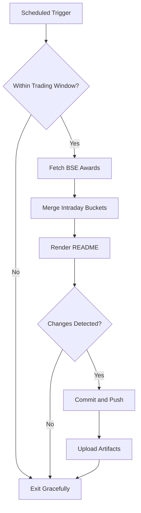

# Bombay Duck 🦆

     

<!-- aim:start -->

## Aim 🎯

⚠️ **Caution:\*\*** This project does not recommend buying or selling any security; it simply tracks BSE "Award of Order / Receipt of Order" announcements for informational purposes.

Bombay Duck keeps a pulse on BSE's "Award of Order / Receipt of Order" announcements so traders can spot fresh bullish catalysts without refreshing the exchange site. The goal is a hands-free tracker that respects BSE rate limits, stores every intraday fetch in git, and keeps the repository's front page as a living dashboard.

<!-- aim:end -->

## Intraday Snapshot 📊

ℹ️ **Important:\*\*** The README snapshot is updated automatically by the scheduled GitHub Action. Always pull the latest changes (or rebase) before editing README content locally to avoid merge conflicts.

<!-- snapshot:start -->

### Today's Awarded Orders (2026-07-03 IST)

| Hour (IST) | Company | Code | Headline | Profit Outlook | Announced At |
| --- | --- | --- | --- | --- | --- |
| 2026-07-03 16:00 | Enviro Infra Engineers Ltd | 544290 | Receipt of Order worth Rs. 126.78 Crores. ([Link](https://www.bseindia.com/stock-share-price/enviro-infra-engineers-ltd/eiel/544290/)) | Likely Positive | 03 Jul 2026 - 16:59 |
| 2026-07-03 16:00 | Enviro Infra Engineers Ltd | 544290 | Receipt of Order worth Rs. 130.14 Crores ([Link](https://www.bseindia.com/stock-share-price/enviro-infra-engineers-ltd/eiel/544290/)) | Likely Positive | 03 Jul 2026 - 16:50 |
| 2026-07-03 16:00 | RRP Defense Ltd | 530929 | Please find attached intimation regarding purchase order received from Bharat Electronics Limited (BEL), Machilipatnam Unit. ([Link](https://www.bseindia.com/stock-share-price/rrp-defense-ltd/rrpdefense/530929/)) | Likely Positive | 03 Jul 2026 - 16:15 |
| 2026-07-03 15:00 | Aptech Ltd | 532475 | Disclosure under Regulation 30 of SEBI (LODR) Regulations, 2015 ([Link](https://www.bseindia.com/stock-share-price/aptech-ltd/aptecht/532475/)) | Neutral | 03 Jul 2026 - 15:49 |
| 2026-07-03 12:00 | Marsons Ltd | 517467 | We would like to inform you that our company has received a purchase order from S. T. Electricals Pvt. Ltd. for supply of 10 MVA Power Transformers. ([Link](https://www.bseindia.com/stock-share-price/marsons-ltd/marsons/517467/)) | Likely Positive | 03 Jul 2026 - 12:45 |
| 2026-07-03 12:00 | Indian Hume Pipe Company Ltd | 504741 | The Company has received letter of Acceptance (LOA) with order value of Rs.738.61 Crores as per attached letter. ([Link](https://www.bseindia.com/stock-share-price/indian-hume-pipe-company-ltd/indianhume/504741/)) | Likely Positive | 03 Jul 2026 - 12:43 |
| 2026-07-03 11:00 | Quality Power Electrical Equipments Ltd | 544367 | Intimation of Receipt of Significant Order by Material subsidiary for FACTS Equipment Supply in Japan ([Link](https://www.bseindia.com/stock-share-price/quality-power-electrical-equipments-ltd/qpower/544367/)) | Likely Positive | 03 Jul 2026 - 11:42 |
| 2026-07-03 11:00 | Krystal Integrated Services Ltd | 544149 | Intimation under Regulation 30 of SEBI (Listing Obligations and Disclosure Requirements) Regulations, 2015. ([Link](https://www.bseindia.com/stock-share-price/krystal-integrated-services-ltd/krystal/544149/)) | Neutral | 03 Jul 2026 - 11:15 |
| 2026-07-03 09:00 | Bluspring Enterprises Ltd | 544414 | Intimation of Bagging/ Receiving of order/ Contracts ([Link](https://www.bseindia.com/stock-share-price/bluspring-enterprises-ltd/bluspring/544414/)) | Likely Positive | 03 Jul 2026 - 09:36 |
| 2026-07-03 07:00 | HCL Technologies Ltd | 532281 | Enclosed please find an intimation by the Company under Regulation 30 of SEBI (Listing Obligations and Disclosure Requirements) Regulations, 2015. ([Link](https://www.bseindia.com/stock-share-price/hcl-technologies-ltd/hcltech/532281/)) | Neutral | 03 Jul 2026 - 07:36 |

_Last updated: 03 Jul 2026 - 17:33 | Entries: 10 | Requests: 3 | Retries: 0 | [Raw JSON](data/2026-07-03.json)_

<!-- snapshot:end -->

<!-- how-it-works:start -->

## How It Works ⚙️

1. Scheduled GitHub Action runs at the top of each hour from 09:00 to 16:00 IST, Monday through Friday.
2. Trading-window guard aborts early outside market hours or on weekends/holidays.
3. Node.js fetcher (with throttling and retries) polls the BSE API and archives the raw JSON response.
4. Intraday state manager deduplicates announcements per hour and rolls over automatically at the next market open.
5. Mustache-based renderer injects a fresh table into the README so the latest data is always visible.
6. If anything changed, the workflow commits the README and JSON state back to `main` using a bot token and uploads artifacts for auditing.

```mermaid
flowchart TD
  A[Scheduled Trigger] --> B{Within Trading Window?}
  B -- No --> Z[Exit Gracefully]
  B -- Yes --> C[Fetch BSE Awards]
  C --> D[Merge Intraday Buckets]
  D --> E[Render README]
  E --> F{Changes Detected?}
  F -- No --> Z
  F -- Yes --> G[Commit and Push]
  G --> H[Upload Artifacts]
  H --> Z
```

<!-- how-it-works:end -->

## Automation Timeline 🕒

- **09:00 IST**: First eligible run clears out yesterday's state, fetches fresh announcements, and resets the README snapshot.
- **09:15-15:00 IST**: At the top of each hour the workflow repeats the fetch->merge->render pipeline, committing only when new data appears.
- **After 15:00 IST**: Guard step exits successfully; the last intraday snapshot remains until markets reopen.

## Project Resources 📚

- 📘 [Contributing Guidelines](CONTRIBUTING.md)
- 🧾 [Pull Request Guide](PR_GUIDE.md)
- 🐞 [Known Issues](KNOWN_ISSUES.md)
- 👥 [Authors](AUTHORS.md)

## Appendix 📎

- **API Endpoint:** `https://api.bseindia.com/BseIndiaAPI/api/AnnSubCategoryGetData/w`
- **Query Parameters:** `strCat=Company Update`, `subcategory=Award of Order / Receipt of Order`; date fields align with the active IST trading day.
- **Outputs:** Exposes `trading_date`, `announcement_count`, and the JSON-encoded announcements via `GITHUB_OUTPUT` for downstream jobs.
- **Logs & Summaries:** Fetch step writes a Markdown table to the GitHub Step Summary for quick triage.
