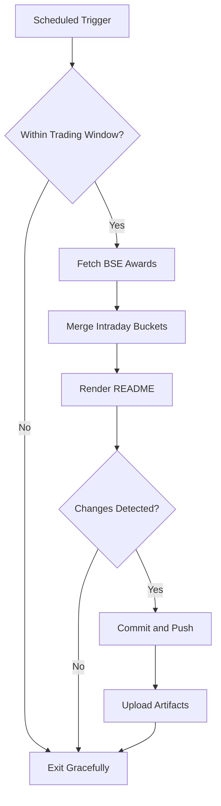

# Bombay Duck 🦆

     

<!-- aim:start -->

## Aim 🎯

⚠️ **Caution:\*\*** This project does not recommend buying or selling any security; it simply tracks BSE "Award of Order / Receipt of Order" announcements for informational purposes.

Bombay Duck keeps a pulse on BSE's "Award of Order / Receipt of Order" announcements so traders can spot fresh bullish catalysts without refreshing the exchange site. The goal is a hands-free tracker that respects BSE rate limits, stores every intraday fetch in git, and keeps the repository's front page as a living dashboard.

<!-- aim:end -->

## Intraday Snapshot 📊

ℹ️ **Important:\*\*** The README snapshot is updated automatically by the scheduled GitHub Action. Always pull the latest changes (or rebase) before editing README content locally to avoid merge conflicts.

<!-- snapshot:start -->

### Today's Awarded Orders (2026-04-30 IST)

| Hour (IST) | Company | Code | Headline | Profit Outlook | Announced At |
| --- | --- | --- | --- | --- | --- |
| 2026-04-30 15:00 | Diffusion Engineers Ltd | 544264 | Intimation of receipt of order of about INR 08.16 Crores (approx.) ([Link](https://www.bseindia.com/stock-share-price/diffusion-engineers-ltd/diffnkg/544264/)) | Likely Positive | 30 Apr 2026 - 15:00 |
| 2026-04-30 14:00 | Shelter Pharma Ltd | 543963 | Intimation under Regulation 30 of SEBI (LODR) Regulations, 2015- Receipt of Significant International Purchase Orders ([Link](https://www.bseindia.com/stock-share-price/shelter-pharma-ltd/shelter/543963/)) | Likely Positive | 30 Apr 2026 - 14:50 |
| 2026-04-30 13:00 | ITCONS E-Solutions Ltd | 543806 | The Company has bagged a new contract from Khadi and Village Industries Commission (KVIC) of RS. 42150201.89. For further details, kindly refer attached file ([Link](https://www.bseindia.com/stock-share-price/itcons-e-solutions-ltd/itcons/543806/)) | Likely Positive | 30 Apr 2026 - 13:42 |
| 2026-04-30 13:00 | Paras Defence and Space Technologies Ltd | 543367 | We are pleased to inform that PARAS has received an order from DRDO, Ministry of Defence valued at approximately Rs. 7.7 Cr. (Inc. of Taxes) for Development of Ku/C-Band Satellite Communication .... ([Link](https://www.bseindia.com/stock-share-price/paras-defence-and-space-technologies-ltd/paras/543367/)) | Likely Positive | 30 Apr 2026 - 13:07 |
| 2026-04-30 13:00 | Brahmaputra Infrastructure Ltd | 535693 | NCDC - Brahmaputra JV declared L-1 of an total Contract Value Rs. 81.98 Crores. ([Link](https://www.bseindia.com/stock-share-price/brahmaputra-infrastructure-ltd/brahminfra/535693/)) | Likely Positive | 30 Apr 2026 - 13:06 |
| 2026-04-30 11:00 | HRS Aluglaze Ltd | 544656 | Please find herewith attached Press release ([Link](https://www.bseindia.com/stock-share-price/hrs-aluglaze-ltd/hrs/544656/)) | Neutral | 30 Apr 2026 - 11:39 |
| 2026-04-30 11:00 | Shakti Pumps India Ltd-$ | 531431 | We are glad to inform that Company has received Letter of Empanelment from Maharashtra State Electricity Distribution Company Limited for 6,580 Off-Grid Solar Photovoltaic Water Pumping .... ([Link](https://www.bseindia.com/stock-share-price/shakti-pumps-india-ltd/shaktipump/531431/)) | Neutral | 30 Apr 2026 - 11:27 |
| 2026-04-30 10:00 | RailTel Corporation of India Ltd | 543265 | New Order Received ([Link](https://www.bseindia.com/stock-share-price/railtel-corporation-of-india-ltd/railtel/543265/)) | Likely Positive | 30 Apr 2026 - 10:25 |
| 2026-04-30 10:00 | Ceigall India Ltd | 544223 | In accordance with the provisions of the SEBI (Listing Obligations and Disclosure Requirements) Regulation, 2015, we wish to inform you that Ceigall India Limited ('CIL') has emerged as .... ([Link](https://www.bseindia.com/stock-share-price/ceigall-india-ltd/ceigall/544223/)) | Neutral | 30 Apr 2026 - 10:10 |
| 2026-04-30 08:00 | Welspun Enterprises Ltd | 532553 | Welspun Enterprises Limited has informed the exchange about bagging/receiving of award for construction of Pune-SHirur Highway - Partially Elevated Highway Corridor along with improvement .... ([Link](https://www.bseindia.com/stock-share-price/welspun-enterprises-ltd/welent/532553/)) | Neutral | 30 Apr 2026 - 08:43 |

_Last updated: 30 Apr 2026 - 15:10 | Entries: 10 | Requests: 5 | Retries: 0 | [Raw JSON](data/2026-04-30.json)_

<!-- snapshot:end -->

<!-- how-it-works:start -->

## How It Works ⚙️

1. Scheduled GitHub Action runs at the top of each hour from 09:00 to 16:00 IST, Monday through Friday.
2. Trading-window guard aborts early outside market hours or on weekends/holidays.
3. Node.js fetcher (with throttling and retries) polls the BSE API and archives the raw JSON response.
4. Intraday state manager deduplicates announcements per hour and rolls over automatically at the next market open.
5. Mustache-based renderer injects a fresh table into the README so the latest data is always visible.
6. If anything changed, the workflow commits the README and JSON state back to `main` using a bot token and uploads artifacts for auditing.

```mermaid
flowchart TD
  A[Scheduled Trigger] --> B{Within Trading Window?}
  B -- No --> Z[Exit Gracefully]
  B -- Yes --> C[Fetch BSE Awards]
  C --> D[Merge Intraday Buckets]
  D --> E[Render README]
  E --> F{Changes Detected?}
  F -- No --> Z
  F -- Yes --> G[Commit and Push]
  G --> H[Upload Artifacts]
  H --> Z
```

<!-- how-it-works:end -->

## Automation Timeline 🕒

- **09:00 IST**: First eligible run clears out yesterday's state, fetches fresh announcements, and resets the README snapshot.
- **09:15-15:00 IST**: At the top of each hour the workflow repeats the fetch->merge->render pipeline, committing only when new data appears.
- **After 15:00 IST**: Guard step exits successfully; the last intraday snapshot remains until markets reopen.

## Project Resources 📚

- 📘 [Contributing Guidelines](CONTRIBUTING.md)
- 🧾 [Pull Request Guide](PR_GUIDE.md)
- 🐞 [Known Issues](KNOWN_ISSUES.md)
- 👥 [Authors](AUTHORS.md)

## Appendix 📎

- **API Endpoint:** `https://api.bseindia.com/BseIndiaAPI/api/AnnSubCategoryGetData/w`
- **Query Parameters:** `strCat=Company Update`, `subcategory=Award of Order / Receipt of Order`; date fields align with the active IST trading day.
- **Outputs:** Exposes `trading_date`, `announcement_count`, and the JSON-encoded announcements via `GITHUB_OUTPUT` for downstream jobs.
- **Logs & Summaries:** Fetch step writes a Markdown table to the GitHub Step Summary for quick triage.
