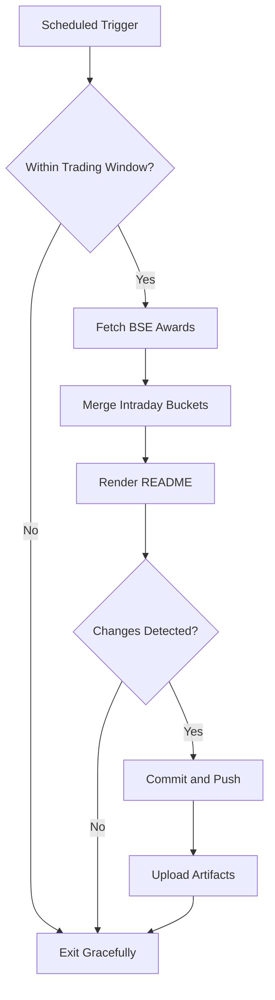

# Bombay Duck 🦆

     

<!-- aim:start -->

## Aim 🎯

⚠️ **Caution:\*\*** This project does not recommend buying or selling any security; it simply tracks BSE "Award of Order / Receipt of Order" announcements for informational purposes.

Bombay Duck keeps a pulse on BSE's "Award of Order / Receipt of Order" announcements so traders can spot fresh bullish catalysts without refreshing the exchange site. The goal is a hands-free tracker that respects BSE rate limits, stores every intraday fetch in git, and keeps the repository's front page as a living dashboard.

<!-- aim:end -->

## Intraday Snapshot 📊

ℹ️ **Important:\*\*** The README snapshot is updated automatically by the scheduled GitHub Action. Always pull the latest changes (or rebase) before editing README content locally to avoid merge conflicts.

<!-- snapshot:start -->

### Today's Awarded Orders (2026-04-01 IST)

| Hour (IST) | Company | Code | Headline | Profit Outlook | Announced At |
| --- | --- | --- | --- | --- | --- |
| 2026-04-01 13:00 | Magellanic Cloud Ltd | 538891 | Order Copy attached for your reference ([Link](https://www.bseindia.com/stock-share-price/magellanic-cloud-ltd/mcloud/538891/)) | Likely Positive | 01 Apr 2026 - 13:53 |
| 2026-04-01 13:00 | Newgen Software Technologies Ltd | 540900 | Enclosed Disclosure of Material Order of Rs.15.11 Cr. ([Link](https://www.bseindia.com/stock-share-price/newgen-software-technologies-ltd/newgen/540900/)) | Likely Positive | 01 Apr 2026 - 13:09 |
| 2026-04-01 12:00 | Finolex Cables Ltd | 500144 | Intimation of original order dated March 30, 2026 issued by Additional Commissioner, Center GST, Deharadun, Uttarakhand. ([Link](https://www.bseindia.com/stock-share-price/finolex-cables-ltd/fincables/500144/)) | Likely Positive | 01 Apr 2026 - 12:48 |
| 2026-04-01 12:00 | Solarworld Energy Solutions Ltd | 544532 | Intimation of receipt of letter of Award of Contract for Block-IX (200 MW) under "BALANCE OF SYSYTEM PACKAGE FOR DEVELOPMENT OF 1000MW (2X300MW + 2X200MW) GRID CONNECTED SOLAR PV PROJECT .... ([Link](https://www.bseindia.com/stock-share-price/solarworld-energy-solutions-ltd/solarworld/544532/)) | Likely Positive | 01 Apr 2026 - 12:41 |
| 2026-04-01 11:00 | MIC Electronics Ltd | 532850 | Please find enclosed intimation regarding the letter of acceptance received from Sambalpur Division, East Coast Railway Division of Indian Railways. ([Link](https://www.bseindia.com/stock-share-price/mic-electronics-ltd/micel/532850/)) | Neutral | 01 Apr 2026 - 11:57 |
| 2026-04-01 11:00 | J. Kumar Infraprojects Ltd | 532940 | We are pleased to inform you that, J. Kumar - SDPL (JV), is in receipt of Letter of Acceptance from M/s. National Highways Authority of India, for the work: Construction of 4 lane (expandable .... ([Link](https://www.bseindia.com/stock-share-price/j-kumar-infraprojects-ltd/jkil/532940/)) | Likely Positive | 01 Apr 2026 - 11:05 |
| 2026-04-01 10:00 | Power Mech Projects Ltd | 539302 | Please find the attached ([Link](https://www.bseindia.com/stock-share-price/power-mech-projects-ltd/powermech/539302/)) | Neutral | 01 Apr 2026 - 10:39 |
| 2026-04-01 10:00 | Shipwaves Online Ltd | 544646 | Intimation of receipt of purchase orders worth Rs. 35,68,500/- from FedEx Express Transportation & Supply Chain Services (India) Private Limited. ([Link](https://www.bseindia.com/stock-share-price/shipwaves-online-ltd/shipwaves/544646/)) | Likely Positive | 01 Apr 2026 - 10:30 |
| 2026-04-01 10:00 | Dee Development Engineers Ltd | 544198 | DEE Development Engineers Limited has informed the Exchange about the Outcome of the Order of Hon''ble PSERC revising the tariff for supply of electricity by its Wholly Owned Subsidiary .... ([Link](https://www.bseindia.com/stock-share-price/dee-development-engineers-ltd/deedev/544198/)) | Likely Positive | 01 Apr 2026 - 10:18 |
| 2026-04-01 08:00 | MTAR Technologies Ltd | 543270 | Company has received a purchase order ([Link](https://www.bseindia.com/stock-share-price/mtar-technologies-ltd/mtartech/543270/)) | Likely Positive | 01 Apr 2026 - 08:48 |

_Last updated: 01 Apr 2026 - 13:56 | Entries: 10 | Requests: 5 | Retries: 0 | [Raw JSON](data/2026-04-01.json)_

<!-- snapshot:end -->

<!-- how-it-works:start -->

## How It Works ⚙️

1. Scheduled GitHub Action runs at the top of each hour from 09:00 to 16:00 IST, Monday through Friday.
2. Trading-window guard aborts early outside market hours or on weekends/holidays.
3. Node.js fetcher (with throttling and retries) polls the BSE API and archives the raw JSON response.
4. Intraday state manager deduplicates announcements per hour and rolls over automatically at the next market open.
5. Mustache-based renderer injects a fresh table into the README so the latest data is always visible.
6. If anything changed, the workflow commits the README and JSON state back to `main` using a bot token and uploads artifacts for auditing.

```mermaid
flowchart TD
  A[Scheduled Trigger] --> B{Within Trading Window?}
  B -- No --> Z[Exit Gracefully]
  B -- Yes --> C[Fetch BSE Awards]
  C --> D[Merge Intraday Buckets]
  D --> E[Render README]
  E --> F{Changes Detected?}
  F -- No --> Z
  F -- Yes --> G[Commit and Push]
  G --> H[Upload Artifacts]
  H --> Z
```

<!-- how-it-works:end -->

## Automation Timeline 🕒

- **09:00 IST**: First eligible run clears out yesterday's state, fetches fresh announcements, and resets the README snapshot.
- **09:15-15:00 IST**: At the top of each hour the workflow repeats the fetch->merge->render pipeline, committing only when new data appears.
- **After 15:00 IST**: Guard step exits successfully; the last intraday snapshot remains until markets reopen.

## Project Resources 📚

- 📘 [Contributing Guidelines](CONTRIBUTING.md)
- 🧾 [Pull Request Guide](PR_GUIDE.md)
- 🐞 [Known Issues](KNOWN_ISSUES.md)
- 👥 [Authors](AUTHORS.md)

## Appendix 📎

- **API Endpoint:** `https://api.bseindia.com/BseIndiaAPI/api/AnnSubCategoryGetData/w`
- **Query Parameters:** `strCat=Company Update`, `subcategory=Award of Order / Receipt of Order`; date fields align with the active IST trading day.
- **Outputs:** Exposes `trading_date`, `announcement_count`, and the JSON-encoded announcements via `GITHUB_OUTPUT` for downstream jobs.
- **Logs & Summaries:** Fetch step writes a Markdown table to the GitHub Step Summary for quick triage.
