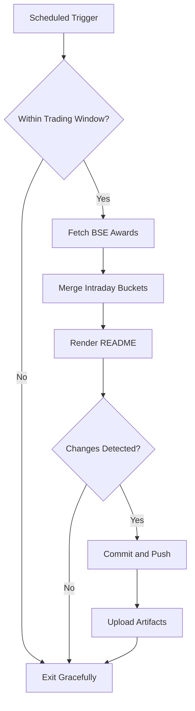

# Bombay Duck 🦆

     

<!-- aim:start -->

## Aim 🎯

⚠️ **Caution:\*\*** This project does not recommend buying or selling any security; it simply tracks BSE "Award of Order / Receipt of Order" announcements for informational purposes.

Bombay Duck keeps a pulse on BSE's "Award of Order / Receipt of Order" announcements so traders can spot fresh bullish catalysts without refreshing the exchange site. The goal is a hands-free tracker that respects BSE rate limits, stores every intraday fetch in git, and keeps the repository's front page as a living dashboard.

<!-- aim:end -->

## Intraday Snapshot 📊

ℹ️ **Important:\*\*** The README snapshot is updated automatically by the scheduled GitHub Action. Always pull the latest changes (or rebase) before editing README content locally to avoid merge conflicts.

<!-- snapshot:start -->

### Today's Awarded Orders (2026-04-22 IST)

| Hour (IST) | Company | Code | Headline | Profit Outlook | Announced At |
| --- | --- | --- | --- | --- | --- |
| 2026-04-22 15:00 | Bharat Electronics Ltd | 500049 | BEL receives orders worth Rs. 569 Crore. ([Link](https://www.bseindia.com/stock-share-price/bharat-electronics-ltd/bel/500049/)) | Likely Positive | 22 Apr 2026 - 15:48 |
| 2026-04-22 15:00 | Hindustan Tin Works Ltd-$ | 530315 | Pursuant to Regulation 30 of SEBI (LODR), 2015, intimation regarding order issued by Commissioner (Appeals-I), CGST, Delhi. ([Link](https://www.bseindia.com/stock-share-price/hindustan-tin-works-ltd/hindtin/530315/)) | Likely Positive | 22 Apr 2026 - 15:39 |
| 2026-04-22 15:00 | Atishay Ltd | 538713 | The Company has secured a work order from the office of CHiPS, Chhattisgarh for Aadhaar Services project -Order value Rs. 1.90 Crores inclusive of taxes. For more details kindly refer .... ([Link](https://www.bseindia.com/stock-share-price/atishay-ltd/atishay/538713/)) | Likely Positive | 22 Apr 2026 - 15:30 |
| 2026-04-22 13:00 | Premier Explosives Ltd | 526247 | Intimation of receipt of export orders for INR 350.23 crores. ([Link](https://www.bseindia.com/stock-share-price/premier-explosives-ltd/premexpln/526247/)) | Likely Positive | 22 Apr 2026 - 13:20 |
| 2026-04-22 11:00 | United Drilling Tools Ltd | 522014 | Award of Order from Vedanta Limited (Cairn Oil & Gas) ([Link](https://www.bseindia.com/stock-share-price/united-drilling-tools-ltd/unidt/522014/)) | Likely Positive | 22 Apr 2026 - 11:59 |
| 2026-04-22 11:00 | Speciality Medicines Ltd | 544738 | We hereby submit the Corporate annoucement on order booking. ([Link](https://www.bseindia.com/stock-share-price/speciality-medicines-ltd/spml/544738/)) | Likely Positive | 22 Apr 2026 - 11:03 |

_Last updated: 22 Apr 2026 - 15:59 | Entries: 6 | Requests: 7 | Retries: 0 | [Raw JSON](data/2026-04-22.json)_

<!-- snapshot:end -->

<!-- how-it-works:start -->

## How It Works ⚙️

1. Scheduled GitHub Action runs at the top of each hour from 09:00 to 16:00 IST, Monday through Friday.
2. Trading-window guard aborts early outside market hours or on weekends/holidays.
3. Node.js fetcher (with throttling and retries) polls the BSE API and archives the raw JSON response.
4. Intraday state manager deduplicates announcements per hour and rolls over automatically at the next market open.
5. Mustache-based renderer injects a fresh table into the README so the latest data is always visible.
6. If anything changed, the workflow commits the README and JSON state back to `main` using a bot token and uploads artifacts for auditing.

```mermaid
flowchart TD
  A[Scheduled Trigger] --> B{Within Trading Window?}
  B -- No --> Z[Exit Gracefully]
  B -- Yes --> C[Fetch BSE Awards]
  C --> D[Merge Intraday Buckets]
  D --> E[Render README]
  E --> F{Changes Detected?}
  F -- No --> Z
  F -- Yes --> G[Commit and Push]
  G --> H[Upload Artifacts]
  H --> Z
```

<!-- how-it-works:end -->

## Automation Timeline 🕒

- **09:00 IST**: First eligible run clears out yesterday's state, fetches fresh announcements, and resets the README snapshot.
- **09:15-15:00 IST**: At the top of each hour the workflow repeats the fetch->merge->render pipeline, committing only when new data appears.
- **After 15:00 IST**: Guard step exits successfully; the last intraday snapshot remains until markets reopen.

## Project Resources 📚

- 📘 [Contributing Guidelines](CONTRIBUTING.md)
- 🧾 [Pull Request Guide](PR_GUIDE.md)
- 🐞 [Known Issues](KNOWN_ISSUES.md)
- 👥 [Authors](AUTHORS.md)

## Appendix 📎

- **API Endpoint:** `https://api.bseindia.com/BseIndiaAPI/api/AnnSubCategoryGetData/w`
- **Query Parameters:** `strCat=Company Update`, `subcategory=Award of Order / Receipt of Order`; date fields align with the active IST trading day.
- **Outputs:** Exposes `trading_date`, `announcement_count`, and the JSON-encoded announcements via `GITHUB_OUTPUT` for downstream jobs.
- **Logs & Summaries:** Fetch step writes a Markdown table to the GitHub Step Summary for quick triage.
