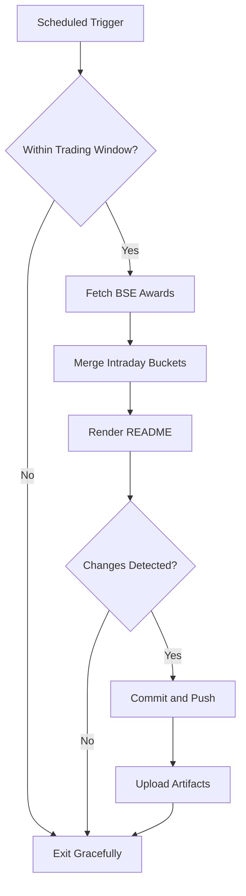

# Bombay Duck 🦆

     

<!-- aim:start -->

## Aim 🎯

⚠️ **Caution:\*\*** This project does not recommend buying or selling any security; it simply tracks BSE "Award of Order / Receipt of Order" announcements for informational purposes.

Bombay Duck keeps a pulse on BSE's "Award of Order / Receipt of Order" announcements so traders can spot fresh bullish catalysts without refreshing the exchange site. The goal is a hands-free tracker that respects BSE rate limits, stores every intraday fetch in git, and keeps the repository's front page as a living dashboard.

<!-- aim:end -->

## Intraday Snapshot 📊

ℹ️ **Important:\*\*** The README snapshot is updated automatically by the scheduled GitHub Action. Always pull the latest changes (or rebase) before editing README content locally to avoid merge conflicts.

<!-- snapshot:start -->

### Today's Awarded Orders (2026-06-11 IST)

| Hour (IST) | Company | Code | Headline | Profit Outlook | Announced At |
| --- | --- | --- | --- | --- | --- |
| 2026-06-11 11:00 | Zaggle Prepaid Ocean Services Ltd | 543985 | Pursuant to Regulation 30 of SEBI(LODR) Regulations, 2015, this is to inform you that Zaggle Prepaid Ocean Services Limited has entered into an agreement with Crompton Greaves Consumer .... ([Link](https://www.bseindia.com/stock-share-price/zaggle-prepaid-ocean-services-ltd/zaggle/543985/)) | Neutral | 11 Jun 2026 - 11:13 |
| 2026-06-11 11:00 | Siyaram Recycling Industries Ltd | 544047 | Intimation with regards to "Siyaram Recycling" secured order amounting to USD 213,000 pursuant to Regualtion 30 of SEBI ( Listing Obligation and Disclosure Requirements) Regulation, 2015. ([Link](https://www.bseindia.com/stock-share-price/siyaram-recycling-industries-ltd/siyaram/544047/)) | Likely Positive | 11 Jun 2026 - 11:03 |
| 2026-06-11 10:00 | Monarch Surveyors and Engineering Consultants Ltd | 544453 | Pursuant to the provisions of Regulation 30 of SEBI (Listing Obligations and Disclosure Requirements), Regulations 2015, we hereby submit that Company has received an order from Maharashtra .... ([Link](https://www.bseindia.com/stock-share-price/monarch-surveyors-and-engineering-consultants-ltd/msecl/544453/)) | Likely Positive | 11 Jun 2026 - 10:56 |
| 2026-06-11 10:00 | Mahindra EPC Irrigation Ltd | 523754 | Mahindra EPC Irrigation Limited has informed the Exchange about award received in terms of Regulations 30(3), 30(4) read with Para B, Part A of Schedule III of SEBI (Listing Obligations .... ([Link](https://www.bseindia.com/stock-share-price/mahindra-epc-irrigation-ltd/mahepc/523754/)) | Neutral | 11 Jun 2026 - 10:53 |
| 2026-06-11 09:00 | Capitalnumbers Infotech Ltd | 544343 | CapitalNumbers Infotech Limited Secures Rupees 2.46 Crore New Order - AI Project in Healthcare domain. ([Link](https://www.bseindia.com/stock-share-price/capitalnumbers-infotech-ltd/cninfotech/544343/)) | Likely Positive | 11 Jun 2026 - 09:14 |

_Last updated: 11 Jun 2026 - 12:03 | Entries: 5 | Requests: 2 | Retries: 1 | [Raw JSON](data/2026-06-11.json)_

<!-- snapshot:end -->

<!-- how-it-works:start -->

## How It Works ⚙️

1. Scheduled GitHub Action runs at the top of each hour from 09:00 to 16:00 IST, Monday through Friday.
2. Trading-window guard aborts early outside market hours or on weekends/holidays.
3. Node.js fetcher (with throttling and retries) polls the BSE API and archives the raw JSON response.
4. Intraday state manager deduplicates announcements per hour and rolls over automatically at the next market open.
5. Mustache-based renderer injects a fresh table into the README so the latest data is always visible.
6. If anything changed, the workflow commits the README and JSON state back to `main` using a bot token and uploads artifacts for auditing.

```mermaid
flowchart TD
  A[Scheduled Trigger] --> B{Within Trading Window?}
  B -- No --> Z[Exit Gracefully]
  B -- Yes --> C[Fetch BSE Awards]
  C --> D[Merge Intraday Buckets]
  D --> E[Render README]
  E --> F{Changes Detected?}
  F -- No --> Z
  F -- Yes --> G[Commit and Push]
  G --> H[Upload Artifacts]
  H --> Z
```

<!-- how-it-works:end -->

## Automation Timeline 🕒

- **09:00 IST**: First eligible run clears out yesterday's state, fetches fresh announcements, and resets the README snapshot.
- **09:15-15:00 IST**: At the top of each hour the workflow repeats the fetch->merge->render pipeline, committing only when new data appears.
- **After 15:00 IST**: Guard step exits successfully; the last intraday snapshot remains until markets reopen.

## Project Resources 📚

- 📘 [Contributing Guidelines](CONTRIBUTING.md)
- 🧾 [Pull Request Guide](PR_GUIDE.md)
- 🐞 [Known Issues](KNOWN_ISSUES.md)
- 👥 [Authors](AUTHORS.md)

## Appendix 📎

- **API Endpoint:** `https://api.bseindia.com/BseIndiaAPI/api/AnnSubCategoryGetData/w`
- **Query Parameters:** `strCat=Company Update`, `subcategory=Award of Order / Receipt of Order`; date fields align with the active IST trading day.
- **Outputs:** Exposes `trading_date`, `announcement_count`, and the JSON-encoded announcements via `GITHUB_OUTPUT` for downstream jobs.
- **Logs & Summaries:** Fetch step writes a Markdown table to the GitHub Step Summary for quick triage.
