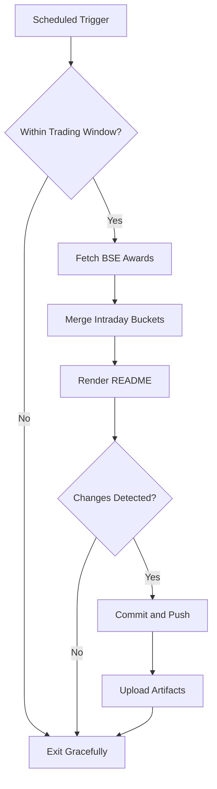

# Bombay Duck 🦆

     

<!-- aim:start -->

## Aim 🎯

⚠️ **Caution:\*\*** This project does not recommend buying or selling any security; it simply tracks BSE "Award of Order / Receipt of Order" announcements for informational purposes.

Bombay Duck keeps a pulse on BSE's "Award of Order / Receipt of Order" announcements so traders can spot fresh bullish catalysts without refreshing the exchange site. The goal is a hands-free tracker that respects BSE rate limits, stores every intraday fetch in git, and keeps the repository's front page as a living dashboard.

<!-- aim:end -->

## Intraday Snapshot 📊

ℹ️ **Important:\*\*** The README snapshot is updated automatically by the scheduled GitHub Action. Always pull the latest changes (or rebase) before editing README content locally to avoid merge conflicts.

<!-- snapshot:start -->

### Today's Awarded Orders (2026-05-05 IST)

| Hour (IST) | Company | Code | Headline | Profit Outlook | Announced At |
| --- | --- | --- | --- | --- | --- |
| 2026-05-05 14:00 | RailTel Corporation of India Ltd | 543265 | New Order Received ([Link](https://www.bseindia.com/stock-share-price/railtel-corporation-of-india-ltd/railtel/543265/)) | Likely Positive | 05 May 2026 - 14:32 |
| 2026-05-05 14:00 | MIC Electronics Ltd | 532850 | We wish to inform you that the company has received a letter of acceptance from the Chhattisgarh Environment Conservation Board for an amount of Rs. 3,78,00,000/- for the design, supply, .... ([Link](https://www.bseindia.com/stock-share-price/mic-electronics-ltd/micel/532850/)) | Neutral | 05 May 2026 - 14:07 |
| 2026-05-05 13:00 | Nanta Tech Ltd | 544668 | Nanta Tech Limited has received a significant order from Pointers Insurance Brokers Private Limited for the supply of end-to-end AI Automation Solutions. ([Link](https://www.bseindia.com/stock-share-price/nanta-tech-ltd/nanta/544668/)) | Likely Positive | 05 May 2026 - 13:14 |
| 2026-05-05 12:00 | Innovators Facade Systems Ltd | 541353 | Pursuant to the provisions of Regulation 30 of SEBI (Listing Obligations and Disclosure Requirements) Regulations, 2015 as amended from time to time and Company''s policy for determining .... ([Link](https://www.bseindia.com/stock-share-price/innovators-facade-systems-ltd/innovators/541353/)) | Neutral | 05 May 2026 - 12:50 |
| 2026-05-05 11:00 | Takyon Networks Ltd | 544471 | Takyon Networks Limited received orderworth of Rs.8,300,000 (Rupees Eighty Three Lakhs Only) from Hindustan Aerinautics Limited (HAL). ([Link](https://www.bseindia.com/stock-share-price/takyon-networks-ltd/takyon/544471/)) | Likely Positive | 05 May 2026 - 11:43 |
| 2026-05-05 11:00 | Shelter Pharma Ltd | 543963 | Intimation under Regulation 30 of SEBI (LODR) Regulations, 2015 - Receipt of Significant International Purchase Orders. ([Link](https://www.bseindia.com/stock-share-price/shelter-pharma-ltd/shelter/543963/)) | Likely Positive | 05 May 2026 - 11:08 |
| 2026-05-05 09:00 | Larsen & Toubro Ltd | 500510 | L&T Secures (Large*) Order to Reinforce India''s Energy Security Through Coal Gasification ([Link](https://www.bseindia.com/stock-share-price/larsen--toubro-ltd/lt/500510/)) | Likely Positive | 05 May 2026 - 09:56 |

_Last updated: 05 May 2026 - 15:05 | Entries: 7 | Requests: 6 | Retries: 0 | [Raw JSON](data/2026-05-05.json)_

<!-- snapshot:end -->

<!-- how-it-works:start -->

## How It Works ⚙️

1. Scheduled GitHub Action runs at the top of each hour from 09:00 to 16:00 IST, Monday through Friday.
2. Trading-window guard aborts early outside market hours or on weekends/holidays.
3. Node.js fetcher (with throttling and retries) polls the BSE API and archives the raw JSON response.
4. Intraday state manager deduplicates announcements per hour and rolls over automatically at the next market open.
5. Mustache-based renderer injects a fresh table into the README so the latest data is always visible.
6. If anything changed, the workflow commits the README and JSON state back to `main` using a bot token and uploads artifacts for auditing.

```mermaid
flowchart TD
  A[Scheduled Trigger] --> B{Within Trading Window?}
  B -- No --> Z[Exit Gracefully]
  B -- Yes --> C[Fetch BSE Awards]
  C --> D[Merge Intraday Buckets]
  D --> E[Render README]
  E --> F{Changes Detected?}
  F -- No --> Z
  F -- Yes --> G[Commit and Push]
  G --> H[Upload Artifacts]
  H --> Z
```

<!-- how-it-works:end -->

## Automation Timeline 🕒

- **09:00 IST**: First eligible run clears out yesterday's state, fetches fresh announcements, and resets the README snapshot.
- **09:15-15:00 IST**: At the top of each hour the workflow repeats the fetch->merge->render pipeline, committing only when new data appears.
- **After 15:00 IST**: Guard step exits successfully; the last intraday snapshot remains until markets reopen.

## Project Resources 📚

- 📘 [Contributing Guidelines](CONTRIBUTING.md)
- 🧾 [Pull Request Guide](PR_GUIDE.md)
- 🐞 [Known Issues](KNOWN_ISSUES.md)
- 👥 [Authors](AUTHORS.md)

## Appendix 📎

- **API Endpoint:** `https://api.bseindia.com/BseIndiaAPI/api/AnnSubCategoryGetData/w`
- **Query Parameters:** `strCat=Company Update`, `subcategory=Award of Order / Receipt of Order`; date fields align with the active IST trading day.
- **Outputs:** Exposes `trading_date`, `announcement_count`, and the JSON-encoded announcements via `GITHUB_OUTPUT` for downstream jobs.
- **Logs & Summaries:** Fetch step writes a Markdown table to the GitHub Step Summary for quick triage.
