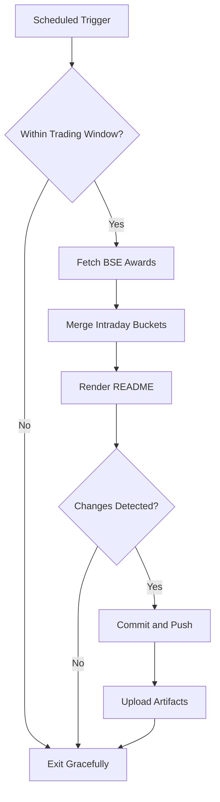

# Bombay Duck 🦆

     

<!-- aim:start -->

## Aim 🎯

⚠️ **Caution:\*\*** This project does not recommend buying or selling any security; it simply tracks BSE "Award of Order / Receipt of Order" announcements for informational purposes.

Bombay Duck keeps a pulse on BSE's "Award of Order / Receipt of Order" announcements so traders can spot fresh bullish catalysts without refreshing the exchange site. The goal is a hands-free tracker that respects BSE rate limits, stores every intraday fetch in git, and keeps the repository's front page as a living dashboard.

<!-- aim:end -->

## Intraday Snapshot 📊

ℹ️ **Important:\*\*** The README snapshot is updated automatically by the scheduled GitHub Action. Always pull the latest changes (or rebase) before editing README content locally to avoid merge conflicts.

<!-- snapshot:start -->

### Today's Awarded Orders (2026-03-27 IST)

| Hour (IST) | Company | Code | Headline | Profit Outlook | Announced At |
| --- | --- | --- | --- | --- | --- |
| 2026-03-27 14:00 | Ceinsys Tech Ltd | 538734 | Intimation for receipt of Service order from Indian Space Research Organization (ISRO) ([Link](https://www.bseindia.com/stock-share-price/ceinsys-tech-ltd/ceinsys/538734/)) | Likely Positive | 27 Mar 2026 - 14:04 |
| 2026-03-27 13:00 | Quality Power Electrical Equipments Ltd | 544367 | Receipt of Significant Order by Material Step-down subsidiary for supply and Integration of Battery Energy Storage System. ([Link](https://www.bseindia.com/stock-share-price/quality-power-electrical-equipments-ltd/qpower/544367/)) | Likely Positive | 27 Mar 2026 - 13:37 |
| 2026-03-27 12:00 | Jupiter Life Line Hospitals Ltd | 543980 | The Company has received a letter from Mumbai Metropolitan Region Development Authority (MMRDA) conveying the acceptance of its tender for allotment of land on lease basis ([Link](https://www.bseindia.com/stock-share-price/jupiter-life-line-hospitals-ltd/jlhl/543980/)) | Neutral | 27 Mar 2026 - 12:59 |
| 2026-03-27 11:00 | Gujarat Inject Kerala Ltd | 524238 | The Company has received a Purchase Order from EARTHWAVE TECHNOLOGY PRIVATE LIMITED for 3645 NOS Solar PV Module. Total Value is around 3.11 Crores (exclusive of GST). ([Link](https://www.bseindia.com/stock-share-price/gujarat-inject-kerala-ltd/gujinjec/524238/)) | Likely Positive | 27 Mar 2026 - 11:33 |
| 2026-03-27 11:00 | Gujarat Inject Kerala Ltd | 524238 | The Company has received a Purchase Order from PERFECT RENEWTECH PRIVATE LIMITED for 1355 NOS Solar PV Module. Total Value is around 1.21 Crores (exclusive of GST). ([Link](https://www.bseindia.com/stock-share-price/gujarat-inject-kerala-ltd/gujinjec/524238/)) | Likely Positive | 27 Mar 2026 - 11:29 |
| 2026-03-27 11:00 | Gujarat Inject Kerala Ltd | 524238 | The Company has received a Purchase Order from EARTHWAVE TECHNOLOGY PRIVATE LIMITED for 4056 NOS Solar PV Module. Total Value is around 3.49 Crores (exclusive of GST). ([Link](https://www.bseindia.com/stock-share-price/gujarat-inject-kerala-ltd/gujinjec/524238/)) | Likely Positive | 27 Mar 2026 - 11:25 |
| 2026-03-27 11:00 | Cryogenic Ogs Ltd | 544440 | We are pleased to inform you that the Company has received a Purchase order from Honeywell LNG LLC (Pennsylvania, USA) amounting to $231,820.00/- ([Link](https://www.bseindia.com/stock-share-price/cryogenic-ogs-ltd/cryogenic/544440/)) | Likely Positive | 27 Mar 2026 - 11:22 |
| 2026-03-27 09:00 | Larsen & Toubro Ltd | 500510 | L&T Wins (Significant*) Order for Buildings & Factories Business ([Link](https://www.bseindia.com/stock-share-price/larsen--toubro-ltd/lt/500510/)) | Likely Positive | 27 Mar 2026 - 09:57 |
| 2026-03-27 08:00 | Seamec Ltd | 526807 | Intimation on Bagging of NOA from ONGC to Consortium of SEAMEC LIMITED and SUPREME HYDRO PVT LIMITED for Hiring of Operation & Maintenance (O&M) Services for ONGC owned MSV "SAMUDRA PRABHA" .... ([Link](https://www.bseindia.com/stock-share-price/seamec-ltd/seamecltd/526807/)) | Neutral | 27 Mar 2026 - 08:00 |

_Last updated: 27 Mar 2026 - 14:47 | Entries: 9 | Requests: 7 | Retries: 0 | [Raw JSON](data/2026-03-27.json)_

<!-- snapshot:end -->

<!-- how-it-works:start -->

## How It Works ⚙️

1. Scheduled GitHub Action runs at the top of each hour from 09:00 to 16:00 IST, Monday through Friday.
2. Trading-window guard aborts early outside market hours or on weekends/holidays.
3. Node.js fetcher (with throttling and retries) polls the BSE API and archives the raw JSON response.
4. Intraday state manager deduplicates announcements per hour and rolls over automatically at the next market open.
5. Mustache-based renderer injects a fresh table into the README so the latest data is always visible.
6. If anything changed, the workflow commits the README and JSON state back to `main` using a bot token and uploads artifacts for auditing.

```mermaid
flowchart TD
  A[Scheduled Trigger] --> B{Within Trading Window?}
  B -- No --> Z[Exit Gracefully]
  B -- Yes --> C[Fetch BSE Awards]
  C --> D[Merge Intraday Buckets]
  D --> E[Render README]
  E --> F{Changes Detected?}
  F -- No --> Z
  F -- Yes --> G[Commit and Push]
  G --> H[Upload Artifacts]
  H --> Z
```

<!-- how-it-works:end -->

## Automation Timeline 🕒

- **09:00 IST**: First eligible run clears out yesterday's state, fetches fresh announcements, and resets the README snapshot.
- **09:15-15:00 IST**: At the top of each hour the workflow repeats the fetch->merge->render pipeline, committing only when new data appears.
- **After 15:00 IST**: Guard step exits successfully; the last intraday snapshot remains until markets reopen.

## Project Resources 📚

- 📘 [Contributing Guidelines](CONTRIBUTING.md)
- 🧾 [Pull Request Guide](PR_GUIDE.md)
- 🐞 [Known Issues](KNOWN_ISSUES.md)
- 👥 [Authors](AUTHORS.md)

## Appendix 📎

- **API Endpoint:** `https://api.bseindia.com/BseIndiaAPI/api/AnnSubCategoryGetData/w`
- **Query Parameters:** `strCat=Company Update`, `subcategory=Award of Order / Receipt of Order`; date fields align with the active IST trading day.
- **Outputs:** Exposes `trading_date`, `announcement_count`, and the JSON-encoded announcements via `GITHUB_OUTPUT` for downstream jobs.
- **Logs & Summaries:** Fetch step writes a Markdown table to the GitHub Step Summary for quick triage.
