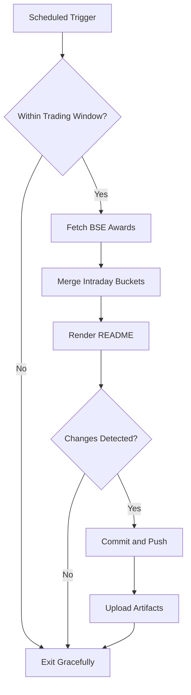

# Bombay Duck 🦆

     

<!-- aim:start -->

## Aim 🎯

⚠️ **Caution:\*\*** This project does not recommend buying or selling any security; it simply tracks BSE "Award of Order / Receipt of Order" announcements for informational purposes.

Bombay Duck keeps a pulse on BSE's "Award of Order / Receipt of Order" announcements so traders can spot fresh bullish catalysts without refreshing the exchange site. The goal is a hands-free tracker that respects BSE rate limits, stores every intraday fetch in git, and keeps the repository's front page as a living dashboard.

<!-- aim:end -->

## Intraday Snapshot 📊

ℹ️ **Important:\*\*** The README snapshot is updated automatically by the scheduled GitHub Action. Always pull the latest changes (or rebase) before editing README content locally to avoid merge conflicts.

<!-- snapshot:start -->

### Today's Awarded Orders (2026-03-30 IST)

| Hour (IST) | Company | Code | Headline | Profit Outlook | Announced At |
| --- | --- | --- | --- | --- | --- |
| 2026-03-30 15:00 | Gabion Technologies India Ltd | 544675 | Revised Intimation of work/supply orders received during the ended March 28, 2026 ([Link](https://www.bseindia.com/stock-share-price/gabion-technologies-india-ltd/gtil/544675/)) | Likely Positive | 30 Mar 2026 - 15:45 |
| 2026-03-30 15:00 | Solarworld Energy Solutions Ltd | 544532 | Letter of Award of Contract for EPC Package for BESS Implementation at Feroze Gandhi Unchahar Thermal Power Station as per Bid Document No. CS-0011-171B-9 ([Link](https://www.bseindia.com/stock-share-price/solarworld-energy-solutions-ltd/solarworld/544532/)) | Likely Positive | 30 Mar 2026 - 15:23 |
| 2026-03-30 15:00 | Solarworld Energy Solutions Ltd | 544532 | Letter of Award of contract for EPC Package for BESS Implementation at Solapur Super Thermal Power station Lot-2 as per Bid Document No. CS-0011-171B-9 ([Link](https://www.bseindia.com/stock-share-price/solarworld-energy-solutions-ltd/solarworld/544532/)) | Likely Positive | 30 Mar 2026 - 15:15 |
| 2026-03-30 14:00 | Gabion Technologies India Ltd | 544675 | Initimation of work/ supply orders received during the week ended march 28, 2026. ([Link](https://www.bseindia.com/stock-share-price/gabion-technologies-india-ltd/gtil/544675/)) | Likely Positive | 30 Mar 2026 - 14:42 |
| 2026-03-30 14:00 | Cryogenic Ogs Ltd | 544440 | We are pleased to inform that the Company has received purchase order of Rs. 2,27,73,997.64/- from Emerson Measurement Systems and Solutions (India) Private Limited. ([Link](https://www.bseindia.com/stock-share-price/cryogenic-ogs-ltd/cryogenic/544440/)) | Likely Positive | 30 Mar 2026 - 14:21 |
| 2026-03-30 14:00 | Bharat Electronics Ltd | 500049 | BEL receives orders worth Rs.1660 Crore. ([Link](https://www.bseindia.com/stock-share-price/bharat-electronics-ltd/bel/500049/)) | Likely Positive | 30 Mar 2026 - 14:19 |
| 2026-03-30 13:00 | Diamond Power Infrastructure Ltd-$ | 522163 | Diamond Power Infrastructure Limited has informed the exchange regarding the receipt of letter of intent ([Link](https://www.bseindia.com/stock-share-price/diamond-power-infrastructure-ltd/diacabs/522163/)) | Likely Positive | 30 Mar 2026 - 13:07 |
| 2026-03-30 12:00 | Enviro Infra Engineers Ltd | 544290 | Orders worth INR 405.71 Crores (excluding GST) ([Link](https://www.bseindia.com/stock-share-price/enviro-infra-engineers-ltd/eiel/544290/)) | Likely Positive | 30 Mar 2026 - 12:57 |
| 2026-03-30 12:00 | Bharat Heavy Electricals Ltd | 500103 | Receipt of Notification of Award (NOA) from NTPC Ltd. ([Link](https://www.bseindia.com/stock-share-price/bharat-heavy-electricals-ltd/bhel/500103/)) | Likely Positive | 30 Mar 2026 - 12:44 |
| 2026-03-30 12:00 | ITCONS E-Solutions Ltd | 543806 | We are pleased to inform that our company has bagged new contract from Department of Agricultural Research and Education (DARE), Indian Council of Agricultural Research (ICAR), Ministry .... ([Link](https://www.bseindia.com/stock-share-price/itcons-e-solutions-ltd/itcons/543806/)) | Likely Positive | 30 Mar 2026 - 12:41 |
| 2026-03-30 11:00 | We Win Ltd | 543535 | Award of Work order for Selection of an Agency for Establishment, Operations and Management of ICCC and District Helpdesks under the Surakshit Matrritva Ashwashan (SUMAN) Program for National .... ([Link](https://www.bseindia.com/stock-share-price/we-win-ltd/wewin/543535/)) | Likely Positive | 30 Mar 2026 - 11:27 |
| 2026-03-30 11:00 | Jyoti Structures Ltd | 513250 | Intimation on New Project Order ([Link](https://www.bseindia.com/stock-share-price/jyoti-structures-ltd/jyotistruc/513250/)) | Likely Positive | 30 Mar 2026 - 11:16 |
| 2026-03-30 08:00 | Welspun Corp Ltd | 532144 | Receipt of Order ([Link](https://www.bseindia.com/stock-share-price/welspun-corp-ltd/welcorp/532144/)) | Likely Positive | 30 Mar 2026 - 08:28 |

_Last updated: 30 Mar 2026 - 15:58 | Entries: 13 | Requests: 7 | Retries: 0 | [Raw JSON](data/2026-03-30.json)_

<!-- snapshot:end -->

<!-- how-it-works:start -->

## How It Works ⚙️

1. Scheduled GitHub Action runs at the top of each hour from 09:00 to 16:00 IST, Monday through Friday.
2. Trading-window guard aborts early outside market hours or on weekends/holidays.
3. Node.js fetcher (with throttling and retries) polls the BSE API and archives the raw JSON response.
4. Intraday state manager deduplicates announcements per hour and rolls over automatically at the next market open.
5. Mustache-based renderer injects a fresh table into the README so the latest data is always visible.
6. If anything changed, the workflow commits the README and JSON state back to `main` using a bot token and uploads artifacts for auditing.

```mermaid
flowchart TD
  A[Scheduled Trigger] --> B{Within Trading Window?}
  B -- No --> Z[Exit Gracefully]
  B -- Yes --> C[Fetch BSE Awards]
  C --> D[Merge Intraday Buckets]
  D --> E[Render README]
  E --> F{Changes Detected?}
  F -- No --> Z
  F -- Yes --> G[Commit and Push]
  G --> H[Upload Artifacts]
  H --> Z
```

<!-- how-it-works:end -->

## Automation Timeline 🕒

- **09:00 IST**: First eligible run clears out yesterday's state, fetches fresh announcements, and resets the README snapshot.
- **09:15-15:00 IST**: At the top of each hour the workflow repeats the fetch->merge->render pipeline, committing only when new data appears.
- **After 15:00 IST**: Guard step exits successfully; the last intraday snapshot remains until markets reopen.

## Project Resources 📚

- 📘 [Contributing Guidelines](CONTRIBUTING.md)
- 🧾 [Pull Request Guide](PR_GUIDE.md)
- 🐞 [Known Issues](KNOWN_ISSUES.md)
- 👥 [Authors](AUTHORS.md)

## Appendix 📎

- **API Endpoint:** `https://api.bseindia.com/BseIndiaAPI/api/AnnSubCategoryGetData/w`
- **Query Parameters:** `strCat=Company Update`, `subcategory=Award of Order / Receipt of Order`; date fields align with the active IST trading day.
- **Outputs:** Exposes `trading_date`, `announcement_count`, and the JSON-encoded announcements via `GITHUB_OUTPUT` for downstream jobs.
- **Logs & Summaries:** Fetch step writes a Markdown table to the GitHub Step Summary for quick triage.
