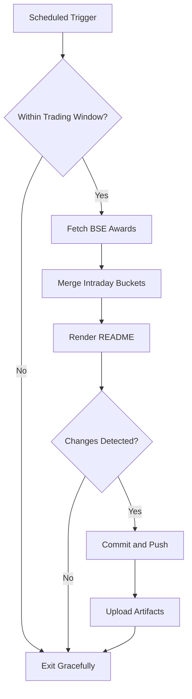

# Bombay Duck 🦆

     

<!-- aim:start -->

## Aim 🎯

⚠️ **Caution:\*\*** This project does not recommend buying or selling any security; it simply tracks BSE "Award of Order / Receipt of Order" announcements for informational purposes.

Bombay Duck keeps a pulse on BSE's "Award of Order / Receipt of Order" announcements so traders can spot fresh bullish catalysts without refreshing the exchange site. The goal is a hands-free tracker that respects BSE rate limits, stores every intraday fetch in git, and keeps the repository's front page as a living dashboard.

<!-- aim:end -->

## Intraday Snapshot 📊

ℹ️ **Important:\*\*** The README snapshot is updated automatically by the scheduled GitHub Action. Always pull the latest changes (or rebase) before editing README content locally to avoid merge conflicts.

<!-- snapshot:start -->

### Today's Awarded Orders (2026-07-02 IST)

| Hour (IST) | Company | Code | Headline | Profit Outlook | Announced At |
| --- | --- | --- | --- | --- | --- |
| 2026-07-02 16:00 | SBC Exports Ltd | 542725 | Extension of Existing order recieved from (MPMMC)(BHU) amounting aprox 32 crores. ([Link](https://www.bseindia.com/stock-share-price/sbc-exports-ltd/sbc/542725/)) | Likely Positive | 02 Jul 2026 - 16:01 |
| 2026-07-02 15:00 | Airfloa Rail Technology Ltd | 544516 | Receiving of Order of Value Rs.1.21 Crores ([Link](https://www.bseindia.com/stock-share-price/airfloa-rail-technology-ltd/airfloa/544516/)) | Likely Positive | 02 Jul 2026 - 15:44 |
| 2026-07-02 15:00 | Artefact Projects Ltd | 531297 | LETTER OF AWARD ([Link](https://www.bseindia.com/stock-share-price/artefact-projects-ltd/artefact/531297/)) | Neutral | 02 Jul 2026 - 15:22 |
| 2026-07-02 13:00 | Siyaram Recycling Industries Ltd | 544047 | Intimation with regards to "Siyaram Recycling" secured order amounting to Rs. 92,11,080 pursuant to Regulation 30 of SEBI (Listing Obligation and Disclosure Requirements) Regulation, 2015. ([Link](https://www.bseindia.com/stock-share-price/siyaram-recycling-industries-ltd/siyaram/544047/)) | Likely Positive | 02 Jul 2026 - 13:30 |
| 2026-07-02 13:00 | Siyaram Recycling Industries Ltd | 544047 | Intimation with regards to "Siyaram Recycling" secured order amounting to Rs. 2,29,68,700 pursuant to Regulation 30 of SEBI (Listing Obligation and Disclosure Requirements) Regulation, 2015. ([Link](https://www.bseindia.com/stock-share-price/siyaram-recycling-industries-ltd/siyaram/544047/)) | Likely Positive | 02 Jul 2026 - 13:25 |
| 2026-07-02 13:00 | Siyaram Recycling Industries Ltd | 544047 | Intimation with regards to "Siyaram Recycling" secured order amounting to Rs. 97,70,400 pursuant to Regulation 30 of SEBI ( Listing Obligation and Disclosure Requirements) Regulation, 2015. ([Link](https://www.bseindia.com/stock-share-price/siyaram-recycling-industries-ltd/siyaram/544047/)) | Likely Positive | 02 Jul 2026 - 13:19 |
| 2026-07-02 13:00 | Crompton Greaves Consumer Electricals Ltd | 539876 | Intimation of receipt of award ([Link](https://www.bseindia.com/stock-share-price/crompton-greaves-consumer-electricals-ltd/crompton/539876/)) | Likely Positive | 02 Jul 2026 - 13:07 |
| 2026-07-02 11:00 | United Drilling Tools Ltd | 522014 | Award of order from vedanta ([Link](https://www.bseindia.com/stock-share-price/united-drilling-tools-ltd/unidt/522014/)) | Likely Positive | 02 Jul 2026 - 11:32 |
| 2026-07-02 11:00 | Meera Industries Ltd | 540519 | MEERA Industries Limited Secures Domestic Order Worth Rs 7.95 Crore from DNB Textiles, Surat, for High speed BSY Yarn Twisting & Cop Winding Line. ([Link](https://www.bseindia.com/stock-share-price/meera-industries-ltd/meera/540519/)) | Likely Positive | 02 Jul 2026 - 11:20 |
| 2026-07-02 09:00 | GK Energy Ltd | 544525 | GK Energy Limited has informed the Exchange that Company has received an allotment of 10 MW of Rooftop Solar Projects. ([Link](https://www.bseindia.com/stock-share-price/gk-energy-ltd/gkenergy/544525/)) | Neutral | 02 Jul 2026 - 09:32 |

_Last updated: 02 Jul 2026 - 16:57 | Entries: 10 | Requests: 3 | Retries: 0 | [Raw JSON](data/2026-07-02.json)_

<!-- snapshot:end -->

<!-- how-it-works:start -->

## How It Works ⚙️

1. Scheduled GitHub Action runs at the top of each hour from 09:00 to 16:00 IST, Monday through Friday.
2. Trading-window guard aborts early outside market hours or on weekends/holidays.
3. Node.js fetcher (with throttling and retries) polls the BSE API and archives the raw JSON response.
4. Intraday state manager deduplicates announcements per hour and rolls over automatically at the next market open.
5. Mustache-based renderer injects a fresh table into the README so the latest data is always visible.
6. If anything changed, the workflow commits the README and JSON state back to `main` using a bot token and uploads artifacts for auditing.

```mermaid
flowchart TD
  A[Scheduled Trigger] --> B{Within Trading Window?}
  B -- No --> Z[Exit Gracefully]
  B -- Yes --> C[Fetch BSE Awards]
  C --> D[Merge Intraday Buckets]
  D --> E[Render README]
  E --> F{Changes Detected?}
  F -- No --> Z
  F -- Yes --> G[Commit and Push]
  G --> H[Upload Artifacts]
  H --> Z
```

<!-- how-it-works:end -->

## Automation Timeline 🕒

- **09:00 IST**: First eligible run clears out yesterday's state, fetches fresh announcements, and resets the README snapshot.
- **09:15-15:00 IST**: At the top of each hour the workflow repeats the fetch->merge->render pipeline, committing only when new data appears.
- **After 15:00 IST**: Guard step exits successfully; the last intraday snapshot remains until markets reopen.

## Project Resources 📚

- 📘 [Contributing Guidelines](CONTRIBUTING.md)
- 🧾 [Pull Request Guide](PR_GUIDE.md)
- 🐞 [Known Issues](KNOWN_ISSUES.md)
- 👥 [Authors](AUTHORS.md)

## Appendix 📎

- **API Endpoint:** `https://api.bseindia.com/BseIndiaAPI/api/AnnSubCategoryGetData/w`
- **Query Parameters:** `strCat=Company Update`, `subcategory=Award of Order / Receipt of Order`; date fields align with the active IST trading day.
- **Outputs:** Exposes `trading_date`, `announcement_count`, and the JSON-encoded announcements via `GITHUB_OUTPUT` for downstream jobs.
- **Logs & Summaries:** Fetch step writes a Markdown table to the GitHub Step Summary for quick triage.
