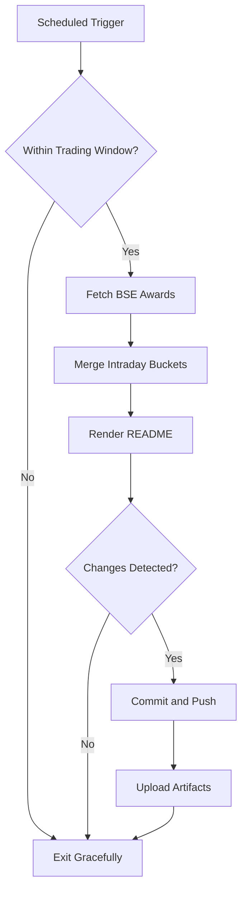

# Bombay Duck 🦆

     

<!-- aim:start -->

## Aim 🎯

⚠️ **Caution:\*\*** This project does not recommend buying or selling any security; it simply tracks BSE "Award of Order / Receipt of Order" announcements for informational purposes.

Bombay Duck keeps a pulse on BSE's "Award of Order / Receipt of Order" announcements so traders can spot fresh bullish catalysts without refreshing the exchange site. The goal is a hands-free tracker that respects BSE rate limits, stores every intraday fetch in git, and keeps the repository's front page as a living dashboard.

<!-- aim:end -->

## Intraday Snapshot 📊

ℹ️ **Important:\*\*** The README snapshot is updated automatically by the scheduled GitHub Action. Always pull the latest changes (or rebase) before editing README content locally to avoid merge conflicts.

<!-- snapshot:start -->

### Today's Awarded Orders (2026-09-09 IST)

| Hour (IST) | Company | Code | Headline | Profit Outlook | Announced At |
| --- | --- | --- | --- | --- | --- |
| 2026-09-09 17:00 | Schneider Electric Infrastructure Ltd | 534139 | Please find enclosed receipt of order from GST authorities. ([Link](https://www.bseindia.com/stock-share-price/schneider-electric-infrastructure-ltd/schneider/534139/)) | Likely Positive | 09 Sep 2026 - 17:24 |
| 2026-09-09 17:00 | Sandur Manganese & Iron Ores Ltd | 504918 | Receipt of penalty order by Royal Sandur Metals Private Limited (formerly Arjas Steel Private Limited), Material Subsidiary of the Company ([Link](https://www.bseindia.com/stock-share-price/sandur-manganese--iron-ores-ltd/sanduma/504918/)) | Likely Positive | 09 Sep 2026 - 17:24 |
| 2026-09-09 17:00 | Shakti Pumps India Ltd-$ | 531431 | We are glad to inform that Company has received Letter of Empanelment from Maharashtra State Electricity Distribution Limited for 10,000 Off-Grid Solar Photovoltaic Water Pumping Systems .... ([Link](https://www.bseindia.com/stock-share-price/shakti-pumps-india-ltd/shaktipump/531431/)) | Neutral | 09 Sep 2026 - 17:23 |
| 2026-09-09 16:00 | Veerhealth Care Ltd | 511523 | The Company wishes to inform that it has entered into supply agreement with a Company having an Indo- Canadian joint venture who is one of the world''s largest manufacturers of luxury .... ([Link](https://www.bseindia.com/stock-share-price/veerhealth-care-ltd/veerhealth/511523/)) | Neutral | 09 Sep 2026 - 16:33 |
| 2026-09-09 14:00 | GPT Infraprojects Ltd | 533761 | Please find enclosed intimation of contract win of Rs. 114.82 Crore by Alcon Builders and Engineers Private Limited, a wholly owned subsidiary of the Company. ([Link](https://www.bseindia.com/stock-share-price/gpt-infraprojects-ltd/gptinfra/533761/)) | Likely Positive | 09 Sep 2026 - 14:41 |
| 2026-09-09 14:00 | Adani Ports and Special Economic Zone Ltd | 532921 | Receipt of Letter of Award (LOA) for development and operations of two dry buik berths at Paradip Port, Odisha ([Link](https://www.bseindia.com/stock-share-price/adani-ports-and-special-economic-zone-ltd/adaniports/532921/)) | Likely Positive | 09 Sep 2026 - 14:12 |
| 2026-09-09 12:00 | EMS Ltd | 543983 | Intimation of Receipt of Letter of Award (LOA) from National Highways Authority of India ([Link](https://www.bseindia.com/stock-share-price/ems-ltd/emslimited/543983/)) | Likely Positive | 09 Sep 2026 - 12:32 |
| 2026-09-09 11:00 | Power Mech Projects Ltd | 539302 | Please see the attched intimation of Receipt of Order ([Link](https://www.bseindia.com/stock-share-price/power-mech-projects-ltd/powermech/539302/)) | Likely Positive | 09 Sep 2026 - 11:41 |
| 2026-09-09 10:00 | Monarch Surveyors and Engineering Consultants Ltd | 544453 | Pursuant to the provisions of Regulation 30 of SEBI (Listing Obligations and Disclosure Requirements), Regulations 2015, we hereby submit that Company has received an order from Ratnagiri .... ([Link](https://www.bseindia.com/stock-share-price/monarch-surveyors-and-engineering-consultants-ltd/msecl/544453/)) | Likely Positive | 09 Sep 2026 - 10:47 |
| 2026-09-09 10:00 | Desco Infratech Ltd | 544387 | Letter of Acceptance received from Indian Oil Corporation Limited amounting to Rs. 30.29 Million ([Link](https://www.bseindia.com/stock-share-price/desco-infratech-ltd/desco/544387/)) | Neutral | 09 Sep 2026 - 10:21 |
| 2026-09-09 10:00 | Larsen & Toubro Ltd | 500510 | L&T Wins Large* Offshore Order from ONGC ([Link](https://www.bseindia.com/stock-share-price/larsen--toubro-ltd/lt/500510/)) | Likely Positive | 09 Sep 2026 - 10:00 |
| 2026-09-09 08:00 | Organic Recycling Systems Ltd | 543997 | We wish to inform you that Solapur Bioenergy Systems Private Limited (SBESPL), A wholly owned subsidary of Organic Recycling Systems Limited (the Company) , has secured APCOM contract from .... ([Link](https://www.bseindia.com/stock-share-price/organic-recycling-systems-ltd/organicrec/543997/)) | Likely Positive | 09 Sep 2026 - 08:40 |

_Last updated: 09 Sep 2026 - 18:06 | Entries: 12 | Requests: 2 | Retries: 0 | [Raw JSON](data/2026-09-09.json)_

<!-- snapshot:end -->

<!-- how-it-works:start -->

## How It Works ⚙️

1. Scheduled GitHub Action runs at the top of each hour from 09:00 to 16:00 IST, Monday through Friday.
2. Trading-window guard aborts early outside market hours or on weekends/holidays.
3. Node.js fetcher (with throttling and retries) polls the BSE API and archives the raw JSON response.
4. Intraday state manager deduplicates announcements per hour and rolls over automatically at the next market open.
5. Mustache-based renderer injects a fresh table into the README so the latest data is always visible.
6. If anything changed, the workflow commits the README and JSON state back to `main` using a bot token and uploads artifacts for auditing.

```mermaid
flowchart TD
  A[Scheduled Trigger] --> B{Within Trading Window?}
  B -- No --> Z[Exit Gracefully]
  B -- Yes --> C[Fetch BSE Awards]
  C --> D[Merge Intraday Buckets]
  D --> E[Render README]
  E --> F{Changes Detected?}
  F -- No --> Z
  F -- Yes --> G[Commit and Push]
  G --> H[Upload Artifacts]
  H --> Z
```

<!-- how-it-works:end -->

## Automation Timeline 🕒

- **09:00 IST**: First eligible run clears out yesterday's state, fetches fresh announcements, and resets the README snapshot.
- **09:15-15:00 IST**: At the top of each hour the workflow repeats the fetch->merge->render pipeline, committing only when new data appears.
- **After 15:00 IST**: Guard step exits successfully; the last intraday snapshot remains until markets reopen.

## Project Resources 📚

- 📘 [Contributing Guidelines](CONTRIBUTING.md)
- 🧾 [Pull Request Guide](PR_GUIDE.md)
- 🐞 [Known Issues](KNOWN_ISSUES.md)
- 👥 [Authors](AUTHORS.md)

## Appendix 📎

- **API Endpoint:** `https://api.bseindia.com/BseIndiaAPI/api/AnnSubCategoryGetData/w`
- **Query Parameters:** `strCat=Company Update`, `subcategory=Award of Order / Receipt of Order`; date fields align with the active IST trading day.
- **Outputs:** Exposes `trading_date`, `announcement_count`, and the JSON-encoded announcements via `GITHUB_OUTPUT` for downstream jobs.
- **Logs & Summaries:** Fetch step writes a Markdown table to the GitHub Step Summary for quick triage.
