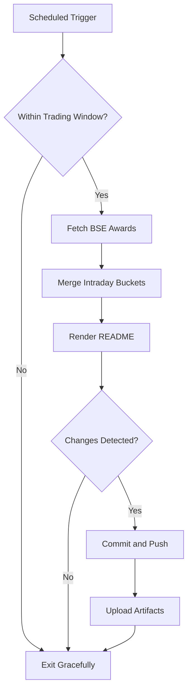

# Bombay Duck 🦆

     

<!-- aim:start -->

## Aim 🎯

⚠️ **Caution:\*\*** This project does not recommend buying or selling any security; it simply tracks BSE "Award of Order / Receipt of Order" announcements for informational purposes.

Bombay Duck keeps a pulse on BSE's "Award of Order / Receipt of Order" announcements so traders can spot fresh bullish catalysts without refreshing the exchange site. The goal is a hands-free tracker that respects BSE rate limits, stores every intraday fetch in git, and keeps the repository's front page as a living dashboard.

<!-- aim:end -->

## Intraday Snapshot 📊

ℹ️ **Important:\*\*** The README snapshot is updated automatically by the scheduled GitHub Action. Always pull the latest changes (or rebase) before editing README content locally to avoid merge conflicts.

<!-- snapshot:start -->

### Today's Awarded Orders (2026-09-21 IST)

| Hour (IST) | Company | Code | Headline | Profit Outlook | Announced At |
| --- | --- | --- | --- | --- | --- |
| 2026-09-21 13:00 | Diamond Power Infrastructure Ltd-$ | 522163 | receipt of order worth Rs. 116.49 Crore for supply of 11 kV XLPE power cable ([Link](https://www.bseindia.com/stock-share-price/diamond-power-infrastructure-ltd/diacabs/522163/)) | Likely Positive | 21 Sep 2026 - 13:39 |
| 2026-09-21 13:00 | GK Energy Ltd | 544525 | GK Energy Limited has informed the exchange that the Company has received a Letter of Award from Maharashtra State Electricity Distribution Company Limited for setting up 150 MW / 300 MWh .... ([Link](https://www.bseindia.com/stock-share-price/gk-energy-ltd/gkenergy/544525/)) | Neutral | 21 Sep 2026 - 13:13 |
| 2026-09-21 11:00 | Kothari Industrial Corporation Ltd | 509732 | award ([Link](https://www.bseindia.com/stock-share-price/kothari-industrial-corporation-ltd/kotic/509732/)) | Neutral | 21 Sep 2026 - 11:06 |
| 2026-09-21 10:00 | Dilip Buildcon Ltd | 540047 | Dilip Buildcon Limited has been declared as L-1 bidder by REC Power Development and Consultancy Limited (RECPDCL) for 'Development and Operation of Intra State Transmission System for Transmission .... ([Link](https://www.bseindia.com/stock-share-price/dilip-buildcon-ltd/dbl/540047/)) | Neutral | 21 Sep 2026 - 10:49 |
| 2026-09-21 09:00 | Garment Mantra Lifestyle Ltd | 539216 | Pursuant to Regulation 30 of SEBI(LODR) receipt of order from Overseas entity is submitted herewith ([Link](https://www.bseindia.com/stock-share-price/garment-mantra-lifestyle-ltd/garmntmntr/539216/)) | Likely Positive | 21 Sep 2026 - 09:34 |
| 2026-09-21 09:00 | Mini Diamonds India Ltd | 523373 | Receipt of significant domestic order for cut and polished natural diamonds amounting to Rs. 14.25 Crores from Aura Diamond ([Link](https://www.bseindia.com/stock-share-price/mini-diamonds-india-ltd/minid/523373/)) | Likely Positive | 21 Sep 2026 - 09:01 |

_Last updated: 21 Sep 2026 - 13:56 | Entries: 6 | Requests: 1 | Retries: 0 | [Raw JSON](data/2026-09-21.json)_

<!-- snapshot:end -->

<!-- how-it-works:start -->

## How It Works ⚙️

1. Scheduled GitHub Action runs at the top of each hour from 09:00 to 16:00 IST, Monday through Friday.
2. Trading-window guard aborts early outside market hours or on weekends/holidays.
3. Node.js fetcher (with throttling and retries) polls the BSE API and archives the raw JSON response.
4. Intraday state manager deduplicates announcements per hour and rolls over automatically at the next market open.
5. Mustache-based renderer injects a fresh table into the README so the latest data is always visible.
6. If anything changed, the workflow commits the README and JSON state back to `main` using a bot token and uploads artifacts for auditing.

```mermaid
flowchart TD
  A[Scheduled Trigger] --> B{Within Trading Window?}
  B -- No --> Z[Exit Gracefully]
  B -- Yes --> C[Fetch BSE Awards]
  C --> D[Merge Intraday Buckets]
  D --> E[Render README]
  E --> F{Changes Detected?}
  F -- No --> Z
  F -- Yes --> G[Commit and Push]
  G --> H[Upload Artifacts]
  H --> Z
```

<!-- how-it-works:end -->

## Automation Timeline 🕒

- **09:00 IST**: First eligible run clears out yesterday's state, fetches fresh announcements, and resets the README snapshot.
- **09:15-15:00 IST**: At the top of each hour the workflow repeats the fetch->merge->render pipeline, committing only when new data appears.
- **After 15:00 IST**: Guard step exits successfully; the last intraday snapshot remains until markets reopen.

## Project Resources 📚

- 📘 [Contributing Guidelines](CONTRIBUTING.md)
- 🧾 [Pull Request Guide](PR_GUIDE.md)
- 🐞 [Known Issues](KNOWN_ISSUES.md)
- 👥 [Authors](AUTHORS.md)

## Appendix 📎

- **API Endpoint:** `https://api.bseindia.com/BseIndiaAPI/api/AnnSubCategoryGetData/w`
- **Query Parameters:** `strCat=Company Update`, `subcategory=Award of Order / Receipt of Order`; date fields align with the active IST trading day.
- **Outputs:** Exposes `trading_date`, `announcement_count`, and the JSON-encoded announcements via `GITHUB_OUTPUT` for downstream jobs.
- **Logs & Summaries:** Fetch step writes a Markdown table to the GitHub Step Summary for quick triage.
