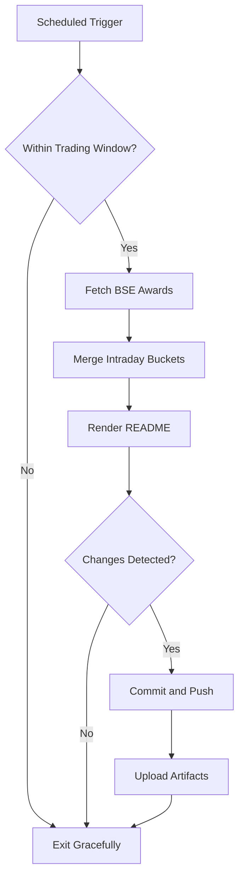

# Bombay Duck 🦆

     

<!-- aim:start -->

## Aim 🎯

⚠️ **Caution:\*\*** This project does not recommend buying or selling any security; it simply tracks BSE "Award of Order / Receipt of Order" announcements for informational purposes.

Bombay Duck keeps a pulse on BSE's "Award of Order / Receipt of Order" announcements so traders can spot fresh bullish catalysts without refreshing the exchange site. The goal is a hands-free tracker that respects BSE rate limits, stores every intraday fetch in git, and keeps the repository's front page as a living dashboard.

<!-- aim:end -->

## Intraday Snapshot 📊

ℹ️ **Important:\*\*** The README snapshot is updated automatically by the scheduled GitHub Action. Always pull the latest changes (or rebase) before editing README content locally to avoid merge conflicts.

<!-- snapshot:start -->

### Today's Awarded Orders (2026-09-23 IST)

| Hour (IST) | Company | Code | Headline | Profit Outlook | Announced At |
| --- | --- | --- | --- | --- | --- |
| 2026-09-23 18:00 | Ashapura Minechem Ltd | 527001 | Disclosure under Regulation 30 of SEBI LODR ([Link](https://www.bseindia.com/stock-share-price/ashapura-minechem-ltd/ashapurmin/527001/)) | Neutral | 23 Sep 2026 - 18:32 |
| 2026-09-23 18:00 | Bharat Dynamics Ltd | 541143 | Receipt of order for SAT- SAAW by IAF ([Link](https://www.bseindia.com/stock-share-price/bharat-dynamics-ltd/bdl/541143/)) | Likely Positive | 23 Sep 2026 - 18:14 |
| 2026-09-23 18:00 | Euphoria Infotech (India) Ltd | 544094 | Bagging of Order ([Link](https://www.bseindia.com/stock-share-price/euphoria-infotech-(india)-ltd/euphoriait/544094/)) | Likely Positive | 23 Sep 2026 - 18:11 |
| 2026-09-23 17:00 | Investment & Precision Castings Ltd | 504786 | Intimation of receipt of order in continuation of earlier order from PLR ([Link](https://www.bseindia.com/stock-share-price/investment--precision-castings-ltd/invprecq/504786/)) | Likely Positive | 23 Sep 2026 - 17:52 |
| 2026-09-23 17:00 | Yaan Enterprises Ltd | 538521 | Intimation under Regulation 30 of SEBI (LODR) Regulations, 2015 for receipt of order of yellow maize of approx. value of Rs. 15.86 crores. ([Link](https://www.bseindia.com/stock-share-price/yaan-enterprises-ltd/yaanent/538521/)) | Likely Positive | 23 Sep 2026 - 17:26 |
| 2026-09-23 16:00 | ITCONS E-Solutions Ltd | 543806 | We are pleased to inform that our Company has bagged a new contract from Department of Defence Research & Development , Office of DG (MSS), Ministry of Defence of contract value of Rs. .... ([Link](https://www.bseindia.com/stock-share-price/itcons-e-solutions-ltd/itcons/543806/)) | Likely Positive | 23 Sep 2026 - 16:11 |
| 2026-09-23 15:00 | Avantel Ltd | 532406 | Receipt of Purchase Order ([Link](https://www.bseindia.com/stock-share-price/avantel-ltd/avantel/532406/)) | Likely Positive | 23 Sep 2026 - 15:45 |
| 2026-09-23 14:00 | Tuni Textile Mills Ltd | 531411 | Pursuant to Regulation 30 of the SEBI (Listing Obligations and Disclosure Requirements) Regulations, 2015 ("SEBI LODR Regulations"), read with the Company''s Policy for Determination of .... ([Link](https://www.bseindia.com/stock-share-price/tuni-textile-mills-ltd/tunitex/531411/)) | Neutral | 23 Sep 2026 - 14:43 |
| 2026-09-23 14:00 | Oriental Rail Infrastructure Ltd | 531859 | Receipt of order ([Link](https://www.bseindia.com/stock-share-price/oriental-rail-infrastructure-ltd/orirail/531859/)) | Likely Positive | 23 Sep 2026 - 14:24 |
| 2026-09-23 14:00 | Fusion Klassroom Edutech Ltd | 544856 | Dear Sir / Madam, Pursuant to Regulation 30 read with Part A of Schedule III of SEBI (LODR) Regulations, 2015, we wish to inform you that Fusion Klassroom Edutech Limited has received .... ([Link](https://www.bseindia.com/stock-share-price/fusion-klassroom-edutech-ltd/klassroom/544856/)) | Neutral | 23 Sep 2026 - 14:21 |
| 2026-09-23 14:00 | Accord Transformer & Switchgear Ltd | 544710 | Intimation of Work / Supply Order Received ([Link](https://www.bseindia.com/stock-share-price/accord-transformer--switchgear-ltd/accordts/544710/)) | Likely Positive | 23 Sep 2026 - 14:17 |
| 2026-09-23 12:00 | Subex Ltd | 532348 | Subex secured a contract with a major mobile network operator in the Asia Pacific region ([Link](https://www.bseindia.com/stock-share-price/subex-ltd/subexltd/532348/)) | Likely Positive | 23 Sep 2026 - 12:36 |
| 2026-09-23 11:00 | Desco Infratech Ltd | 544387 | Intimation regarding receipt of Purchase Order amounting to Rs. 23.40 million from Adani Total Gas Limited ("ATGL") under Regulation 30 of SEBI (Listing and Disclosure Requirements) Regulations, 2015. ([Link](https://www.bseindia.com/stock-share-price/desco-infratech-ltd/desco/544387/)) | Likely Positive | 23 Sep 2026 - 11:49 |
| 2026-09-23 10:00 | Skipper Ltd | 538562 | Receipt of order ([Link](https://www.bseindia.com/stock-share-price/skipper-ltd/skipper/538562/)) | Likely Positive | 23 Sep 2026 - 10:42 |
| 2026-09-23 08:00 | Oswal Pumps Ltd | 544418 | As per attached intimation letter. ([Link](https://www.bseindia.com/stock-share-price/oswal-pumps-ltd/oswalpumps/544418/)) | Neutral | 23 Sep 2026 - 08:54 |

_Last updated: 23 Sep 2026 - 19:29 | Entries: 15 | Requests: 2 | Retries: 0 | [Raw JSON](data/2026-09-23.json)_

<!-- snapshot:end -->

<!-- how-it-works:start -->

## How It Works ⚙️

1. Scheduled GitHub Action runs at the top of each hour from 09:00 to 16:00 IST, Monday through Friday.
2. Trading-window guard aborts early outside market hours or on weekends/holidays.
3. Node.js fetcher (with throttling and retries) polls the BSE API and archives the raw JSON response.
4. Intraday state manager deduplicates announcements per hour and rolls over automatically at the next market open.
5. Mustache-based renderer injects a fresh table into the README so the latest data is always visible.
6. If anything changed, the workflow commits the README and JSON state back to `main` using a bot token and uploads artifacts for auditing.

```mermaid
flowchart TD
  A[Scheduled Trigger] --> B{Within Trading Window?}
  B -- No --> Z[Exit Gracefully]
  B -- Yes --> C[Fetch BSE Awards]
  C --> D[Merge Intraday Buckets]
  D --> E[Render README]
  E --> F{Changes Detected?}
  F -- No --> Z
  F -- Yes --> G[Commit and Push]
  G --> H[Upload Artifacts]
  H --> Z
```

<!-- how-it-works:end -->

## Automation Timeline 🕒

- **09:00 IST**: First eligible run clears out yesterday's state, fetches fresh announcements, and resets the README snapshot.
- **09:15-15:00 IST**: At the top of each hour the workflow repeats the fetch->merge->render pipeline, committing only when new data appears.
- **After 15:00 IST**: Guard step exits successfully; the last intraday snapshot remains until markets reopen.

## Project Resources 📚

- 📘 [Contributing Guidelines](CONTRIBUTING.md)
- 🧾 [Pull Request Guide](PR_GUIDE.md)
- 🐞 [Known Issues](KNOWN_ISSUES.md)
- 👥 [Authors](AUTHORS.md)

## Appendix 📎

- **API Endpoint:** `https://api.bseindia.com/BseIndiaAPI/api/AnnSubCategoryGetData/w`
- **Query Parameters:** `strCat=Company Update`, `subcategory=Award of Order / Receipt of Order`; date fields align with the active IST trading day.
- **Outputs:** Exposes `trading_date`, `announcement_count`, and the JSON-encoded announcements via `GITHUB_OUTPUT` for downstream jobs.
- **Logs & Summaries:** Fetch step writes a Markdown table to the GitHub Step Summary for quick triage.
