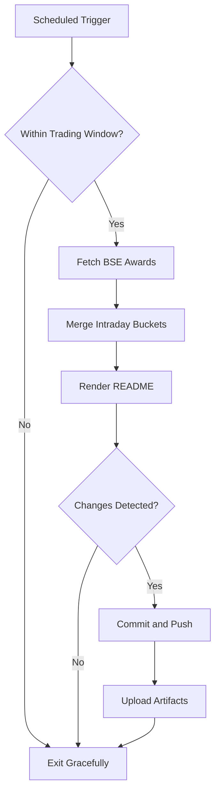

# Bombay Duck 🦆

     

<!-- aim:start -->

## Aim 🎯

⚠️ **Caution:\*\*** This project does not recommend buying or selling any security; it simply tracks BSE "Award of Order / Receipt of Order" announcements for informational purposes.

Bombay Duck keeps a pulse on BSE's "Award of Order / Receipt of Order" announcements so traders can spot fresh bullish catalysts without refreshing the exchange site. The goal is a hands-free tracker that respects BSE rate limits, stores every intraday fetch in git, and keeps the repository's front page as a living dashboard.

<!-- aim:end -->

## Intraday Snapshot 📊

ℹ️ **Important:\*\*** The README snapshot is updated automatically by the scheduled GitHub Action. Always pull the latest changes (or rebase) before editing README content locally to avoid merge conflicts.

<!-- snapshot:start -->

### Today's Awarded Orders (2026-08-20 IST)

| Hour (IST) | Company | Code | Headline | Profit Outlook | Announced At |
| --- | --- | --- | --- | --- | --- |
| 2026-08-20 15:00 | Popular Foundations Ltd | 544259 | Domestic order worth 19.82 Crores from Sastra Deemed to be University, Thanjavur ([Link](https://www.bseindia.com/stock-share-price/popular-foundations-ltd/pfl/544259/)) | Likely Positive | 20 Aug 2026 - 15:25 |
| 2026-08-20 15:00 | B. L. Kashyap and Sons Ltd | 532719 | The Company has secured a new work order worth Rs. 183.18 Crores ([Link](https://www.bseindia.com/stock-share-price/b-l-kashyap-and-sons-ltd/blkashyap/532719/)) | Likely Positive | 20 Aug 2026 - 15:13 |
| 2026-08-20 14:00 | Dee Development Engineers Ltd | 544198 | DEE Development Engineers Ltd has informed that it has received an Order on Job work basis of Rs. 36 crore ([Link](https://www.bseindia.com/stock-share-price/dee-development-engineers-ltd/deedev/544198/)) | Likely Positive | 20 Aug 2026 - 14:33 |
| 2026-08-20 14:00 | Aarvi Encon Ltd | 544850 | Intimation of Work Order Received of Rs. 30 Cr. ([Link](https://www.bseindia.com/stock-share-price/aarvi-encon-ltd/aarvi/544850/)) | Likely Positive | 20 Aug 2026 - 14:28 |
| 2026-08-20 14:00 | Sattrix Information Security Ltd | 544189 | Sattrix Information Security Limited has secured a significant order from one of the Private Sector Bank in India. ([Link](https://www.bseindia.com/stock-share-price/sattrix-information-security-ltd/sattrix/544189/)) | Likely Positive | 20 Aug 2026 - 14:21 |
| 2026-08-20 13:00 | Cryogenic Ogs Ltd | 544440 | We are pleased to inform you that Cryogenic OGS Limited has received two Purchase Orders from a specialized Industrial instrumentation and process optimisation solutions Multinational Company .... ([Link](https://www.bseindia.com/stock-share-price/cryogenic-ogs-ltd/cryogenic/544440/)) | Likely Positive | 20 Aug 2026 - 13:48 |
| 2026-08-20 13:00 | Rail Vikas Nigam Ltd | 542649 | Disclosure under Regulation 30 of SEBI (LODR) Regulations, 2015- Letter of Acceptance from East Coast Railway ([Link](https://www.bseindia.com/stock-share-price/rail-vikas-nigam-ltd/rvnl/542649/)) | Neutral | 20 Aug 2026 - 13:26 |
| 2026-08-20 12:00 | EMS Ltd | 543983 | In continuation to our intimation dated July 13, 2026, we are pleased to inform about Receipt of Letter of Acceptance (LOA) from UP Jal Nigam (Urban), Varanasi for Sewerage Work ([Link](https://www.bseindia.com/stock-share-price/ems-ltd/emslimited/543983/)) | Likely Positive | 20 Aug 2026 - 12:55 |
| 2026-08-20 12:00 | Brahmaputra Infrastructure Ltd | 535693 | M/s Brahmaputra Infrastructure Limited declared an L-1 of an total amount Rs. 78.09 Crores announced by the office of the chief Engineer, Pump Storage Project Department, West Bengal State .... ([Link](https://www.bseindia.com/stock-share-price/brahmaputra-infrastructure-ltd/brahminfra/535693/)) | Neutral | 20 Aug 2026 - 12:14 |
| 2026-08-20 11:00 | ITCONS E-Solutions Ltd | 543806 | We are pleased to inform that our Company has bagged a new contract from South Western Railway, Indian Railways, Ministry of Railways of Rs. 136808080.63. For further details kindly refer .... ([Link](https://www.bseindia.com/stock-share-price/itcons-e-solutions-ltd/itcons/543806/)) | Likely Positive | 20 Aug 2026 - 11:51 |
| 2026-08-20 11:00 | Kernex Microsystems India Ltd | 532686 | We wish to inform you that the company has received an order from Integral Coach Factory, Chennai for an amount of Rs.31.87 crores for the supply, installation and commissioning of On-board .... ([Link](https://www.bseindia.com/stock-share-price/kernex-microsystems-india-ltd/kernex/532686/)) | Likely Positive | 20 Aug 2026 - 11:05 |
| 2026-08-20 10:00 | Dev Information Technology Ltd | 543462 | Intimation Regarding Receipt Of Order ([Link](https://www.bseindia.com/stock-share-price/dev-information-technology-ltd/devit/543462/)) | Likely Positive | 20 Aug 2026 - 10:25 |
| 2026-08-20 10:00 | Larsen & Toubro Ltd | 500510 | L&T Wins (Large) Order for Automated People Mover System at Dubai''s AI Maktoum Airport ([Link](https://www.bseindia.com/stock-share-price/larsen--toubro-ltd/lt/500510/)) | Likely Positive | 20 Aug 2026 - 10:03 |

_Last updated: 20 Aug 2026 - 15:51 | Entries: 13 | Requests: 8 | Retries: 0 | [Raw JSON](data/2026-08-20.json)_

<!-- snapshot:end -->

<!-- how-it-works:start -->

## How It Works ⚙️

1. Scheduled GitHub Action runs at the top of each hour from 09:00 to 16:00 IST, Monday through Friday.
2. Trading-window guard aborts early outside market hours or on weekends/holidays.
3. Node.js fetcher (with throttling and retries) polls the BSE API and archives the raw JSON response.
4. Intraday state manager deduplicates announcements per hour and rolls over automatically at the next market open.
5. Mustache-based renderer injects a fresh table into the README so the latest data is always visible.
6. If anything changed, the workflow commits the README and JSON state back to `main` using a bot token and uploads artifacts for auditing.

```mermaid
flowchart TD
  A[Scheduled Trigger] --> B{Within Trading Window?}
  B -- No --> Z[Exit Gracefully]
  B -- Yes --> C[Fetch BSE Awards]
  C --> D[Merge Intraday Buckets]
  D --> E[Render README]
  E --> F{Changes Detected?}
  F -- No --> Z
  F -- Yes --> G[Commit and Push]
  G --> H[Upload Artifacts]
  H --> Z
```

<!-- how-it-works:end -->

## Automation Timeline 🕒

- **09:00 IST**: First eligible run clears out yesterday's state, fetches fresh announcements, and resets the README snapshot.
- **09:15-15:00 IST**: At the top of each hour the workflow repeats the fetch->merge->render pipeline, committing only when new data appears.
- **After 15:00 IST**: Guard step exits successfully; the last intraday snapshot remains until markets reopen.

## Project Resources 📚

- 📘 [Contributing Guidelines](CONTRIBUTING.md)
- 🧾 [Pull Request Guide](PR_GUIDE.md)
- 🐞 [Known Issues](KNOWN_ISSUES.md)
- 👥 [Authors](AUTHORS.md)

## Appendix 📎

- **API Endpoint:** `https://api.bseindia.com/BseIndiaAPI/api/AnnSubCategoryGetData/w`
- **Query Parameters:** `strCat=Company Update`, `subcategory=Award of Order / Receipt of Order`; date fields align with the active IST trading day.
- **Outputs:** Exposes `trading_date`, `announcement_count`, and the JSON-encoded announcements via `GITHUB_OUTPUT` for downstream jobs.
- **Logs & Summaries:** Fetch step writes a Markdown table to the GitHub Step Summary for quick triage.
