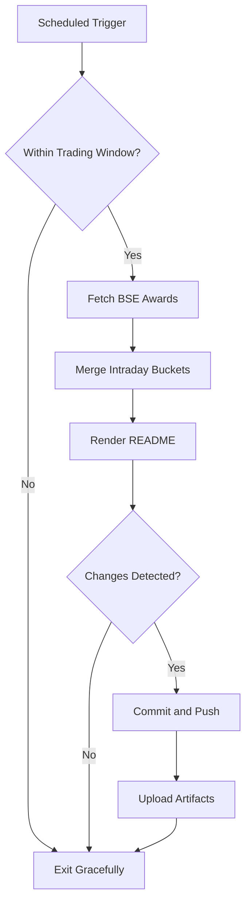

# Bombay Duck 🦆

     

<!-- aim:start -->

## Aim 🎯

⚠️ **Caution:\*\*** This project does not recommend buying or selling any security; it simply tracks BSE "Award of Order / Receipt of Order" announcements for informational purposes.

Bombay Duck keeps a pulse on BSE's "Award of Order / Receipt of Order" announcements so traders can spot fresh bullish catalysts without refreshing the exchange site. The goal is a hands-free tracker that respects BSE rate limits, stores every intraday fetch in git, and keeps the repository's front page as a living dashboard.

<!-- aim:end -->

## Intraday Snapshot 📊

ℹ️ **Important:\*\*** The README snapshot is updated automatically by the scheduled GitHub Action. Always pull the latest changes (or rebase) before editing README content locally to avoid merge conflicts.

<!-- snapshot:start -->

### Today's Awarded Orders (2026-08-05 IST)

| Hour (IST) | Company | Code | Headline | Profit Outlook | Announced At |
| --- | --- | --- | --- | --- | --- |
| 2026-08-05 16:00 | Ameenji Rubber Ltd | 544555 | Disclosure under Regulation 30 of the SEBI (LISTING OBLIGATIONS AND DISCLOSURE REQUIREMENTS) REGULATIONS, 2015 with respect to Purchase Order. ([Link](https://www.bseindia.com/stock-share-price/ameenji-rubber-ltd/ameenji/544555/)) | Likely Positive | 05 Aug 2026 - 16:39 |
| 2026-08-05 16:00 | Medico Remedies Ltd | 540937 | Please find enclosed ([Link](https://www.bseindia.com/stock-share-price/medico-remedies-ltd/medico/540937/)) | Neutral | 05 Aug 2026 - 16:22 |
| 2026-08-05 14:00 | Interarch Building Solutions Ltd | 544232 | Intimation under Regulation 30 of the SEBI(LODR) Regulations, 2015 ,regarding receipt of an Order. ([Link](https://www.bseindia.com/stock-share-price/interarch-building-solutions-ltd/interarch/544232/)) | Likely Positive | 05 Aug 2026 - 14:42 |
| 2026-08-05 14:00 | Kotyark Industries Ltd | 544726 | Intimation under Regulation 30 of SEBI (LODR), 2015 on receipt of LOI from BPCL and HPCL for the supply of Bio Diesel. ([Link](https://www.bseindia.com/stock-share-price/kotyark-industries-ltd/kotyark/544726/)) | Likely Positive | 05 Aug 2026 - 14:12 |
| 2026-08-05 12:00 | Shayona Engineering Ltd | 544686 | Intimation under Regulation 30 of the SEBI (Listing Obligations and Disclosure Requirements) Regulations, 2015 - Receipt of Purchase Orders ([Link](https://www.bseindia.com/stock-share-price/shayona-engineering-ltd/shayonaeng/544686/)) | Likely Positive | 05 Aug 2026 - 12:18 |
| 2026-08-05 12:00 | SEPC Ltd | 532945 | Intimation under under Reg.30 SEBI (LODR) Regulations, 2015 - Receipt of LOA from SAIL - ISP Burnpur for Total Value of Rs.854.57 Crores (Net of ITC) - Detailed Letter Enclosed ([Link](https://www.bseindia.com/stock-share-price/sepc-ltd/sepc/532945/)) | Likely Positive | 05 Aug 2026 - 12:18 |
| 2026-08-05 11:00 | Ceinsys Tech Ltd | 538734 | Intimation for receipt of Purchase Order from EKS InTec India Private Limited ([Link](https://www.bseindia.com/stock-share-price/ceinsys-tech-ltd/ceinsys/538734/)) | Likely Positive | 05 Aug 2026 - 11:42 |
| 2026-08-05 11:00 | Monarch Surveyors and Engineering Consultants Ltd | 544453 | Pursuant to the provisions of Regulation 30 of SEBI (Listing Obligations and Disclosure Requirements), Regulations 2015, we hereby submit that Company has received an order from Central Railway. ([Link](https://www.bseindia.com/stock-share-price/monarch-surveyors-and-engineering-consultants-ltd/msecl/544453/)) | Likely Positive | 05 Aug 2026 - 11:32 |
| 2026-08-05 09:00 | Valiant Communications Ltd-$ | 526775 | Please find attached herewith the Press Release and the required disclosure under Regulation 30 of SEBI Listing Regulations, 2015 ([Link](https://www.bseindia.com/stock-share-price/valiant-communications-ltd/valiant/526775/)) | Neutral | 05 Aug 2026 - 09:44 |
| 2026-08-05 09:00 | Panacea Biotec Ltd | 531349 | We are delighted to inform you that the Company has received Letter of Award for supply of bivalent Oral Polio Vaccine (bOPV) to UNICEF in 10 and 20 dose presentation worth ~US$8.205 million .... ([Link](https://www.bseindia.com/stock-share-price/panacea-biotec-ltd/panaceabio/531349/)) | Neutral | 05 Aug 2026 - 09:39 |

_Last updated: 05 Aug 2026 - 16:43 | Entries: 10 | Requests: 3 | Retries: 1 | [Raw JSON](data/2026-08-05.json)_

<!-- snapshot:end -->

<!-- how-it-works:start -->

## How It Works ⚙️

1. Scheduled GitHub Action runs at the top of each hour from 09:00 to 16:00 IST, Monday through Friday.
2. Trading-window guard aborts early outside market hours or on weekends/holidays.
3. Node.js fetcher (with throttling and retries) polls the BSE API and archives the raw JSON response.
4. Intraday state manager deduplicates announcements per hour and rolls over automatically at the next market open.
5. Mustache-based renderer injects a fresh table into the README so the latest data is always visible.
6. If anything changed, the workflow commits the README and JSON state back to `main` using a bot token and uploads artifacts for auditing.

```mermaid
flowchart TD
  A[Scheduled Trigger] --> B{Within Trading Window?}
  B -- No --> Z[Exit Gracefully]
  B -- Yes --> C[Fetch BSE Awards]
  C --> D[Merge Intraday Buckets]
  D --> E[Render README]
  E --> F{Changes Detected?}
  F -- No --> Z
  F -- Yes --> G[Commit and Push]
  G --> H[Upload Artifacts]
  H --> Z
```

<!-- how-it-works:end -->

## Automation Timeline 🕒

- **09:00 IST**: First eligible run clears out yesterday's state, fetches fresh announcements, and resets the README snapshot.
- **09:15-15:00 IST**: At the top of each hour the workflow repeats the fetch->merge->render pipeline, committing only when new data appears.
- **After 15:00 IST**: Guard step exits successfully; the last intraday snapshot remains until markets reopen.

## Project Resources 📚

- 📘 [Contributing Guidelines](CONTRIBUTING.md)
- 🧾 [Pull Request Guide](PR_GUIDE.md)
- 🐞 [Known Issues](KNOWN_ISSUES.md)
- 👥 [Authors](AUTHORS.md)

## Appendix 📎

- **API Endpoint:** `https://api.bseindia.com/BseIndiaAPI/api/AnnSubCategoryGetData/w`
- **Query Parameters:** `strCat=Company Update`, `subcategory=Award of Order / Receipt of Order`; date fields align with the active IST trading day.
- **Outputs:** Exposes `trading_date`, `announcement_count`, and the JSON-encoded announcements via `GITHUB_OUTPUT` for downstream jobs.
- **Logs & Summaries:** Fetch step writes a Markdown table to the GitHub Step Summary for quick triage.
