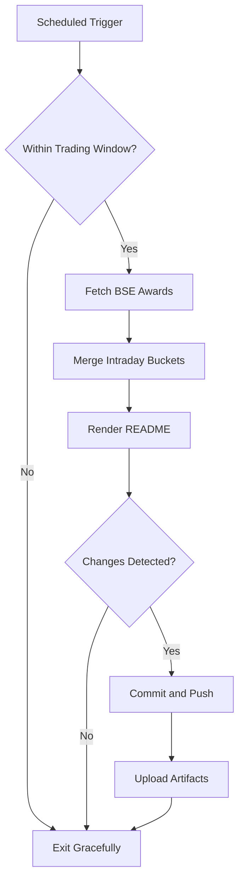

# Bombay Duck 🦆

     

<!-- aim:start -->

## Aim 🎯

⚠️ **Caution:\*\*** This project does not recommend buying or selling any security; it simply tracks BSE "Award of Order / Receipt of Order" announcements for informational purposes.

Bombay Duck keeps a pulse on BSE's "Award of Order / Receipt of Order" announcements so traders can spot fresh bullish catalysts without refreshing the exchange site. The goal is a hands-free tracker that respects BSE rate limits, stores every intraday fetch in git, and keeps the repository's front page as a living dashboard.

<!-- aim:end -->

## Intraday Snapshot 📊

ℹ️ **Important:\*\*** The README snapshot is updated automatically by the scheduled GitHub Action. Always pull the latest changes (or rebase) before editing README content locally to avoid merge conflicts.

<!-- snapshot:start -->

### Today's Awarded Orders (2026-09-18 IST)

| Hour (IST) | Company | Code | Headline | Profit Outlook | Announced At |
| --- | --- | --- | --- | --- | --- |
| 2026-09-18 17:00 | Methodhub Software Ltd | 544637 | Intimation for receipt of order worth Rs. 161 crores from an International Entity ([Link](https://www.bseindia.com/stock-share-price/methodhub-software-ltd/methodhub/544637/)) | Likely Positive | 18 Sep 2026 - 17:19 |
| 2026-09-18 17:00 | HEG Ltd | 509631 | Receipt of orders by Replus Engitech Private Limited, a subsidiary of the Company ([Link](https://www.bseindia.com/stock-share-price/heg-ltd/heg/509631/)) | Likely Positive | 18 Sep 2026 - 17:05 |
| 2026-09-18 16:00 | AstraZeneca Pharma India Ltd | 506820 | Please find the enclosed intimation of the Company with respect to the captioned subject for your reference. ([Link](https://www.bseindia.com/stock-share-price/astrazeneca-pharma-india-ltd/astrazen/506820/)) | Neutral | 18 Sep 2026 - 16:56 |
| 2026-09-18 16:00 | Relicab Cable Manufacturing Ltd | 539760 | Announcement under Regulation 30 (LODR)- Award of order receipt of order ([Link](https://www.bseindia.com/stock-share-price/relicab-cable-manufacturing-ltd/relicab/539760/)) | Likely Positive | 18 Sep 2026 - 16:48 |
| 2026-09-18 14:00 | Zaggle Prepaid Ocean Services Ltd | 543985 | Pursuant to Regulation 30 of SEBI (LODR) Regulations, 2015, this is to inform you that Zaggle Prepaid Ocean Services Limited has entered into an agreement with Bandhan AMC Limited ([Link](https://www.bseindia.com/stock-share-price/zaggle-prepaid-ocean-services-ltd/zaggle/543985/)) | Neutral | 18 Sep 2026 - 14:57 |
| 2026-09-18 14:00 | East India Drums and Barrels Manufacturing Ltd | 523874 | Receipt of Order of Indo Tibetan Border Police, Ministry of Home Affairs, Government of India ([Link](https://www.bseindia.com/stock-share-price/east-india-drums-and-barrels-manufacturing-ltd/eastindia/523874/)) | Likely Positive | 18 Sep 2026 - 14:55 |
| 2026-09-18 14:00 | Hazoor Multi Projects Ltd-$ | 532467 | We are pleased to inform you that the Company has received the Work Order from M/s Emerald Haven Life Spaces 3 Private Limited (EHLS3PL) at Pallavaram, Chengalpattu, Chennai. ([Link](https://www.bseindia.com/stock-share-price/hazoor-multi-projects-ltd/hazoor/532467/)) | Likely Positive | 18 Sep 2026 - 14:21 |
| 2026-09-18 11:00 | KS Smart Technologies Ltd | 516038 | Intimation regarding bagging of order by KS Smart Solutions Private Limited, a Wholly-Owned Subsidiary of the Company from School Education Department, Government of Punjab. ([Link](https://www.bseindia.com/stock-share-price/ks-smart-technologies-ltd/kssmart/516038/)) | Likely Positive | 18 Sep 2026 - 11:49 |
| 2026-09-18 11:00 | Siyaram Recycling Industries Ltd | 544047 | Attached herewith Intimation under Regulation 30 of SEBI LODR- Awarding of Order updates ([Link](https://www.bseindia.com/stock-share-price/siyaram-recycling-industries-ltd/siyaram/544047/)) | Likely Positive | 18 Sep 2026 - 11:39 |
| 2026-09-18 11:00 | Cryogenic Ogs Ltd | 544440 | We are pleased to inform you that Cryogenic OGS Limited has received a Purchase Order from a Global EPC Company amounting to USD 2,022,816 (i.e. approximately Rs. 19.36 Crores.). ([Link](https://www.bseindia.com/stock-share-price/cryogenic-ogs-ltd/cryogenic/544440/)) | Likely Positive | 18 Sep 2026 - 11:38 |
| 2026-09-18 10:00 | DMR Engineering Ltd | 543410 | We wish to inform you that DMR Engineering Ltd. as the Lead Member, in a Joint Venture with Shri Balaji Hydro Construction Private Limited, has received a Letter of Award (LoA) for the .... ([Link](https://www.bseindia.com/stock-share-price/dmr-engineering-ltd/dmr/543410/)) | Neutral | 18 Sep 2026 - 10:36 |
| 2026-09-18 09:00 | BEML Ltd | 500048 | Receipt of Order ([Link](https://www.bseindia.com/stock-share-price/beml-ltd/beml/500048/)) | Likely Positive | 18 Sep 2026 - 09:17 |

_Last updated: 18 Sep 2026 - 18:03 | Entries: 12 | Requests: 2 | Retries: 0 | [Raw JSON](data/2026-09-18.json)_

<!-- snapshot:end -->

<!-- how-it-works:start -->

## How It Works ⚙️

1. Scheduled GitHub Action runs at the top of each hour from 09:00 to 16:00 IST, Monday through Friday.
2. Trading-window guard aborts early outside market hours or on weekends/holidays.
3. Node.js fetcher (with throttling and retries) polls the BSE API and archives the raw JSON response.
4. Intraday state manager deduplicates announcements per hour and rolls over automatically at the next market open.
5. Mustache-based renderer injects a fresh table into the README so the latest data is always visible.
6. If anything changed, the workflow commits the README and JSON state back to `main` using a bot token and uploads artifacts for auditing.

```mermaid
flowchart TD
  A[Scheduled Trigger] --> B{Within Trading Window?}
  B -- No --> Z[Exit Gracefully]
  B -- Yes --> C[Fetch BSE Awards]
  C --> D[Merge Intraday Buckets]
  D --> E[Render README]
  E --> F{Changes Detected?}
  F -- No --> Z
  F -- Yes --> G[Commit and Push]
  G --> H[Upload Artifacts]
  H --> Z
```

<!-- how-it-works:end -->

## Automation Timeline 🕒

- **09:00 IST**: First eligible run clears out yesterday's state, fetches fresh announcements, and resets the README snapshot.
- **09:15-15:00 IST**: At the top of each hour the workflow repeats the fetch->merge->render pipeline, committing only when new data appears.
- **After 15:00 IST**: Guard step exits successfully; the last intraday snapshot remains until markets reopen.

## Project Resources 📚

- 📘 [Contributing Guidelines](CONTRIBUTING.md)
- 🧾 [Pull Request Guide](PR_GUIDE.md)
- 🐞 [Known Issues](KNOWN_ISSUES.md)
- 👥 [Authors](AUTHORS.md)

## Appendix 📎

- **API Endpoint:** `https://api.bseindia.com/BseIndiaAPI/api/AnnSubCategoryGetData/w`
- **Query Parameters:** `strCat=Company Update`, `subcategory=Award of Order / Receipt of Order`; date fields align with the active IST trading day.
- **Outputs:** Exposes `trading_date`, `announcement_count`, and the JSON-encoded announcements via `GITHUB_OUTPUT` for downstream jobs.
- **Logs & Summaries:** Fetch step writes a Markdown table to the GitHub Step Summary for quick triage.
