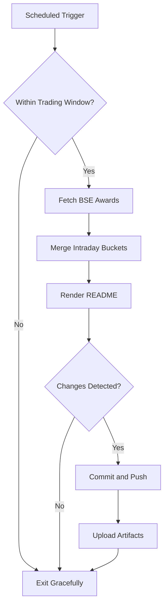

# Bombay Duck 🦆

     

<!-- aim:start -->

## Aim 🎯

⚠️ **Caution:\*\*** This project does not recommend buying or selling any security; it simply tracks BSE "Award of Order / Receipt of Order" announcements for informational purposes.

Bombay Duck keeps a pulse on BSE's "Award of Order / Receipt of Order" announcements so traders can spot fresh bullish catalysts without refreshing the exchange site. The goal is a hands-free tracker that respects BSE rate limits, stores every intraday fetch in git, and keeps the repository's front page as a living dashboard.

<!-- aim:end -->

## Intraday Snapshot 📊

ℹ️ **Important:\*\*** The README snapshot is updated automatically by the scheduled GitHub Action. Always pull the latest changes (or rebase) before editing README content locally to avoid merge conflicts.

<!-- snapshot:start -->

### Today's Awarded Orders (2026-09-07 IST)

| Hour (IST) | Company | Code | Headline | Profit Outlook | Announced At |
| --- | --- | --- | --- | --- | --- |
| 2026-09-07 18:00 | Rajputana Stainless Ltd | 544731 | Intimation under Regulation 30. ([Link](https://www.bseindia.com/stock-share-price/rajputana-stainless-ltd/rsl/544731/)) | Neutral | 07 Sep 2026 - 18:12 |
| 2026-09-07 17:00 | GE Vernova T&D India Ltd | 522275 | Intimation of Receipt of Order ([Link](https://www.bseindia.com/stock-share-price/ge-vernova-td-india-ltd/gvtd/522275/)) | Likely Positive | 07 Sep 2026 - 17:44 |
| 2026-09-07 17:00 | Container Corporation of India Ltd | 531344 | Award of Order ([Link](https://www.bseindia.com/stock-share-price/container-corporation-of-india-ltd/concor/531344/)) | Likely Positive | 07 Sep 2026 - 17:41 |
| 2026-09-07 14:00 | Radaan Mediaworks India Ltd | 590070 | Intimation under Reg 30 of LODR - Receipt of favourable Order from CENSTAT, Chennai ([Link](https://www.bseindia.com/stock-share-price/radaan-mediaworks-india-ltd/radaan/590070/)) | Likely Positive | 07 Sep 2026 - 14:46 |
| 2026-09-07 13:00 | Accord Transformer & Switchgear Ltd | 544710 | Order Received for an Amount 1.92 Crores ([Link](https://www.bseindia.com/stock-share-price/accord-transformer--switchgear-ltd/accordts/544710/)) | Likely Positive | 07 Sep 2026 - 13:22 |
| 2026-09-07 12:00 | Techknowgreen Solutions Ltd | 543991 | Receipt of order from Mahindra & Mahindra Limited ([Link](https://www.bseindia.com/stock-share-price/techknowgreen-solutions-ltd/techkgreen/543991/)) | Likely Positive | 07 Sep 2026 - 12:04 |
| 2026-09-07 09:00 | Investment & Precision Castings Ltd | 504786 | Intimation under regulation 30 of SEBI (LODR), 2015 for recepit of signifiocat irder from HAL ([Link](https://www.bseindia.com/stock-share-price/investment--precision-castings-ltd/invprecq/504786/)) | Neutral | 07 Sep 2026 - 09:05 |
| 2026-09-07 08:00 | VA Tech Wabag Ltd | 533269 | WABAG secures repeat order from RIL to deliver state-of-the-art ETP at Jamnagar ([Link](https://www.bseindia.com/stock-share-price/va-tech-wabag-ltd/wabag/533269/)) | Likely Positive | 07 Sep 2026 - 08:14 |

_Last updated: 07 Sep 2026 - 19:20 | Entries: 8 | Requests: 2 | Retries: 2 | [Raw JSON](data/2026-09-07.json)_

<!-- snapshot:end -->

<!-- how-it-works:start -->

## How It Works ⚙️

1. Scheduled GitHub Action runs at the top of each hour from 09:00 to 16:00 IST, Monday through Friday.
2. Trading-window guard aborts early outside market hours or on weekends/holidays.
3. Node.js fetcher (with throttling and retries) polls the BSE API and archives the raw JSON response.
4. Intraday state manager deduplicates announcements per hour and rolls over automatically at the next market open.
5. Mustache-based renderer injects a fresh table into the README so the latest data is always visible.
6. If anything changed, the workflow commits the README and JSON state back to `main` using a bot token and uploads artifacts for auditing.

```mermaid
flowchart TD
  A[Scheduled Trigger] --> B{Within Trading Window?}
  B -- No --> Z[Exit Gracefully]
  B -- Yes --> C[Fetch BSE Awards]
  C --> D[Merge Intraday Buckets]
  D --> E[Render README]
  E --> F{Changes Detected?}
  F -- No --> Z
  F -- Yes --> G[Commit and Push]
  G --> H[Upload Artifacts]
  H --> Z
```

<!-- how-it-works:end -->

## Automation Timeline 🕒

- **09:00 IST**: First eligible run clears out yesterday's state, fetches fresh announcements, and resets the README snapshot.
- **09:15-15:00 IST**: At the top of each hour the workflow repeats the fetch->merge->render pipeline, committing only when new data appears.
- **After 15:00 IST**: Guard step exits successfully; the last intraday snapshot remains until markets reopen.

## Project Resources 📚

- 📘 [Contributing Guidelines](CONTRIBUTING.md)
- 🧾 [Pull Request Guide](PR_GUIDE.md)
- 🐞 [Known Issues](KNOWN_ISSUES.md)
- 👥 [Authors](AUTHORS.md)

## Appendix 📎

- **API Endpoint:** `https://api.bseindia.com/BseIndiaAPI/api/AnnSubCategoryGetData/w`
- **Query Parameters:** `strCat=Company Update`, `subcategory=Award of Order / Receipt of Order`; date fields align with the active IST trading day.
- **Outputs:** Exposes `trading_date`, `announcement_count`, and the JSON-encoded announcements via `GITHUB_OUTPUT` for downstream jobs.
- **Logs & Summaries:** Fetch step writes a Markdown table to the GitHub Step Summary for quick triage.
