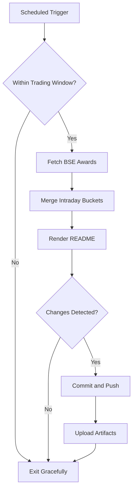

# Bombay Duck 🦆

     

<!-- aim:start -->

## Aim 🎯

⚠️ **Caution:\*\*** This project does not recommend buying or selling any security; it simply tracks BSE "Award of Order / Receipt of Order" announcements for informational purposes.

Bombay Duck keeps a pulse on BSE's "Award of Order / Receipt of Order" announcements so traders can spot fresh bullish catalysts without refreshing the exchange site. The goal is a hands-free tracker that respects BSE rate limits, stores every intraday fetch in git, and keeps the repository's front page as a living dashboard.

<!-- aim:end -->

## Intraday Snapshot 📊

ℹ️ **Important:\*\*** The README snapshot is updated automatically by the scheduled GitHub Action. Always pull the latest changes (or rebase) before editing README content locally to avoid merge conflicts.

<!-- snapshot:start -->

### Today's Awarded Orders (2026-09-08 IST)

| Hour (IST) | Company | Code | Headline | Profit Outlook | Announced At |
| --- | --- | --- | --- | --- | --- |
| 2026-09-08 16:00 | Cosmic CRF Ltd | 543928 | Receipt of Purchase Order of Rs. 651.00 Lakhs by M/s. N. S Engineering Projects Private Limited, a subsidiary of M/s. Cosmic CRF Limited ([Link](https://www.bseindia.com/stock-share-price/cosmic-crf-ltd/cosmiccrf/543928/)) | Likely Positive | 08 Sep 2026 - 16:57 |
| 2026-09-08 16:00 | Innovision Ltd | 544732 | Intimation of work order received from NHAI at NH-39 for four lane of Jhansi Khajuraho Section of Madhya Pradesh Toll on the basis of competitive bidding ([Link](https://www.bseindia.com/stock-share-price/innovision-ltd/innovision/544732/)) | Likely Positive | 08 Sep 2026 - 16:56 |
| 2026-09-08 16:00 | Cosmic CRF Ltd | 543928 | Receipt of Purchase Order by the Company of Rs. 563.27 Lakhs. ([Link](https://www.bseindia.com/stock-share-price/cosmic-crf-ltd/cosmiccrf/543928/)) | Likely Positive | 08 Sep 2026 - 16:53 |
| 2026-09-08 16:00 | Innovision Ltd | 544732 | Intimation of Work order received from NHAI, Six Lane of Indore Dewas section of NH-3 in the state of Madhya Pradesh on the basis of competitive bidding ([Link](https://www.bseindia.com/stock-share-price/innovision-ltd/innovision/544732/)) | Likely Positive | 08 Sep 2026 - 16:36 |
| 2026-09-08 16:00 | Enviro Infra Engineers Ltd | 544290 | Receipt of Order worth Rs. 189.99 Crores(excluding GST) ([Link](https://www.bseindia.com/stock-share-price/enviro-infra-engineers-ltd/eiel/544290/)) | Likely Positive | 08 Sep 2026 - 16:22 |
| 2026-09-08 16:00 | Ascensive Educare Ltd | 543443 | Bagging of Order ([Link](https://www.bseindia.com/stock-share-price/ascensive-educare-ltd/ascensive/543443/)) | Likely Positive | 08 Sep 2026 - 16:18 |
| 2026-09-08 15:00 | Hazoor Multi Projects Ltd-$ | 532467 | We are pleased to inform you that the Company has been awarded the Letter of Award from the National Highways Auhtority of India (NHAI) at H. Pudhupatti Fee Plaza. ([Link](https://www.bseindia.com/stock-share-price/hazoor-multi-projects-ltd/hazoor/532467/)) | Likely Positive | 08 Sep 2026 - 15:34 |
| 2026-09-08 13:00 | Deep Industries Ltd | 543288 | Receipt of order ([Link](https://www.bseindia.com/stock-share-price/deep-industries-ltd/deepinds/543288/)) | Likely Positive | 08 Sep 2026 - 13:41 |
| 2026-09-08 12:00 | Goldiam International Ltd | 526729 | We are pleased to announce that the Compnay, along with its Wholly Owned subsidiaries, have received purchase orders aggregating to Rs.60 cr. for the manufacturing and export of lab-grown .... ([Link](https://www.bseindia.com/stock-share-price/goldiam-international-ltd/goldiam/526729/)) | Likely Positive | 08 Sep 2026 - 12:53 |
| 2026-09-08 12:00 | Ceigall India Ltd | 544223 | In accordance with the above-mentioned provisions of the SEBI (Listing Obligations and Disclosure Requirements) Regulation, 2015, we wish to inform you that Ceigall India Limited ('CIL') .... ([Link](https://www.bseindia.com/stock-share-price/ceigall-india-ltd/ceigall/544223/)) | Neutral | 08 Sep 2026 - 12:42 |
| 2026-09-08 12:00 | Jyoti Ltd-$ | 504076 | Receipt of Letter of Intent (LOI) ([Link](https://www.bseindia.com/stock-share-price/jyoti-ltd/jyoti/504076/)) | Likely Positive | 08 Sep 2026 - 12:39 |
| 2026-09-08 10:00 | Affordable Robotic & Automation Ltd | 541402 | Pursuant to Regulation 30 of SEBI (Listing Obligations and Disclosure Requirements) Regulations, 2015, we hereby inform you that the Company has received a purchase order from its esteemed .... ([Link](https://www.bseindia.com/stock-share-price/affordable-robotic--automation-ltd/affordable/541402/)) | Likely Positive | 08 Sep 2026 - 10:27 |
| 2026-09-08 10:00 | Valiant Communications Ltd-$ | 526775 | As attached ([Link](https://www.bseindia.com/stock-share-price/valiant-communications-ltd/valiant/526775/)) | Neutral | 08 Sep 2026 - 10:11 |
| 2026-09-08 10:00 | RMC Switchgears Ltd | 540358 | LOE worth Rs. 14,98,65,900/- ([Link](https://www.bseindia.com/stock-share-price/rmc-switchgears-ltd/rmc/540358/)) | Neutral | 08 Sep 2026 - 10:06 |
| 2026-09-08 08:00 | Organic Recycling Systems Ltd | 543997 | We Wish to inform you that Solapur Bioenergy Systems Private Limited ("SBEPSL"), a Wholly Owned Subsidiary of Organic Recycling Systems Limited (The Company), has secured Contracts from .... ([Link](https://www.bseindia.com/stock-share-price/organic-recycling-systems-ltd/organicrec/543997/)) | Likely Positive | 08 Sep 2026 - 08:35 |
| 2026-09-08 01:00 | HLE Glascoat Ltd | 522215 | HLE Glascoat Limited has informed the exchange about the receipt of order / contract. ([Link](https://www.bseindia.com/stock-share-price/hle-glascoat-ltd/hleglas/522215/)) | Likely Positive | 08 Sep 2026 - 01:43 |

_Last updated: 08 Sep 2026 - 17:58 | Entries: 16 | Requests: 2 | Retries: 0 | [Raw JSON](data/2026-09-08.json)_

<!-- snapshot:end -->

<!-- how-it-works:start -->

## How It Works ⚙️

1. Scheduled GitHub Action runs at the top of each hour from 09:00 to 16:00 IST, Monday through Friday.
2. Trading-window guard aborts early outside market hours or on weekends/holidays.
3. Node.js fetcher (with throttling and retries) polls the BSE API and archives the raw JSON response.
4. Intraday state manager deduplicates announcements per hour and rolls over automatically at the next market open.
5. Mustache-based renderer injects a fresh table into the README so the latest data is always visible.
6. If anything changed, the workflow commits the README and JSON state back to `main` using a bot token and uploads artifacts for auditing.

```mermaid
flowchart TD
  A[Scheduled Trigger] --> B{Within Trading Window?}
  B -- No --> Z[Exit Gracefully]
  B -- Yes --> C[Fetch BSE Awards]
  C --> D[Merge Intraday Buckets]
  D --> E[Render README]
  E --> F{Changes Detected?}
  F -- No --> Z
  F -- Yes --> G[Commit and Push]
  G --> H[Upload Artifacts]
  H --> Z
```

<!-- how-it-works:end -->

## Automation Timeline 🕒

- **09:00 IST**: First eligible run clears out yesterday's state, fetches fresh announcements, and resets the README snapshot.
- **09:15-15:00 IST**: At the top of each hour the workflow repeats the fetch->merge->render pipeline, committing only when new data appears.
- **After 15:00 IST**: Guard step exits successfully; the last intraday snapshot remains until markets reopen.

## Project Resources 📚

- 📘 [Contributing Guidelines](CONTRIBUTING.md)
- 🧾 [Pull Request Guide](PR_GUIDE.md)
- 🐞 [Known Issues](KNOWN_ISSUES.md)
- 👥 [Authors](AUTHORS.md)

## Appendix 📎

- **API Endpoint:** `https://api.bseindia.com/BseIndiaAPI/api/AnnSubCategoryGetData/w`
- **Query Parameters:** `strCat=Company Update`, `subcategory=Award of Order / Receipt of Order`; date fields align with the active IST trading day.
- **Outputs:** Exposes `trading_date`, `announcement_count`, and the JSON-encoded announcements via `GITHUB_OUTPUT` for downstream jobs.
- **Logs & Summaries:** Fetch step writes a Markdown table to the GitHub Step Summary for quick triage.
