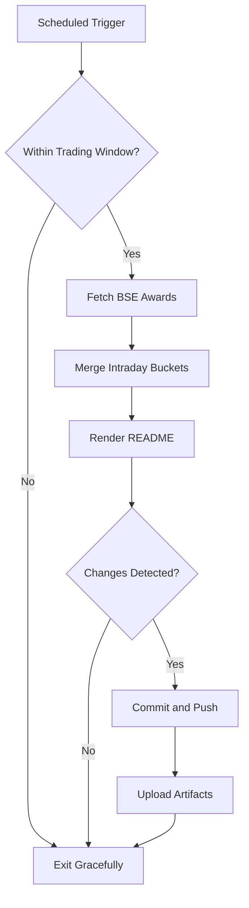

# Bombay Duck 🦆

     

<!-- aim:start -->

## Aim 🎯

⚠️ **Caution:\*\*** This project does not recommend buying or selling any security; it simply tracks BSE "Award of Order / Receipt of Order" announcements for informational purposes.

Bombay Duck keeps a pulse on BSE's "Award of Order / Receipt of Order" announcements so traders can spot fresh bullish catalysts without refreshing the exchange site. The goal is a hands-free tracker that respects BSE rate limits, stores every intraday fetch in git, and keeps the repository's front page as a living dashboard.

<!-- aim:end -->

## Intraday Snapshot 📊

ℹ️ **Important:\*\*** The README snapshot is updated automatically by the scheduled GitHub Action. Always pull the latest changes (or rebase) before editing README content locally to avoid merge conflicts.

<!-- snapshot:start -->

### Today's Awarded Orders (2026-09-29 IST)

| Hour (IST) | Company | Code | Headline | Profit Outlook | Announced At |
| --- | --- | --- | --- | --- | --- |
| 2026-09-29 21:00 | Laser Power & Infra Ltd | 544822 | Intimation pursuant to Regulation 30 of the SEBI (Listing Obligations and Disclosure Requirements) Regulations, 2015- Letter of Intent received from CESC Limited for execution of EPC works ([Link](https://www.bseindia.com/stock-share-price/laser-power--infra-ltd/laserpower/544822/)) | Neutral | 29 Sep 2026 - 21:16 |
| 2026-09-29 20:00 | KSB Ltd | 500249 | KSB Limited receives letter of award from Dangote projects free zone enterprise ([Link](https://www.bseindia.com/stock-share-price/ksb-ltd/ksb/500249/)) | Neutral | 29 Sep 2026 - 20:39 |
| 2026-09-29 18:00 | JNK India Ltd | 544167 | Intimation regarding receipt of orders. ([Link](https://www.bseindia.com/stock-share-price/jnk-india-ltd/jnkindia/544167/)) | Likely Positive | 29 Sep 2026 - 18:34 |
| 2026-09-29 17:00 | Power Mech Projects Ltd | 539302 | Please find the enclosed disclosure related to receipt of Order ([Link](https://www.bseindia.com/stock-share-price/power-mech-projects-ltd/powermech/539302/)) | Likely Positive | 29 Sep 2026 - 17:54 |
| 2026-09-29 17:00 | Krystal Integrated Services Ltd | 544149 | Intimation under Regulation 30 of SEBI (Listing Obligations and Disclosure Requirements) Regulations, 2015 ([Link](https://www.bseindia.com/stock-share-price/krystal-integrated-services-ltd/krystal/544149/)) | Neutral | 29 Sep 2026 - 17:49 |
| 2026-09-29 17:00 | Accord Transformer & Switchgear Ltd | 544710 | Intimation for Material Order received for an amount -8.63 Crores ([Link](https://www.bseindia.com/stock-share-price/accord-transformer--switchgear-ltd/accordts/544710/)) | Likely Positive | 29 Sep 2026 - 17:06 |
| 2026-09-29 16:00 | STL Networks Ltd | 544395 | Receipt of Letter of Intent ([Link](https://www.bseindia.com/stock-share-price/stl-networks-ltd/stlnetwork/544395/)) | Likely Positive | 29 Sep 2026 - 16:09 |
| 2026-09-29 15:00 | ArisInfra Solutions Ltd | 544419 | Receipt of Order from Transcon Bellaviu Private Limited, SPV of Transcon Group through Subsidiary company ([Link](https://www.bseindia.com/stock-share-price/arisinfra-solutions-ltd/aris/544419/)) | Likely Positive | 29 Sep 2026 - 15:50 |
| 2026-09-29 14:00 | Schneider Electric President Systems Ltd | 544786 | Please find enclosed Order in Original received by the Company in relation to availment of Input Tax Credit on certain reverse charge mechanism (RCM) transactions pertaining to pre GST .... ([Link](https://www.bseindia.com/stock-share-price/schneider-electric-president-systems-ltd/selectric/544786/)) | Likely Positive | 29 Sep 2026 - 14:16 |
| 2026-09-29 14:00 | Aptech Ltd | 532475 | Disclosure under Regulation 30 of SEBI (Listing Obligations and Disclosure Requirements) Regulations, 2015 ([Link](https://www.bseindia.com/stock-share-price/aptech-ltd/aptecht/532475/)) | Neutral | 29 Sep 2026 - 14:16 |
| 2026-09-29 13:00 | Bondada Engineering Ltd | 543971 | Intimation of receipt of work order. ([Link](https://www.bseindia.com/stock-share-price/bondada-engineering-ltd/bondada/543971/)) | Likely Positive | 29 Sep 2026 - 13:59 |
| 2026-09-29 12:00 | Valiant Communications Ltd-$ | 526775 | Receives Letter of Award worth Rs. 4,025 Lacs for Indian Power Utilities ([Link](https://www.bseindia.com/stock-share-price/valiant-communications-ltd/valiant/526775/)) | Neutral | 29 Sep 2026 - 12:41 |
| 2026-09-29 11:00 | Sugs Lloyd Ltd | 544501 | Sugs LLoyd Limited receives LOI from Sachkhand Sri Harmandir Sahib, Sri Darbar Sahib, Sri Amritsar for 2 MW(AC) Ground Mounted Solar Power Project ([Link](https://www.bseindia.com/stock-share-price/sugs-lloyd-ltd/sugslloyd/544501/)) | Neutral | 29 Sep 2026 - 11:13 |
| 2026-09-29 10:00 | ITCONS E-Solutions Ltd | 543806 | We are pleased to inform that our Company has bagged a new contract from UP Power Transmission Corporation Limited for a period of 2 years of contract value of Rs. 69400954.24. For further .... ([Link](https://www.bseindia.com/stock-share-price/itcons-e-solutions-ltd/itcons/543806/)) | Likely Positive | 29 Sep 2026 - 10:40 |
| 2026-09-29 10:00 | Shayona Engineering Ltd | 544686 | Intimation under Reg 30 for receipt of Order ([Link](https://www.bseindia.com/stock-share-price/shayona-engineering-ltd/shayonaeng/544686/)) | Likely Positive | 29 Sep 2026 - 10:32 |

_Last updated: 29 Sep 2026 - 21:46 | Entries: 15 | Requests: 2 | Retries: 0 | [Raw JSON](data/2026-09-29.json)_

<!-- snapshot:end -->

<!-- how-it-works:start -->

## How It Works ⚙️

1. Scheduled GitHub Action runs at the top of each hour from 09:00 to 16:00 IST, Monday through Friday.
2. Trading-window guard aborts early outside market hours or on weekends/holidays.
3. Node.js fetcher (with throttling and retries) polls the BSE API and archives the raw JSON response.
4. Intraday state manager deduplicates announcements per hour and rolls over automatically at the next market open.
5. Mustache-based renderer injects a fresh table into the README so the latest data is always visible.
6. If anything changed, the workflow commits the README and JSON state back to `main` using a bot token and uploads artifacts for auditing.

```mermaid
flowchart TD
  A[Scheduled Trigger] --> B{Within Trading Window?}
  B -- No --> Z[Exit Gracefully]
  B -- Yes --> C[Fetch BSE Awards]
  C --> D[Merge Intraday Buckets]
  D --> E[Render README]
  E --> F{Changes Detected?}
  F -- No --> Z
  F -- Yes --> G[Commit and Push]
  G --> H[Upload Artifacts]
  H --> Z
```

<!-- how-it-works:end -->

## Automation Timeline 🕒

- **09:00 IST**: First eligible run clears out yesterday's state, fetches fresh announcements, and resets the README snapshot.
- **09:15-15:00 IST**: At the top of each hour the workflow repeats the fetch->merge->render pipeline, committing only when new data appears.
- **After 15:00 IST**: Guard step exits successfully; the last intraday snapshot remains until markets reopen.

## Project Resources 📚

- 📘 [Contributing Guidelines](CONTRIBUTING.md)
- 🧾 [Pull Request Guide](PR_GUIDE.md)
- 🐞 [Known Issues](KNOWN_ISSUES.md)
- 👥 [Authors](AUTHORS.md)

## Appendix 📎

- **API Endpoint:** `https://api.bseindia.com/BseIndiaAPI/api/AnnSubCategoryGetData/w`
- **Query Parameters:** `strCat=Company Update`, `subcategory=Award of Order / Receipt of Order`; date fields align with the active IST trading day.
- **Outputs:** Exposes `trading_date`, `announcement_count`, and the JSON-encoded announcements via `GITHUB_OUTPUT` for downstream jobs.
- **Logs & Summaries:** Fetch step writes a Markdown table to the GitHub Step Summary for quick triage.
