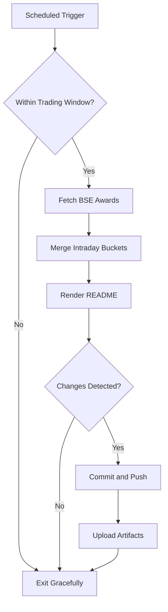

# Bombay Duck 🦆

     

<!-- aim:start -->

## Aim 🎯

⚠️ **Caution:\*\*** This project does not recommend buying or selling any security; it simply tracks BSE "Award of Order / Receipt of Order" announcements for informational purposes.

Bombay Duck keeps a pulse on BSE's "Award of Order / Receipt of Order" announcements so traders can spot fresh bullish catalysts without refreshing the exchange site. The goal is a hands-free tracker that respects BSE rate limits, stores every intraday fetch in git, and keeps the repository's front page as a living dashboard.

<!-- aim:end -->

## Intraday Snapshot 📊

ℹ️ **Important:\*\*** The README snapshot is updated automatically by the scheduled GitHub Action. Always pull the latest changes (or rebase) before editing README content locally to avoid merge conflicts.

<!-- snapshot:start -->

### Today's Awarded Orders (2026-10-08 IST)

| Hour (IST) | Company | Code | Headline | Profit Outlook | Announced At |
| --- | --- | --- | --- | --- | --- |
| 2026-10-08 20:00 | KEC International Ltd | 532714 | We are pleased to enclose a copy of the press release with respect to new orders of Rs. 1,030 Crores secured by the Company. All the orders mentioned in the enclosed press release have .... ([Link](https://www.bseindia.com/stock-share-price/kec-international-ltd/kec/532714/)) | Likely Positive | 08 Oct 2026 - 20:55 |
| 2026-10-08 19:00 | Highway Infrastructure Ltd | 544477 | Company received a work order for the Velanchettiyur Fee Plaza. ([Link](https://www.bseindia.com/stock-share-price/highway-infrastructure-ltd/hilinfra/544477/)) | Likely Positive | 08 Oct 2026 - 19:20 |
| 2026-10-08 19:00 | Waaree Renewable Technologies Ltd | 534618 | Please find attached herewith disclosure for Order awarded to the Company ([Link](https://www.bseindia.com/stock-share-price/waaree-renewable-technologies-ltd/waareertl/534618/)) | Likely Positive | 08 Oct 2026 - 19:07 |
| 2026-10-08 17:00 | S&S Power Switchgear Ltd | 517273 | Announcement under regulation 30 (LODR) Receipt of order ([Link](https://www.bseindia.com/stock-share-price/ss-power-switchgear-ltd/sspower/517273/)) | Likely Positive | 08 Oct 2026 - 17:36 |
| 2026-10-08 17:00 | NCC Ltd | 500294 | Disclosure regarding receipt of Major Order ([Link](https://www.bseindia.com/stock-share-price/ncc-ltd/ncc/500294/)) | Likely Positive | 08 Oct 2026 - 17:26 |
| 2026-10-08 17:00 | Pace Digitek Ltd | 544550 | Intimation for receipt of letter of Intent (LOI) aggregating to Rs. 1,794 million ([Link](https://www.bseindia.com/stock-share-price/pace-digitek-ltd/pacedigitk/544550/)) | Likely Positive | 08 Oct 2026 - 17:07 |
| 2026-10-08 13:00 | EMS Ltd | 543983 | In continuation to our intimation dated August 17th, 2026, we are pleased to inform about receipt of Letter of Award from Municipal Corporation Jodhpur for Sewerage Work ([Link](https://www.bseindia.com/stock-share-price/ems-ltd/emslimited/543983/)) | Likely Positive | 08 Oct 2026 - 13:06 |
| 2026-10-08 12:00 | Cranex Ltd | 522001 | Enclosed herewith is the intimation regarding the receipt of a Letter of Award (LOA) for a new order valued at approximately Rs. 1,06,81,360/- for supply, commissioning and testing of a .... ([Link](https://www.bseindia.com/stock-share-price/cranex-ltd/cranex/522001/)) | Likely Positive | 08 Oct 2026 - 12:56 |
| 2026-10-08 12:00 | Shree Refrigerations Ltd | 544458 | Pursuant to the provisions of Regulation 30 read with sub para 4, para B, Part A Schedule III, of SEBI (LODR) Regulations, 2015, we hereby inform that the Company has secured an order amounting .... ([Link](https://www.bseindia.com/stock-share-price/shree-refrigerations-ltd/shreeref/544458/)) | Likely Positive | 08 Oct 2026 - 12:31 |
| 2026-10-08 12:00 | RailTel Corporation of India Ltd | 543265 | New Order Received ([Link](https://www.bseindia.com/stock-share-price/railtel-corporation-of-india-ltd/railtel/543265/)) | Likely Positive | 08 Oct 2026 - 12:14 |
| 2026-10-08 12:00 | Dee Development Engineers Ltd | 544198 | DEE Development Engineers Limited has informed that its WOS M/s DEE Fabricom India Private Limited has received an order/ contract of approximately Rs. 55 Crore (exclusive of GST) ([Link](https://www.bseindia.com/stock-share-price/dee-development-engineers-ltd/deedev/544198/)) | Likely Positive | 08 Oct 2026 - 12:10 |
| 2026-10-08 11:00 | Interarch Building Solutions Ltd | 544232 | Disclosure under Regulation 30 of SEBI(LODR) Regulations, 2015 regarding bagging of an order. ([Link](https://www.bseindia.com/stock-share-price/interarch-building-solutions-ltd/interarch/544232/)) | Likely Positive | 08 Oct 2026 - 11:09 |
| 2026-10-08 10:00 | JD Cables Ltd | 544524 | BSE Intimation persuant to Regulation 30 of SEBI (LODR Regulations) 2015, regarding the receipt of order from reputed government and private entities ([Link](https://www.bseindia.com/stock-share-price/jd-cables-ltd/jdcables/544524/)) | Likely Positive | 08 Oct 2026 - 10:34 |

_Last updated: 08 Oct 2026 - 22:36 | Entries: 13 | Requests: 2 | Retries: 0 | [Raw JSON](data/2026-10-08.json)_

<!-- snapshot:end -->

<!-- how-it-works:start -->

## How It Works ⚙️

1. Scheduled GitHub Action runs at the top of each hour from 09:00 to 16:00 IST, Monday through Friday.
2. Trading-window guard aborts early outside market hours or on weekends/holidays.
3. Node.js fetcher (with throttling and retries) polls the BSE API and archives the raw JSON response.
4. Intraday state manager deduplicates announcements per hour and rolls over automatically at the next market open.
5. Mustache-based renderer injects a fresh table into the README so the latest data is always visible.
6. If anything changed, the workflow commits the README and JSON state back to `main` using a bot token and uploads artifacts for auditing.

```mermaid
flowchart TD
  A[Scheduled Trigger] --> B{Within Trading Window?}
  B -- No --> Z[Exit Gracefully]
  B -- Yes --> C[Fetch BSE Awards]
  C --> D[Merge Intraday Buckets]
  D --> E[Render README]
  E --> F{Changes Detected?}
  F -- No --> Z
  F -- Yes --> G[Commit and Push]
  G --> H[Upload Artifacts]
  H --> Z
```

<!-- how-it-works:end -->

## Automation Timeline 🕒

- **09:00 IST**: First eligible run clears out yesterday's state, fetches fresh announcements, and resets the README snapshot.
- **09:15-15:00 IST**: At the top of each hour the workflow repeats the fetch->merge->render pipeline, committing only when new data appears.
- **After 15:00 IST**: Guard step exits successfully; the last intraday snapshot remains until markets reopen.

## Project Resources 📚

- 📘 [Contributing Guidelines](CONTRIBUTING.md)
- 🧾 [Pull Request Guide](PR_GUIDE.md)
- 🐞 [Known Issues](KNOWN_ISSUES.md)
- 👥 [Authors](AUTHORS.md)

## Appendix 📎

- **API Endpoint:** `https://api.bseindia.com/BseIndiaAPI/api/AnnSubCategoryGetData/w`
- **Query Parameters:** `strCat=Company Update`, `subcategory=Award of Order / Receipt of Order`; date fields align with the active IST trading day.
- **Outputs:** Exposes `trading_date`, `announcement_count`, and the JSON-encoded announcements via `GITHUB_OUTPUT` for downstream jobs.
- **Logs & Summaries:** Fetch step writes a Markdown table to the GitHub Step Summary for quick triage.
