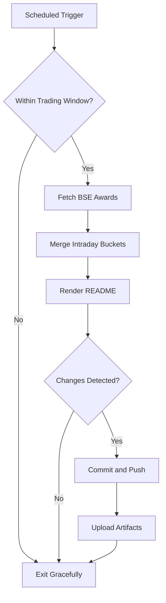

# Bombay Duck 🦆

     

<!-- aim:start -->

## Aim 🎯

⚠️ **Caution:\*\*** This project does not recommend buying or selling any security; it simply tracks BSE "Award of Order / Receipt of Order" announcements for informational purposes.

Bombay Duck keeps a pulse on BSE's "Award of Order / Receipt of Order" announcements so traders can spot fresh bullish catalysts without refreshing the exchange site. The goal is a hands-free tracker that respects BSE rate limits, stores every intraday fetch in git, and keeps the repository's front page as a living dashboard.

<!-- aim:end -->

## Intraday Snapshot 📊

ℹ️ **Important:\*\*** The README snapshot is updated automatically by the scheduled GitHub Action. Always pull the latest changes (or rebase) before editing README content locally to avoid merge conflicts.

<!-- snapshot:start -->

### Today's Awarded Orders (2026-10-06 IST)

| Hour (IST) | Company | Code | Headline | Profit Outlook | Announced At |
| --- | --- | --- | --- | --- | --- |
| 2026-10-06 20:00 | Dhanuka Agritech Ltd | 507717 | Demand orders received under Haryana Tax on Entry of Goods into Local Areas Act, 2008. ([Link](https://www.bseindia.com/stock-share-price/dhanuka-agritech-ltd/dhanuka/507717/)) | Likely Positive | 06 Oct 2026 - 20:25 |
| 2026-10-06 19:00 | Om Power Transmission Ltd | 544750 | Intimation of receipt of Letter of Intent for AIS substation ([Link](https://www.bseindia.com/stock-share-price/om-power-transmission-ltd/ompower/544750/)) | Likely Positive | 06 Oct 2026 - 19:41 |
| 2026-10-06 18:00 | Container Corporation of India Ltd | 531344 | Award an order ([Link](https://www.bseindia.com/stock-share-price/container-corporation-of-india-ltd/concor/531344/)) | Likely Positive | 06 Oct 2026 - 18:20 |
| 2026-10-06 17:00 | TVS Srichakra Ltd-$ | 509243 | Intimation of order received on 05/10/2026 from the office of the State Tax Officer, Rudrapur, Uttarakhand ([Link](https://www.bseindia.com/stock-share-price/tvs-srichakra-ltd/tvssrichak/509243/)) | Likely Positive | 06 Oct 2026 - 17:39 |
| 2026-10-06 17:00 | Om Power Transmission Ltd | 544750 | Intimation of receipt of Letter of Intent ([Link](https://www.bseindia.com/stock-share-price/om-power-transmission-ltd/ompower/544750/)) | Likely Positive | 06 Oct 2026 - 17:02 |
| 2026-10-06 15:00 | Ameenji Rubber Ltd | 544555 | Disclosure under Regulation 30 of SEBI (LODR) Regulations 2015 with respect to Purchase Order ([Link](https://www.bseindia.com/stock-share-price/ameenji-rubber-ltd/ameenji/544555/)) | Likely Positive | 06 Oct 2026 - 15:56 |
| 2026-10-06 15:00 | Indowind Energy Ltd | 532894 | Dear sir/Madam, PFA disclosure under reg 30. ([Link](https://www.bseindia.com/stock-share-price/indowind-energy-ltd/indowind/532894/)) | Neutral | 06 Oct 2026 - 15:47 |
| 2026-10-06 12:00 | Shakti Pumps India Ltd-$ | 531431 | We are glad to inform that Comapny has received a Letter of Empanelment from Maharashtra State Electricity Distribution Company Limited for 4,755 Off-Grid Solar Photovoltaic Water Pumping .... ([Link](https://www.bseindia.com/stock-share-price/shakti-pumps-india-ltd/shaktipump/531431/)) | Neutral | 06 Oct 2026 - 12:28 |
| 2026-10-06 12:00 | Interarch Building Solutions Ltd | 544232 | Intimation under Regulation 30 of SEBI(LODR) Regulations, 2015 regarding bagging of an order. ([Link](https://www.bseindia.com/stock-share-price/interarch-building-solutions-ltd/interarch/544232/)) | Likely Positive | 06 Oct 2026 - 12:18 |
| 2026-10-06 12:00 | Solex Energy Ltd | 544862 | Intimation of Receipt of Work Order ([Link](https://www.bseindia.com/stock-share-price/solex-energy-ltd/solex/544862/)) | Likely Positive | 06 Oct 2026 - 12:17 |
| 2026-10-06 11:00 | Bondada Engineering Ltd | 543971 | Intimation of receipt of Work Order ([Link](https://www.bseindia.com/stock-share-price/bondada-engineering-ltd/bondada/543971/)) | Likely Positive | 06 Oct 2026 - 11:22 |
| 2026-10-06 10:00 | RailTel Corporation of India Ltd | 543265 | New order received ([Link](https://www.bseindia.com/stock-share-price/railtel-corporation-of-india-ltd/railtel/543265/)) | Likely Positive | 06 Oct 2026 - 10:43 |

_Last updated: 06 Oct 2026 - 21:55 | Entries: 12 | Requests: 3 | Retries: 0 | [Raw JSON](data/2026-10-06.json)_

<!-- snapshot:end -->

<!-- how-it-works:start -->

## How It Works ⚙️

1. Scheduled GitHub Action runs at the top of each hour from 09:00 to 16:00 IST, Monday through Friday.
2. Trading-window guard aborts early outside market hours or on weekends/holidays.
3. Node.js fetcher (with throttling and retries) polls the BSE API and archives the raw JSON response.
4. Intraday state manager deduplicates announcements per hour and rolls over automatically at the next market open.
5. Mustache-based renderer injects a fresh table into the README so the latest data is always visible.
6. If anything changed, the workflow commits the README and JSON state back to `main` using a bot token and uploads artifacts for auditing.

```mermaid
flowchart TD
  A[Scheduled Trigger] --> B{Within Trading Window?}
  B -- No --> Z[Exit Gracefully]
  B -- Yes --> C[Fetch BSE Awards]
  C --> D[Merge Intraday Buckets]
  D --> E[Render README]
  E --> F{Changes Detected?}
  F -- No --> Z
  F -- Yes --> G[Commit and Push]
  G --> H[Upload Artifacts]
  H --> Z
```

<!-- how-it-works:end -->

## Automation Timeline 🕒

- **09:00 IST**: First eligible run clears out yesterday's state, fetches fresh announcements, and resets the README snapshot.
- **09:15-15:00 IST**: At the top of each hour the workflow repeats the fetch->merge->render pipeline, committing only when new data appears.
- **After 15:00 IST**: Guard step exits successfully; the last intraday snapshot remains until markets reopen.

## Project Resources 📚

- 📘 [Contributing Guidelines](CONTRIBUTING.md)
- 🧾 [Pull Request Guide](PR_GUIDE.md)
- 🐞 [Known Issues](KNOWN_ISSUES.md)
- 👥 [Authors](AUTHORS.md)

## Appendix 📎

- **API Endpoint:** `https://api.bseindia.com/BseIndiaAPI/api/AnnSubCategoryGetData/w`
- **Query Parameters:** `strCat=Company Update`, `subcategory=Award of Order / Receipt of Order`; date fields align with the active IST trading day.
- **Outputs:** Exposes `trading_date`, `announcement_count`, and the JSON-encoded announcements via `GITHUB_OUTPUT` for downstream jobs.
- **Logs & Summaries:** Fetch step writes a Markdown table to the GitHub Step Summary for quick triage.
