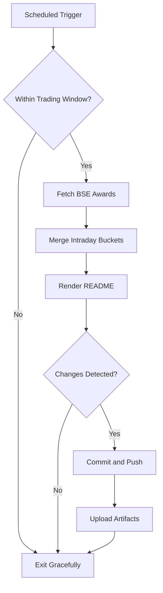

# Bombay Duck 🦆

     

<!-- aim:start -->

## Aim 🎯

⚠️ **Caution:\*\*** This project does not recommend buying or selling any security; it simply tracks BSE "Award of Order / Receipt of Order" announcements for informational purposes.

Bombay Duck keeps a pulse on BSE's "Award of Order / Receipt of Order" announcements so traders can spot fresh bullish catalysts without refreshing the exchange site. The goal is a hands-free tracker that respects BSE rate limits, stores every intraday fetch in git, and keeps the repository's front page as a living dashboard.

<!-- aim:end -->

## Intraday Snapshot 📊

ℹ️ **Important:\*\*** The README snapshot is updated automatically by the scheduled GitHub Action. Always pull the latest changes (or rebase) before editing README content locally to avoid merge conflicts.

<!-- snapshot:start -->

### Today's Awarded Orders (2026-09-30 IST)

| Hour (IST) | Company | Code | Headline | Profit Outlook | Announced At |
| --- | --- | --- | --- | --- | --- |
| 2026-09-30 21:00 | Highway Infrastructure Ltd | 544477 | Announcement under Reg. 30 (LODR) - Company has received LOA for Velanchettiyur Fee Plaza ([Link](https://www.bseindia.com/stock-share-price/highway-infrastructure-ltd/hilinfra/544477/)) | Neutral | 30 Sep 2026 - 21:17 |
| 2026-09-30 18:00 | Cryogenic Ogs Ltd | 544440 | We are pleased to inform you that Cryogenic OGS Limited has received a Purchase Order from an International MNC Specializing Industrial Process Engineering amounting to Rs. 5,07,54,947/- ([Link](https://www.bseindia.com/stock-share-price/cryogenic-ogs-ltd/cryogenic/544440/)) | Likely Positive | 30 Sep 2026 - 18:18 |
| 2026-09-30 18:00 | NCC Ltd | 500294 | Order(s) received during September 2026 ([Link](https://www.bseindia.com/stock-share-price/ncc-ltd/ncc/500294/)) | Likely Positive | 30 Sep 2026 - 18:00 |
| 2026-09-30 17:00 | Kaushalya Infrastructure Development Corporation Ltd | 532925 | Pleases find attached herewith disclosure under regulation 30 of SEBI LODR for receipt of order. ([Link](https://www.bseindia.com/stock-share-price/kaushalya-infrastructure-development-corporation-ltd/kaushalya/532925/)) | Likely Positive | 30 Sep 2026 - 17:49 |
| 2026-09-30 17:00 | North Eastern Carrying Corporation Ltd | 534615 | We are please to inform that the Company has been awarded a work contract by Tata Steel Limited for the transportation of iron ore from Kalamang to various siding locations/railways stations, .... ([Link](https://www.bseindia.com/stock-share-price/north-eastern-carrying-corporation-ltd/neccltd/534615/)) | Likely Positive | 30 Sep 2026 - 17:48 |
| 2026-09-30 17:00 | Highway Infrastructure Ltd | 544477 | Company has received a Work Order for Gorakhpur Link Expressways. ([Link](https://www.bseindia.com/stock-share-price/highway-infrastructure-ltd/hilinfra/544477/)) | Likely Positive | 30 Sep 2026 - 17:43 |
| 2026-09-30 17:00 | Ceenik Exports India Ltd | 531119 | Intimation under Regulation 30 of SEBI (LODR) Regulations, 2015 - Receipt of Final RD Order ([Link](https://www.bseindia.com/stock-share-price/ceenik-exports-india-ltd/ceenik/531119/)) | Likely Positive | 30 Sep 2026 - 17:38 |
| 2026-09-30 17:00 | Interarch Building Solutions Ltd | 544232 | Intimation Under Regulation 30 of SEBI(LODR) Regulations, 2015 regarding bagging of an order. ([Link](https://www.bseindia.com/stock-share-price/interarch-building-solutions-ltd/interarch/544232/)) | Likely Positive | 30 Sep 2026 - 17:35 |
| 2026-09-30 17:00 | Modulex Construction Technologies Ltd | 504273 | Receipt of an Order. ([Link](https://www.bseindia.com/stock-share-price/modulex-construction-technologies-ltd/modulex/504273/)) | Likely Positive | 30 Sep 2026 - 17:28 |
| 2026-09-30 17:00 | Prince Pipes and Fittings Ltd | 542907 | Receipt of Show Cause cum Demand Notice ([Link](https://www.bseindia.com/stock-share-price/prince-pipes-and-fittings-ltd/princepipe/542907/)) | Likely Positive | 30 Sep 2026 - 17:19 |
| 2026-09-30 17:00 | Prince Pipes and Fittings Ltd | 542907 | Receipt of Show Cause cum Demand Notice ([Link](https://www.bseindia.com/stock-share-price/prince-pipes-and-fittings-ltd/princepipe/542907/)) | Likely Positive | 30 Sep 2026 - 17:16 |
| 2026-09-30 16:00 | Schneider Electric President Systems Ltd | 544786 | In reference to our earlier communication dated September 29, 2026 on receipt of Order in original (OIO), the Company has received a Summary of Order dated September 29, 2026 read with .... ([Link](https://www.bseindia.com/stock-share-price/schneider-electric-president-systems-ltd/selectric/544786/)) | Likely Positive | 30 Sep 2026 - 16:25 |
| 2026-09-30 15:00 | Almondz Global Securities Ltd | 531400 | Please find attached relevant disclosure ([Link](https://www.bseindia.com/stock-share-price/almondz-global-securities-ltd/almondz/531400/)) | Neutral | 30 Sep 2026 - 15:50 |
| 2026-09-30 15:00 | Ideaforge Technology Ltd | 543932 | Intimation regarding the receipt of order received by ideaForge Technology Limited aggregating to Rs. 23.62 Crore. ([Link](https://www.bseindia.com/stock-share-price/ideaforge-technology-ltd/ideaforge/543932/)) | Likely Positive | 30 Sep 2026 - 15:03 |
| 2026-09-30 14:00 | Kanohar Electricals Ltd | 544911 | Disclosure pursuant to regulation 30(12) of the SEBI (Listing Obligations and Disclosure Requirements) Regulations, 2015-Receipt of Notification of Award ([Link](https://www.bseindia.com/stock-share-price/kanohar-electricals-ltd/kanohar/544911/)) | Likely Positive | 30 Sep 2026 - 14:01 |
| 2026-09-30 13:00 | Solarworld Energy Solutions Ltd | 544532 | Receipt of purchase order for supply of Solar Panels. ([Link](https://www.bseindia.com/stock-share-price/solarworld-energy-solutions-ltd/solarworld/544532/)) | Likely Positive | 30 Sep 2026 - 13:35 |
| 2026-09-30 12:00 | Larsen & Toubro Ltd | 500510 | L&T Transportation Infrastructure Vertical Secures Twin Contracts in Dubai ([Link](https://www.bseindia.com/stock-share-price/larsen--toubro-ltd/lt/500510/)) | Likely Positive | 30 Sep 2026 - 12:15 |
| 2026-09-30 12:00 | Ceigall India Ltd | 544223 | In continuation to our earlier intimation dated 08th September 2026 and in accordance with the above-mentioned provisions of the SEBI (Listing Obligations and Disclosure Requirements) Regulation, .... ([Link](https://www.bseindia.com/stock-share-price/ceigall-india-ltd/ceigall/544223/)) | Neutral | 30 Sep 2026 - 12:04 |
| 2026-09-30 11:00 | Admach Systems Ltd | 544669 | Admach Systems Limited has informed the Exchange regarding receipt of Purchase Order. ([Link](https://www.bseindia.com/stock-share-price/admach-systems-ltd/admach/544669/)) | Likely Positive | 30 Sep 2026 - 11:51 |
| 2026-09-30 10:00 | Shayona Engineering Ltd | 544686 | Intimation of Receipt of Purchase Order ([Link](https://www.bseindia.com/stock-share-price/shayona-engineering-ltd/shayonaeng/544686/)) | Likely Positive | 30 Sep 2026 - 10:37 |
| 2026-09-30 09:00 | Dhabriya Polywood Ltd | 538715 | Intimation of receiving of work order. ([Link](https://www.bseindia.com/stock-share-price/dhabriya-polywood-ltd/dhabriya/538715/)) | Likely Positive | 30 Sep 2026 - 09:36 |

_Last updated: 30 Sep 2026 - 21:41 | Entries: 21 | Requests: 2 | Retries: 0 | [Raw JSON](data/2026-09-30.json)_

<!-- snapshot:end -->

<!-- how-it-works:start -->

## How It Works ⚙️

1. Scheduled GitHub Action runs at the top of each hour from 09:00 to 16:00 IST, Monday through Friday.
2. Trading-window guard aborts early outside market hours or on weekends/holidays.
3. Node.js fetcher (with throttling and retries) polls the BSE API and archives the raw JSON response.
4. Intraday state manager deduplicates announcements per hour and rolls over automatically at the next market open.
5. Mustache-based renderer injects a fresh table into the README so the latest data is always visible.
6. If anything changed, the workflow commits the README and JSON state back to `main` using a bot token and uploads artifacts for auditing.

```mermaid
flowchart TD
  A[Scheduled Trigger] --> B{Within Trading Window?}
  B -- No --> Z[Exit Gracefully]
  B -- Yes --> C[Fetch BSE Awards]
  C --> D[Merge Intraday Buckets]
  D --> E[Render README]
  E --> F{Changes Detected?}
  F -- No --> Z
  F -- Yes --> G[Commit and Push]
  G --> H[Upload Artifacts]
  H --> Z
```

<!-- how-it-works:end -->

## Automation Timeline 🕒

- **09:00 IST**: First eligible run clears out yesterday's state, fetches fresh announcements, and resets the README snapshot.
- **09:15-15:00 IST**: At the top of each hour the workflow repeats the fetch->merge->render pipeline, committing only when new data appears.
- **After 15:00 IST**: Guard step exits successfully; the last intraday snapshot remains until markets reopen.

## Project Resources 📚

- 📘 [Contributing Guidelines](CONTRIBUTING.md)
- 🧾 [Pull Request Guide](PR_GUIDE.md)
- 🐞 [Known Issues](KNOWN_ISSUES.md)
- 👥 [Authors](AUTHORS.md)

## Appendix 📎

- **API Endpoint:** `https://api.bseindia.com/BseIndiaAPI/api/AnnSubCategoryGetData/w`
- **Query Parameters:** `strCat=Company Update`, `subcategory=Award of Order / Receipt of Order`; date fields align with the active IST trading day.
- **Outputs:** Exposes `trading_date`, `announcement_count`, and the JSON-encoded announcements via `GITHUB_OUTPUT` for downstream jobs.
- **Logs & Summaries:** Fetch step writes a Markdown table to the GitHub Step Summary for quick triage.
