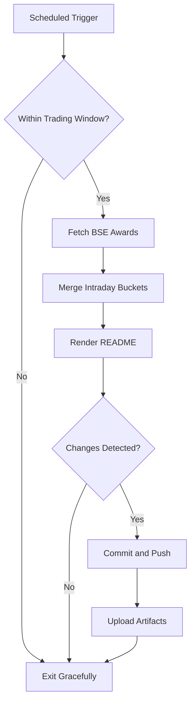

# Bombay Duck 🦆

     

<!-- aim:start -->

## Aim 🎯

⚠️ **Caution:\*\*** This project does not recommend buying or selling any security; it simply tracks BSE "Award of Order / Receipt of Order" announcements for informational purposes.

Bombay Duck keeps a pulse on BSE's "Award of Order / Receipt of Order" announcements so traders can spot fresh bullish catalysts without refreshing the exchange site. The goal is a hands-free tracker that respects BSE rate limits, stores every intraday fetch in git, and keeps the repository's front page as a living dashboard.

<!-- aim:end -->

## Intraday Snapshot 📊

ℹ️ **Important:\*\*** The README snapshot is updated automatically by the scheduled GitHub Action. Always pull the latest changes (or rebase) before editing README content locally to avoid merge conflicts.

<!-- snapshot:start -->

### Today's Awarded Orders (2026-10-30 IST)

| Hour (IST) | Company | Code | Headline | Profit Outlook | Announced At |
| --- | --- | --- | --- | --- | --- |
| 2026-10-30 19:00 | Venus Pipes & Tubes Ltd | 543528 | intimation ([Link](https://www.bseindia.com/stock-share-price/venus-pipes--tubes-ltd/venuspipes/543528/)) | Neutral | 30 Oct 2026 - 19:01 |
| 2026-10-30 17:00 | Belrise Industries Ltd | 544405 | Intimation under regulation 30 of the SEBI listing regulations, 2015 regarding receipt of GST order. ([Link](https://www.bseindia.com/stock-share-price/belrise-industries-ltd/belrise/544405/)) | Likely Positive | 30 Oct 2026 - 17:31 |
| 2026-10-30 17:00 | Manipal Health Enterprises Ltd | 544847 | Please find attached the disclosure under Regulation 30 read with Schedule III of the SEBI (LODR) Regulations, 2015 pertaining to actions taken/ order passed against the subsidiary Company. ([Link](https://www.bseindia.com/stock-share-price/manipal-health-enterprises-ltd/manipalhos/544847/)) | Likely Positive | 30 Oct 2026 - 17:20 |
| 2026-10-30 12:00 | Novus Loyalty Ltd | 544735 | Announcement of award of an order ([Link](https://www.bseindia.com/stock-share-price/novus-loyalty-ltd/novus/544735/)) | Likely Positive | 30 Oct 2026 - 12:58 |
| 2026-10-30 12:00 | Knowledge Marine & Engineering Works Ltd | 543273 | We are please to inform you that the KMEW has received a work order from New Mangalore Port Authority (NMPA) for Maintenance Dredging at New Mangalore Port for the period of 3 years. The .... ([Link](https://www.bseindia.com/stock-share-price/knowledge-marine--engineering-works-ltd/kmew/543273/)) | Likely Positive | 30 Oct 2026 - 12:04 |
| 2026-10-30 12:00 | Oswal Pumps Ltd | 544418 | As per attached intimation letter. ([Link](https://www.bseindia.com/stock-share-price/oswal-pumps-ltd/oswalpumps/544418/)) | Neutral | 30 Oct 2026 - 12:02 |
| 2026-10-30 11:00 | TeleCanor Global Ltd | 530595 | Update on Purchase Order from PrimeZen Innovations Inc ([Link](https://www.bseindia.com/stock-share-price/telecanor-global-ltd/telecanor/530595/)) | Likely Positive | 30 Oct 2026 - 11:41 |
| 2026-10-30 11:00 | RailTel Corporation of India Ltd | 543265 | New Order Received ([Link](https://www.bseindia.com/stock-share-price/railtel-corporation-of-india-ltd/railtel/543265/)) | Likely Positive | 30 Oct 2026 - 11:25 |

_Last updated: 30 Oct 2026 - 21:54 | Entries: 8 | Requests: 2 | Retries: 3 | [Raw JSON](data/2026-10-30.json)_

<!-- snapshot:end -->

<!-- how-it-works:start -->

## How It Works ⚙️

1. Scheduled GitHub Action runs at the top of each hour from 09:00 to 16:00 IST, Monday through Friday.
2. Trading-window guard aborts early outside market hours or on weekends/holidays.
3. Node.js fetcher (with throttling and retries) polls the BSE API and archives the raw JSON response.
4. Intraday state manager deduplicates announcements per hour and rolls over automatically at the next market open.
5. Mustache-based renderer injects a fresh table into the README so the latest data is always visible.
6. If anything changed, the workflow commits the README and JSON state back to `main` using a bot token and uploads artifacts for auditing.

```mermaid
flowchart TD
  A[Scheduled Trigger] --> B{Within Trading Window?}
  B -- No --> Z[Exit Gracefully]
  B -- Yes --> C[Fetch BSE Awards]
  C --> D[Merge Intraday Buckets]
  D --> E[Render README]
  E --> F{Changes Detected?}
  F -- No --> Z
  F -- Yes --> G[Commit and Push]
  G --> H[Upload Artifacts]
  H --> Z
```

<!-- how-it-works:end -->

## Automation Timeline 🕒

- **09:00 IST**: First eligible run clears out yesterday's state, fetches fresh announcements, and resets the README snapshot.
- **09:15-15:00 IST**: At the top of each hour the workflow repeats the fetch->merge->render pipeline, committing only when new data appears.
- **After 15:00 IST**: Guard step exits successfully; the last intraday snapshot remains until markets reopen.

## Project Resources 📚

- 📘 [Contributing Guidelines](CONTRIBUTING.md)
- 🧾 [Pull Request Guide](PR_GUIDE.md)
- 🐞 [Known Issues](KNOWN_ISSUES.md)
- 👥 [Authors](AUTHORS.md)

## Appendix 📎

- **API Endpoint:** `https://api.bseindia.com/BseIndiaAPI/api/AnnSubCategoryGetData/w`
- **Query Parameters:** `strCat=Company Update`, `subcategory=Award of Order / Receipt of Order`; date fields align with the active IST trading day.
- **Outputs:** Exposes `trading_date`, `announcement_count`, and the JSON-encoded announcements via `GITHUB_OUTPUT` for downstream jobs.
- **Logs & Summaries:** Fetch step writes a Markdown table to the GitHub Step Summary for quick triage.
